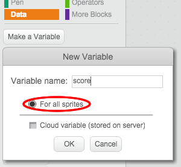

---
title: Ghostbusters
level: Scratch 1
language: ro-RO
stylesheet: scratch
embeds: "*.png"
materials: ["Club Leader Resources/*.*"]
...

## Note: { .challenge .pdf-hidden }
The 'Balloons' project has been moved to the [Additional Scratch Projects](http://projects.codeclub.org.uk/en-GB/03_scratch_bonus/index.html) section.

# Introducere { .intro }

Vei crea jocul ”Vânătorul de fantome”!
 
<div class="scratch-preview">
  <iframe allowtransparency="true" width="485" height="402" src="http://scratch.mit.edu/projects/embed/60787262/?autostart=false" frameborder="0"></iframe>
  
</div>

# Pasul 1: Animează fantoma { .activity }

## Lista de Activități { .check }

+ Deschide un proiect nou în Scratch și șterge sprite-ul pisică pentru a avea un proiect gol.
 
+ Adaugă un sprite nou fantoma și o scenă adecvată.

	

+ Adaugă codul de mai jos pentru fantomă. Dacă l-ai adăugat corect, fantoma ar trebui să apară și dispară tot timpul:

	```blocks
		when flag clicked
		forever
			hide
			wait (1) secs
			show
			wait (1) secs
		end
	```

+ Testează-ți codul prin apăsarea steagului verde.

## Salvează proiectul { .save }


# Pasul 2: Fantome la întâmplare { .activity }

Fantoma ta este foarte ușor de prins pentru că nu se mișcă!

## Lista de Activități { .check }

+ În loc să stea în aceeași poziție, poți lăsa programul să aleagă la întâmplare coordonatele x și y. Adaugă un bloc `go to` {.blockmotion} la codul dedicat fantomei. Codul tău va arăta așa:

	```blocks
		when flag clicked
		forever
			hide
			wait (1) secs
			go to x:(pick random (-150) to (150)) y:(pick random (-150) to (150))
			show
			wait (1) secs
		end
	```

+ Testează-ți fantoma din nou. Ar trebui să apară de fiecare dată în locuri diferite.

## Salvează proiectul { .save }

## Provocare: Și mai multe lucruri întâmplătoare {.challenge}

Poți să controlezi fantoma să aștepte (`wait` {.blockcontrol}) o perioadă de timp aleatorie înainte de să reapară? Poți să utilizezi blocul `set size` {.blocklooks} pentru a modifica fantoma să aibe o altă dimensiune de fiecare data când apare?

## Salvează proiectul { .save }

# Step 3: Să prindem fantomele { .activity }

Haideți să le permitem celor care vor să se joace să prindă fantomele!

## Lista de Activități { .check }

+ Pentru a permite jucătorilor să prindă o fantomă, adaugă codul:

	```blocks
		when this sprite clicked
		hide
	```

+ Testează-ți proiectul. Poți să prinzi fantomele când apar? Dacă e prea dificil să le prinzi, poți juca jocul pe tot ecranul apăsând pe acest buton:

	

## Provocare: Adaugă sunet { .challenge }
Poți să scoți un sunet de fiecare data când prinzi o fantomă?

## Salvează proiectul { .save }

# Pasul 4: Adaugă scorul { .activity .new-page }

Haideți să complicăm un pic lucrurile prin adăugarea scorului. 

## Lista de activități { .check }

+ Pentru a ține scorul, trebuie să ai un loc unde să-l pui. O __variabilă__ este un loc unde poți păstra date care se schimbă, ca un scor. 

	Pentru a crea o nouă variabilă, apasă pe tab-ul 'Scripts', selectează `Data` {.blockdata} și apoi apasă pe 'Make a Variable'.

	

	Schimbă numele variabilei în 'score'. Fii sigur că variabila va apărea pentru toate sprite-urile, apoi apasă 'OK' ca să o creezi. Vei vedea o mulțime de blocuri de cod care se pot folosi cu variabila ta `score` {.blockdata}.

	

	Poți vedea scorul in colțul din stânga-sus al scenei. 

	

+ Când începi nou joc (apăsând pe steagul verde), trebuie să setezi scorul la 0:

	```blocks
	when flag clicked
	set [score v] to [0]
	```

+ În momentul în care jucătorul a prins o fantomă, adaugă 1 la scor:

	

+ Pornește programul și prinde niște fantome. Se schimbă scorul? 

## Salvează proiectul { .save }

# Step 5: Adaugă un cronometru { .activity }

Jocul poate devein mai interesant dacă îi dai jucătorului 10 secunde să prindă cât mai multe fantome. 

## Lista de activități { .check }

+ Poți utiliza o altă variabilă pentru a păstra timpul rămas din joc. Click în scenă și adaugă o nouă variabilă numită 'time':

	

+ Cronometrul ar trebui să arate în felul următor:

	+ Cronometrul trebuie să începă la 10 secunde;
	+ Cronometrul trebuie să numere descrescător în fiecare secundă;
	+ Jocul trebuie oprit când cronometrul ajunge la 0.

	Codul de mai jos va face exact acest lucru. Îl poți adăuga la __scena__ ta:

	```blocks
		when flag clicked
		set [time v] to [10]
		repeat until <(time) = [0]>
			wait (1) secs
			change [time v] by (-1)
		end
		stop [all v]
	```

	Așa adaugi codul `repeat until`{.blockcontrol}`time`{.blockdata}`= 0`{.blockoperators}:

	

+ Mută variabila 'time' să apară în partea dreaptă a scenei. Poți să faci click dreapta pe variabilă și să selectezi 'large readout' pentru a schimba cum apare timpul.

	

+ Cere unui prieten să testeze jocul. Câte puncte a reușit să câștige? Dacă jocul ți se pare prea ușor, poți să faci următoarele:

	+ Dă-i jucătorului mai puțin timp;
	+ Fă fantomele să apară mai rar;
	+ Fă fantomele mai mici.

	Testează jocul de câteva ori până când ești mulțumit de nivelul de dificultate.

## Salvează proiectul { .save }

## Provocare: Mai multe obiecte {.challenge}
Poți să adaugi mai multe obiecte în joc?


Gândește-te la obiectul pe care îl adaugi:

+ Cât de mare este?
+ Va apărea de mai multe sau de mai puține ori decât fantoma?
+ Cum va arăta / ce sunet va face când va fi prins?
+ Câte puncte vei aduna (sau pierde) dacă îl prinzi?

Dacă ai nevoie de ajutor să adaugi un obiect nou, poți să reutilizezi pașii de mai sus!

## Salvează proiectul { .save }

