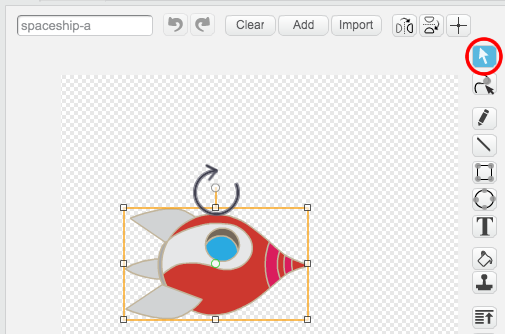

---
title: Lost in Space
level: Scratch 1
language: ro-RO
stylesheet: scratch
embeds: "*.png"
...

# Introducere { .intro }

Vei invata cum sa faci propria ta animatie!

<div class="scratch-preview">
  <iframe allowtransparency="true" width="485" height="402" src="http://scratch.mit.edu/projects/embed/26818098/?autostart=false" frameborder="0"></iframe>
  
</div>

# Pasul 1: Animeaza o naveta spatiala { .activity .new-page}

Sa facem o naveta spatiala care navigheaza spre Pamant!

## Lista de activitati { .check }

+ Porneste un nou proiect Scratch si sterge sprite-ul pisica astfel incat proiectul tau sa fie gol. Poti gasi editorul online de Scratch la <a href="http://jumpto.cc/scratch-new">jumpto.cc/scratch-new</a>.

+ Adauga sprite-urile 'Spaceship' (naveta spatiala) si 'Earth' (Pamant) pe scena ta. Ar trebui sa adaugi si fundalul 'Stars' (stele) la scena. Scena ta ar trebui sa arate asa:

	

+ Fa click pe noul tau sprite naveta spatiala, apoi fa click pe tab-ul 'Costumes'.

	

+ Foloseste unealta sageata (arrow tool) pentru a selecta imaginea. Apoi fa click pe manerul circular si roteste imaginea pana ajunge in pozitie orizontala.

	

+ Adauga acest cod la sprite-ul tau naveta spatiala:

	

	Schimba numerele in blocurile de cod, astfel incat codul sa fie exact ca in imaginea de deasupra.

+ Daca faci click pe blocurile de cod pentru a executa codul, ar trebui sa vezi naveta spatiala vorbind, intorcandu-se si miscandu-se catre centrul scenei.

	

	Pozitia de pe ecran `x:(0) y:(0)` {.blockmotion} este centrul scenei. O pozitie ca `x:(-150) y:(-150)` {.blockmotion} este spre partea din stanga-jos a scenei, iar o pozitie ca `x:(150) y:(150)` {.blockmotion} este aproape de coltul din dreapta sus.

	

	Daca vrei sa afli coordonatele unei pozitii de pe scena, muta cursorul mouse-ului in pozitia pe care o doresti si noteaza coordonatele, care sunt afisate sub scena.

	

+ Porneste animatia, facand click pe steagul verde situat chiar deasupra scenei.

	

## Provocare: Imbunatateste animatia {.challenge}
Poti modifica numerele in codul animatiei tale, astfel incat:
+ naveta spatiala se misca pana atinge Pamantul?
+ naveta spatiala se misca mai incet spre Pamant?

Va trebui sa modifici numerele in acest bloc de cod:

```blocks
	glide (1) secs to x:(0) y:(0)
```

## Salveaza proiectul { .save }

# Pasul 2: Animati folosind bucle { .activity .new-page }

Un alt mod de a anima naveta spatiala este prin a o instrui sa se miste in pasi mici, de multe ori.

## Lista de activitati { .check }

+ Sterge blocul `glide` {.blockmotion} din codul tau, facand click dreapta pe bloc, iar apoi click pe 'delete'. De asemenea poti sterge cod tragandu-l afara din zona de script, inapoi in zona blocurilor de cod.

	

+ Odata ce ai sters codul, adauga acest cod in locul lui:

	

	Blocul `repeat` {.blockcontrol} este folosit pentru a repeta o actiune de multe ori si este cunoscut sub numele de __bucla__.

+ Daca faci click pe steag pentru a incerca acest nou cod, vei observa ca face aproximativ aceleasi actiuni ca inainte.

+ Poti adauga mai mult cod in bucla ta, pentru a face lucruri interesante. Adauga blocul `change color effect by 25` {.blocklooks} in bucla (din sectiunea 'Looks'), pentru a schimba culoarea navetei spatiale in mod repetat in timp ce se misca:

	

+ Fa click pe steag pentru a vedea noua ta animatie.

	

+ Poti si sa faci naveta sa se micsoreze in timp ce se misca spre Pamant.

	

+ Testeaza animatia. Ce se intampla daca faci click pe steag a doua oara? Naveta porneste cu dimensiunea corecta? Poti folosi acest bloc sa corectezi animatia:

	```scratch
	set size to (100) %
	```

## Salveaza proiectul { .save }

# Pasul 3: Maimuta Plutitoare { .activity .new-page }

Hai sa adaugam o maimuta animatiei tale, care e pierduta in spatiu! 

## Lista de activitati { .check }

+ Incepe prin a adauga sprite-ul monkey (maimuta) din librarie.

	

+ Daca faci click pe noul 'sprite' maimuta si pe urma pe 'Costumes'(costume), poti schimba cum arata maimuta. Apasa pe unealta 'Elipse' si deseneaza o casca spatiala alba in jurul capului maimutei.

	

+ Acuma fa click pe 'Scripts' si adauga acest cod maimutei, astfel incat ea sa se invarta incet, in cerc, pentru todeauna :

	```blocks
		when FLAG clicked
		forever
		    turn right (1) degrees
		end
	```

	Blocul `forever` {.blockcontrol} este alta bucla, dar de data aceasta una care nu se termina.

+ Fa click pe steag pentru a-ti testa maimuta. Va trebui sa dai pe click pe butonul de stop (langa steag) ca sa opresti animatia.

	

# Pasul 4: Asteroizi Saltareti { .activity .new-page }

Hai sa adaugam niste roci spatiale plutitoare animatiei tale.

## Lista de activitati { .check }

+ Adauga un sprite 'rock' (piatra) animatiei tale.

	

+ Adauga acest cod asteroidului tau ca il faci sa salte (bounce) in jurul scenei:

	```scratch
	when flag clicked
	point towards [Earth v]
	forever
		move (2) steps
		if on edge, bounce
	```

+ Fa click pe steag sa iti testezi asteroidul. Salta in jurul scenei ?

# Pasul 5: Stele stralucitoare { .activity .new-page }

Hai sa combinam bucle ca sa creem o stea stralucitoare.

## Lista de activitati { .check }

+ Adauga un sprite 'star' (stea) animatiei tale

	

+ Adauga acest cod stelei tale:

	

+ Fa click pe steag sa testezi aceasta animatie pentru stea. Ce face acest cod? Pai, aceasta stea este marita putin de 20 de ori, si apoi este micsorata putin de 20 de ori, inapoi la dimensiunea originala. Aceste 2 bucle sunt inauntrul buclei `forever` {.blockcontrol}, astfel incat animatia se tot repeta.

## Salveaza proiectul { .save }

## Provocare: Creeaza animatia ta {.challenge}
Opreste animatia spatiala, si apoi fa click pe 'File' si pe urma pe 'New', pentru a incepe un nou proiect.

Foloseste ce ai invatat in acest proiect pentru a crea propria ta animatie. Poate sa fie orice iti place, dar incearca sa iti faci animatia sa corespunda contextului. Aici ai cateva exemple:


## Salveaza proiectul { .save }
