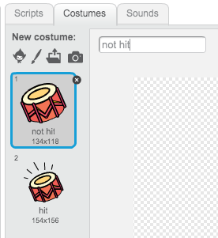
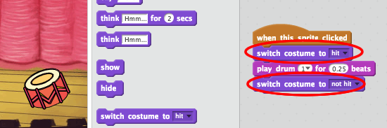

---
title: Rock Band
level: Scratch 1
language: ro-RO
stylesheet: scratch
embeds: "*.png"
materials: ["Club Leader Resources/*.*"]
...

# Introducere { .intro }

În acest proiect vei învăța să creezi propiul tău instrument muzical!

<div class="scratch-preview">
  <iframe allowtransparency="true" width="485" height="402" src="http://scratch.mit.edu/projects/embed/26741186/?autostart=false" frameborder="0"></iframe>
  
</div>

# Pasul 1: Sprites { .activity }

Înainte să începi să animezi ai nevoie să alegi un "actor" pe care să-l
controlezi. În Scratch, aceste "caractere" se numesc __sprites__.

## Lista de Activități { .check }

+ Pentru început, deschide editorul de Scratch. Îl poți vedea online la <a href="http://jumpto.cc/scratch-new">jumpto.cc/scratch-new</a>. Arată cam așa:

	

+ Sprite-ul pisică pe care îl vezi este mascota Scratch. Haide să-l ștergem. Clic dreapta pe mouse și după aceea pe 'delete'.

	

+ După aceea selectează 'Choose sprite from library' ca să deschizi o listă cu toate caracterele din Scratch.

	

+ În dosarul 'Things' caută un 'sprite' tobă (în engleză
'drum'). Selectează-l și apasă 'OK' pentru a-l aduce în
proiectul tău.

	

+ Apasă pe icoana 'shrink' (micșorare), apoi de câteva ori pe tobă ca să o faci
mai mică.

	

## Salvează proiectul { .save }

Dă un nume programului tău. Scrie numele nou în fereastra de
deasupra scenei.

Poți să faci clic pe 'File' și apoi pe 'Save now' ca să-ți salvezi proiectul.


# Pasul 2: Scena { .activity }

__Scena__ este aria din stânga și este locul unde proiectul tău prinde viață.

## Lista de Activități { .check }

+ La început scena este goală și arată cam plictisitor! Haide să-i punem un fundal. Selectează: 'Choose new sprite from file'.

	

+ Din dosarul 'Media' selectează 'Backgrounds' și apoi 'Indoors'.
Din acest dosar alege fundalul pe care vrei să-l alegi pentru scena și apoi pe 'OK'.

	

+ Scena ta ar trebui să arate așa:

	

# Pasul 3: Construiește o Tobă { .activity }

Haide să scriem un script pentru tobă. Vrem ca ea să scoată un sunet când este atinsă.

## Lista de Activități { .check }

+ Vei găsi script-urile în secțiunea 'Scripts'. Toate script-urile sunt grupate pe module reprezentate prin aceeași culoare.
De exemplu toate script-urile care controlează sunetul au culoarea roz si se află în grupul 'Sound'!

Fă clic pe sprite-ul tobă și mută cele două script-uri în aria
de cod din mijloc, având grijă să le conectezi între ele(asemena
unor piese Lego):

	

+ Fă clic pe tobă și testează noul tău instrument muzical!

+ Poti să schimbi cum arată toba atunci când o lovești. Pentru asta trebuie să creezi un costum nou. Apasă pe sectiunea 'Costumes', și vei vedea imaginea tobei.

	

+ Selecteză cu mouse-ul costumul și apoi clic dreapta pe acesta. Clic 'duplicate' ca să creezi o copie a costumului.

	

+ Selectează noul costum(numit 'drum2'), apoi selectează 'line tool' și desenează câteva linii ca și cum toba ar scoate un sunet.

	

+ Numele costumelor nu sunt foarte clare. Haide să le schimbăm cu 'not hit' și "hit" ca și în imaginea de mai jos.

	

+ Acum că ai două costume pentru tobă, poți să alegi ce costum vrei să arăți! Adaugă aceste două blocuri la script-ul tău:

	

	Blocul de cod pentru schimbarea costumelor se găsește în secțiunea 'Looks' {.blocklooks}.

+ Testează-ți toba. Când o atingi, toba ta ar trebui să pară că ar scoate un sunet!

## Salvează proiectul { .save }

##Exercițiu: Să îmbunătățim toba { .challenge }

+ Poți să schimbi sunetul scos de tobă atunci când faci clic pe ea?


+ Poți să faci toba să sune și atunci când apeși tasta 'spacebar' de la tastatură?
Va trebui sa folosesti acest bloc eveniment: 'event' {.blockevents}:

```blocks
	when [space v] key pressed
```

Poți să folosești codul deja existent dacă faci clic dreapta pe el și apoi alegi optiunea 'duplicate'.


## Salvează proiectul { .save }

# Pasul 4: Să construim un cântăreț { .activity .new-page }

Hai să adăugăm un cântăreț în formația noastră!

## Lista de Activități { .check }

+ Adaugă înca două caractere (sprites) pe scena ta: un cântăreț și un microfon.

	

+ Pentru a-l face pe cântăreț să cânte trebuie să adaugăm un sunet sprite-ului tău.
Selectează cântărețul și fă clic pe secțiunea 'Sounds'. Selectează opțiunea 'Choose sound from library' care ne permite să alegem un sunet din biblioteca de fișiere:

	

+ Dacă faci clic pe secțiunea 'Vocals' din partea stângă, vei putea apoi alege un sunet potrivit pentru sprite-ul tău.

	

+ Acum că am adăugat sunetul, putem adăuga acest script cântărețului nostru:

	```blocks
		when this sprite clicked
		play sound [singer1 v] until done
	```

+ Fă clic pe cântărețul tău pentru a verifica dacă acesta cântă atunci când apăsăm pe el.

## Salvează proiectul { .save }

##Exercițiu: Să schimbăm costumul cântărețului { .challenge }
Vrem ca atunci când facem clic pe cântăreț să vedem că acesta cântă. Poți face asta? Daca ai nevoie de ajutor poți folosi instrucțiunile de la pasul 3 "Construind o tobă".


Nu uita să testezi dacă modificările tale funcționează corect!

## Salvează proiectul { .save }

##Exercițiu: Crează propria ta formație { .challenge }
Poți folosi ceea ce ai învățat în acest proiect pentru a crea propria ta formație muzicală!
Poți crea orice instrument dorești. Ca să îți faci întâi o idee, aruncă o privire asupra sunetelor și instrumentelor disponibile în Scratch.


Instrumentele nu trebuie să fie neapărat reale. De exemplu, ai putea să construiești un pian din brioșe!


Pe lângă sprite-urile existente, poți de asemenea să desenezi unele noi.


Dacă ai un microfon, poți să înregistrezi sunetele tale sau poți folosi o camera web pentru a interacționa cu instrumentele.


## Salvează proiectul { .save }

