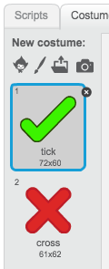
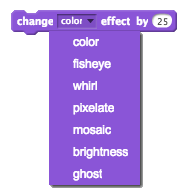

---
title: Brain Game
level: Scratch 2
language: ro
stylesheet: scratch
embeds: "*.png"
materials: ["Club Leader Resources/*"]
...

# Introducere { .intro }

În acest proiect vei învăţa cum să creezi, un chestionar cu intrebari din tabla înmulţirii, la care trebuie să răspunzi corect la cât mai multe întrebări în 30 de secunde.

<div class="scratch-preview">
  <iframe allowtransparency="true" width="485" height="402" src="http://scratch.mit.edu/projects/embed/42225768/?autostart=false" frameborder="0"></iframe>
  
</div>

# Pasul 1: Crearea întrebărilor { .activity }

Să începem prin a creea întrebări aleatorii, la care jucătorul va trebui să răspundă.

## Listă de activităţi { .check }

+ Creează un nou proiect Scratch, şi şterge sprite-ul pisică pentru ca proiectul să fie gol. Poţi să găsești editorul Scratch online aici <a href="http://jumpto.cc/scratch-new">jumpto.cc/scratch-new</a>.

+ Alege un personaj şi un fundal pentru jocul tau. Poţi să alegi ce vrei! Uite un exemplu:

		
    
+ Creează două noi variabile numite `numărul 1` {.blockdata} şi `numărul 2` {.blockdata}. Aceste variabile vor ţine minte cele două numere, care vor fi înmulțite între ele.  

	
    
+ Adaugă cod personajului tău, pentru a asigna ambelor variabile un numar `aleator` {.blockoperators} între 2 şi 12

	```blocks
		cand se dă click pe steag
        setează [number 1 v] la (alege un numar aleatoriu intre(2) şi (12))
		setează [number 2 v] la (alege un numar aleatoriu intre(2) şi (12))
	```

+ Pe urmă poţi întreba jucătorul pentru răspuns, şi să îi zici dacă acesta a fost corect sau nu. 

	```blocks
		când se dă click pe steag 
		setează [number 1 v] la (alege un numar aleatoriu intre (2) şi (12))
		setează [number 2 v] la (alege un numar aleatoriu intre (2) şi (12))
		întreabă (îmbină (number 1)(îmbină [ x ] (number 2))) şi aşteaptă
		dacă <(răspuns) = ((number 1)*(number 2))> atunci
			spune [yes! :)] pentru (2) secunde
		altfel
			spune [nope :(] pentru (2) secunde
		sfârşit
	```

+ Testează-ţi proiectul în întregime, răspunzând corect unei întrebări şi greşit altei întrebări.

+ Adaugă o buclă `la infinit` {.blockcontrol} în jurul acestui cod, astfel încât jucătorul să fie întrebat o mulţime de întrebări.

+ Creează un cronometru pe scenă folosind o variabilă numita  `timp` {.blockdata}. Dacă ai nevoie de ajutor, proiectul 'Balloons' are instrucţiuni pentru creearea unui cronometru (în pasul 6).   

+ Testează-ţi din nou proiectul - ar trebui să poți pune întrebări până îţi expiră timpul.

## Salvează-ţi proiectul { .save }

## Provocare: Costume schimbatoare {.challenge}
Poţi să schimbi costumul personajului tau, astfel încât el să reacţioneze la răspunsul jucatorului ?


## Provocare: Adăugarea scorului {.challenge} 
Poţi să adaugi un scor jocului tău? Poţi să adaugi un punct pentru fiecare răspuns corect. Dacă vrei, ai putea să resetezi scorul jucatorului la 0 dacă greşeşte la o întrebare. 

## Salvează-ţi proiectul { .save }

# Pasul 2: Jocuri multiple { .activity .new-page}

Hai să adăugam un buton 'play' jocului, astfel încât să te poţi juca de o groază de ori.

## Listă de activităţi { .check }

+ Creează un nou buton sprite, numit Play, pe care jucatorul va trebui să dea click, ca să înceapă un joc nou. Poţi să il desenezi chiar tu, sau să modifici un sprite in librăria Scratch.

	

+ Adaugă acest cod noului tău buton.

	```blocks
		când se da click pe steag
		afiseaza

        când se da click pe acest sprite
		ascunde
		expediere la toţi [start v]
	```

    Acest cod afișeaza butonul Play când începe proiectul. Când se dă click pe buton, se ascunde şi pe urma transmite un mesaj, care va începe jocul.

+ Va trebui să modifici codul personajului tău, astfel încât jocul să înceapă când primește mesajul `start`  {.blockevents} şi nu când se dă click pe steag.

	Înlocuieşte codul `când se dă click pe steag` {.blockevents} cu `când primesc start` {.blockevents}.

	
    
    + Dă click pe steagul verde și apoi dă click pe noul tau buton de play ca să îl testezi. Ar trebui să vezi că jocul nu se porneşte până când nu se dă click pe buton.

+ Ai observat că cronometrul începe când se dă click pe steagul galben şi nu când jocul începe ?

	

	Poţi rezolva această problemă ?

+ Dă click pe scenă şi înlocuieşte blocul `opreşte tot` cu un mesaj  `sfarsit` {.blockevents}.

	

+ Poţi să adaugi un cod nou butonului tău, să îl arăţi din nou la sfârşitul fiecărui joc.

	```blocks
		când primesc [end v]
		afişează
	```

+ De asemenea va trebui să îţi oprești personajul din pus întrebări la sfârşitul fiecărui joc:

	```blocks
		cand primesc [end v]
		opreste [alte script-uri pentru sprite v]
	```
+ Testează-ţi butonul Play prin jucarea unor runde. Ar trebui să observi că butonul play apare după fiecare joc. Ca să testezi mai uşor, poţi să scurtezi fiecare joc, astfel încât el să dureze numai cateva secunde.

	```blocks
		setează [timp v] la [10]
	```

+ Poţi de asemenea să schimbi cum arată butonul cand pluteşti cu mouse-ul deasupra lui.

	```blocks
		când se dă click pe steag
		afişează
		la infinit
		dacă <touching [cursorul mouse-lui v]?> atunci
			setează efectul [ochi de peşte v] la (30)
		altfel
			setează efectul [ochi de peşte v] la (0)
		sfârşit
		sfârşit
	```


## Salvează-ţi proiectul { .save }

## Provocare: Ecranul de start {.challenge}

Poţi sa adaugi încă un fundal scenei tale, care va deveni ecranul de start al jocului tău? Poţi să foloseşti blocurile  `când primesc start` {.blockevents} si  `când primesc end` {.blockevents} să schimbi între fundaluri. 

Poţi de asemenea să arăţi sau să ascunzi personajul, şi chiar să ascunzi sau să arăţi cronometrul prin folosirea acestor blockuri:

```blocks
afişează variabila [time v]
```
```blocks
ascunde variabila [time v]
```


## Salvează-ţi proiectul { .save }

# Pasul 3: Adăugarea graficelor { .activity .new-page}

În loc ca personajul să zică numai  `da! :)` sau `nu :(` jucatorului, hai să adăugam nişte grafice care îi vor zice jucătorului cum se descurcă.

+ Creează un nou sprite numit 'Result', care să conţină o 'bifă' şi un 'X'.

	

+ Schimbă codul personajului, astfel încât, în loc să zică jucătorului cum a făcut, să transmită mesajele `corect` {.blockevents} şi `gresit` {.blockevents}.

	

+ Acum poţi folosi aceste mesaje ca să arăţi 'bifa' sau 'X'. Adaugă acest cod sprite-ului 'Result': 

		

+ Testează-ţi din nou jocul. Ar trebui să vezi o bifă de fiecare dată când nimereşti un răspuns corect şi un 'x' de fiecare dată când greşeşti.

	
    
+ Ai observat faptul că codul pentru `când primesc corect`  {.blockevents} este aproape identic cu codul pentru  `când primesc gresit` {.blockevents} ? Hai să creăm o funcţie care să ne permită să modificăm mult mai ușor codului.

    În sprite-ul 'Result', dă click pe `Mai multe blocuri` {.blockmoreblocks} şi pe urmă pe 'Creează un block'. Creează o nouă funcţie numită `animate` {.blockmoreblocks}.
    
	
    
    + Pe urmă poţi să adaugi codul de animaţie în noua ta funcţie, si să foloseşti funcţia de două ori:

	
    
    + Acum, dacă vrei să arăţi bifa și X pentru o perioadă mai lungă sau scurtă de timp, trebuie să faci o singură schimbare codului tau. Încearcă!

+ În loc sa arăţi sau să ascunzi, bifa și X dintr-o dată, ar trebui să schimbi funcţia de animaţie, astfel încât graficele să dispară lent.

	```blocks
		defineşte [animate]
		setează efectul [fantomă v] la (100)		
		afiseaza
		repetă (25)
			modifică efectul [fantomă v] cu (-4)
		sfârşit
		ascunde
	```

## Salvează-ţi proiectul { .save }

## Provocare: Animatie mai bună {.challenge}
Poţi să faci animaţia grafică mai bună ? Ai putea să faci bifa şi X astfel încat să dispară în fundal. Sau ai putea să foloseşti alte efecte faine:



## Salvează-ţi proiectul { .save }

## Provocare: Sunet şi muzică {.challenge}
Poţi să adaugi efecte sonore şi muzică jocului tau ? De exemplu:

+ Redarea unui sunet când jucătorul nimereşte sau greşeşte un răspuns;
+ Adăugarea unui sunet de tic cronometrului;
+ Redarea unui sunet când expiră timpul;

	```blocks
		cântă la toba (10 v) pentru (0.1) timpi
	```
    
+ Ai putea de asemenea să pui muzică de fundal într-o bucla (dacă nu eşti sigur cum să faci asta, pasul patru din proiectul 'Rock Band' te va ajuta).

## Salvează-ţi proiectul { .save }

## Provocare: Cursa la 10 points {.challenge}
Poţi să schimbi jocul, astfel încât, în loc să răspundă la cât mai multe intrebări în 30 de secunde, jucătorul să vadă în cât timp poate să raspundă corect la 10 întrebări ?

Pentru a face asta, va trebui să schimbi codul cronometrului. Poţi să îţi dai seama ce trebuie schimbat ?

```blocks
	când primesc [start v]
	setează [time v] la (30)
	repetă până când <(time) = [0]>
		aşteaptă (1) sec
		schimbă  [time v] cu (-1)
	sfârit
	expedire la toţi [end v]
```

## Salvează-ţi proiectul { .save }

## Provocare: Ecranul cu instrucţiuni {.challenge}
Poţi să adaugi un ecran cu instrucţiuni jocului tău, spunându-i jucătorului cum se joacă acest joc ? Vei avea nevoie de un buton 'Instrucţiuni' si de încă un fundal.


S-ar putea să ai nevoie şi de un buton 'Înapoi' să te reîntoarcă la meniul principal.

```blocks
	expediere la toţi [main menu v]
```

## Salvează-ţi proiectul { .save }
