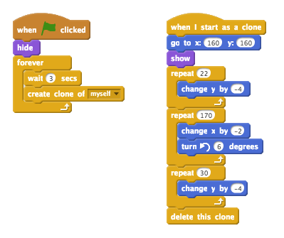

---
title: Dodgeball
level: Scratch 2
language: ro-RO
stylesheet: scratch
embeds: "*.png"
materials: ["Club Leader Resources/*","Project Resources/*"]
...

# Introducere { .intro }

În acest proiect vei învăța cum să creezi o platformă pentru un joc în care va trebui să te ferești de mingile care se mișcă și să ajungi la sfârșitul nivelului.

<div class="scratch-preview">
  <iframe allowtransparency="true" width="485" height="402" src="http://scratch.mit.edu/projects/embed/39740618/?autostart=false" frameborder="0"></iframe>
  
</div>

# Pasul 1: Mișcarea personajului { .activity }

Haide să începem prin a crea un personaj care se poate mișca stânga și dreapta și să se cațăre pe stâlpi.

## Lista de activități { .check }

+ Începe un nou proiect Scratch și șterge sprite-ul pisică. Poți găsi editorul de Scratch online la <a href="http://jumpto.cc/scratch-new">jumpto.cc/scratch-new</a>.

+ Pentru proiect vei avea nevoie de un director 'Project Resources' care conține imaginea de fundal de care ai nevoie. Dacă nu găsești directorul roagă-l pe liderul clubului să te ajute.

	

+ Adaugă imaginea "background.png" ca un fundal nou pentru scenă, sau deseneză o nouă scenă! Dacă desenezi propria scenă pentru un nivel, ai grijă ca stâlpii și podelele să fie de culori  diferite, și să existe o ușă (sau ceva similar) la care jucătorul trebuie să ajungă. Iată cum ar trebui să arate proiectul:

	

+ Adaugă un sprite nou care va fi personajul tău. E mai bine dacă alegi un sprite cu mai multe costume, astfel încât să arate ca și cum merge.

	

+ Haide să utilizăm săgețile pentru a mișca personajul tău. Atunci când jucătorul apasă pe săgeata dreaptă, vei dori ca personajul tău să arate înspre dreapta, să facă câțiva pași și să-și schimbe costumul:

	```blocks
		when flag clicked
		forever
			if <key [right arrow v] pressed? > then
				point in direction (90 v)
				move (3) steps
				next costume
			end
		end
	```

+ Testează personajul prin apăsarea steagului verde. Ține apăsată săgeata-dreaptă. Se mișcă jucătorul înspre dreapta? Pare că merge?

	

+ Pentru a mișca personajul spre stânga trebuie să adaugi încă un bloc `if` {.blockcontrol} în interiorul buclei `forever` {.blockcontrol}. Nu uita să-ți testezi noul cod, să fii sigur că funcționează!

+ Pentru a se cățăra pe un stâlp, personajul trebuie să se miște încet în sus în momentul când săgeata-sus este apăsată și a atins culoarea corectă. Adaugă codul de mai jos în scriptul personajului, în interiorul buclei `forever` {.blockcontrol}:

	```blocks
		if < <key [up arrow v] pressed?> and <touching color [#FFFF00]?> > then
			change y by (4)
		end
	```

+ Testează personajul – poți să te cațeri pe stâlpii galbeni și să ajungi la sfârșitul nivelului?

	

## Salvează proiectul { .save }

## Provocare: Termină nivelul {.challenge}
Poți să scrii mai mult cod pentru personajul tău pentru ca să spună ceva când ajunge la ușa maro?
 


## Salvează proiectul { .save }

# Pasul 2: Gravitația și sărituri { .activity }

Haide să facem personajul să pară mai realist. Vom lua în considerare gravitația și îi vom permite să sară.
 
## Lista de activități { .check }

+ Poate ai notat că personajul tău poate să meargă prin aer. Încearcă să părăsești platforma și vezi ce se întâmplă.

	

+ Pentru a fixa problema aceasta, trebuie să luăm în considerare gravitația. Creează o variabilă numită `gravity` {.blockdata}. Poți să o  ascunzi din scenă dacă vrei.

	

+ Adaugă noul bloc de cod de mai jos care setează gravitația la un număr negativ, apoi o folosește să schimbe repetitiv coordonată-y a personajului.

	```blocks
		when flag clicked
		set [gravity v] to [-4]
		forever
			change y by (gravity)
		end
	```

+ Click pe steag, și apoi mută personajul în partea de sus a scenei. Ce se întâmplă? Lucrează gravitația cum ne-am așteptat?

	

+ Gravitația nu ar trebui să tragă jucătorul în jos printr-o platformă sau un stâlp! Adaugă un bloc `if` {.blockcontrol} la cod pentru a fi sigur că gravitația este luată în considerare numai dacă personajul este în aer. Codul care controlează gravitația ar trebui să arate așa:

	```blocks
		when flag clicked
		set [gravity v] to [-4]
		forever
			if < not < <touching color [#0000FF]?> or <touching color [#FFFF00]?> > > then
				change y by (gravity)
			end
		end
	```

+ Testează gravitația încă o dată. Se oprește personajul când stă pe o platformă sau pe un stâlp? Poți să cazi de pe o platformă pe nivelul de mai jos?

	

+  Haide să facem personajul să sară când jucătoru apasă tasta ‘space bar’. O variantă foarte ușoară ar fi să mutăm personajul în sus de câteva ori:

	```blocks
		when [space v] key pressed
		repeat (10)
			change y by (4)
		end
	```

	Atunci când gravitația îți împinge personajul în jos cu 4 pixeli, trebuie să alegi un număr mai mare decât 4 în blocul `change y by (4)` {.blockmotion}. Schimbă numărul până când ești fericit cu înălțimea la care sare personajul.

+ Dacă testezi codul, vei vedea că funcționează, doar că mișcările nu sunt foarte line. Pentru a face săritura să pară mai lină, trebuie să miști personajul cu din ce în ce mai puțini pixeli până când se oprește din săritură.

+ Pentru a face asta trebuie să creezi o altă variabilă numită `jump height` {.blockdata} (înălțimea săriturii). Din nou, poți să ascuzi variabila dacă preferi.

+ Șterge codul pentru sărituri și schimbă-l cu codul de mai jos:

	```blocks
		when [space v] key pressed
		set [jump height v] to [8]
		repeat until < (jump height) = [0] >
			change y by (jump height)
			change [jump height v] by (-0.5)
		end
	```

	Codul acesta va muta personajul în sus cu 8 pixeli după care cu 7.5, apoi 7, și tot așa, până când personajul tău a terminat de sărit. În felul acesta săritura va părea mai lină.

+ Schimbă valoarea de început a variabilei `jump height` {.blockdata} și testeaz-o până când ești mulțumit cu săritura personajului tău.

## Salvează proiectul { .save }

## Provocare: Îmbunătățește săritura {.challenge}
Personajul tău poate sări oricând apeși tasta spacebar, chiar și atunci când este în aer. Poți verifica asta prin apăsarea continua a tastei spacebar. Poți să fixezi defectul acesta ca să faci personajul să sară numai dacă atinge platforma albastră?

## Salvează proiectul { .save }

# Pasul 3: Evitarea mingilor { .activity .new-page}

Acum că ai reușit să controlezi mișcările personajului, să încercăm să adăugăm niște mingi care trebuie evitate.

## Lista de activități { .check }

+ Creează un un nou sprite minge. Poți să alegi orice fel de minge vrei.

	

+ Redimensionază mingea, astfel încât personajul să poată sări peste ea. Încearcă să sari peste minge pentru a o testa. 

	

+ Adaugă codul de mai jos la minge:

	

	Acest cod creează o nouă minge la un interval de 3 secunde. Fiecare minge nouă se mișcă pe platforma superioară.

+ Click pe steag pentru a testa codul.

	

+ Adaugă mai mult cod la sprite-ul minge pentru a o mișca între cele 3 platforme.

	

+ În final, vei avea nevoie de cod pentru situația când personajul este lovit de o minge! Adaugă codul de mai jos la minge:

	```blocks
		when I start as a clone
		forever
			if < touching [Pico walking v]? > then
				broadcast [hit v]
			end
		end
	```

+ Vei avea nevoie de asemenea să adaugi cod la personajul tău ca să revină la start dacă a fost lovit:

	```blocks
		when I receive [hit v]
		point in direction (90 v)
		go to x: (-210) y: (-120)
	```	

+ Testează codul și vezi dacă personajul revine la poziția inițială dacă a fost lovit de o minge.

## Salvează proiectul { .save }

## Provocare: Mingi aleatorii {.challenge}
Mingile pe care personajul tău trebuie să le evite arată la fel și vor apărea întotdeauna la 3 secunde între ele. Poți să le îmbunătățești:

+ să nu arate la fel?
+ să apară după un timp aleatoriu?
+ să aibă o mărime aleatorie?


## Salvează proiectul { .save }

# Step 4: Lasere! { .activity .new-page}

Haide să facem jocul un pic mai complicat introducând lasere!

## Lista de activități { .check }

+ Adaugă un nou sprite numit 'Laser'. Ar trebui să aibe două costume numite 'on' și 'off'.

	

+ Plasează noul laser oriunde vrei între două platforme.

	

+ Adaugă cod la laser astfel încât să-l faci să alterneze între cele două costume.

	```blocks
		when flag clicked
		forever
			switch costume to [on v]
			wait (2) secs
			switch costume to [off v]
			wait (2) secs
		end
	```

	Dacă preferi poți să aștepți (`wait` {.blockcontrol}) un interval de timp aleatoriu (`random` {.blockoperators}) înainte de a schimba costumul.

+ În final adaugă cod la laser pentru a se transmite mesajul ‘lovit’ în momentul lovirii personajului. Codul va fi asemănător cu cel pe care l-ai adăugat la sprite-ul minge.

	Nu trebuie să adaugi cod nou la personajul tău – el va ști că a fost lovit!

+ Testează jocul pentru a vedea dacă poți să treci de laser. Schimbă numărul de secunde de așteptare (`wait` {.blockcontrol}) în cod dacă laserele sunt prea ușoare sau prea grele.

## Provocare: Mai multe obstacole {.challenge}
Dacă încă crezi că jocul este prea ușor, poți adăuga mai multe obstacole pe nivel. Poți adăuga orice dorești. Mai jos câteva idei:

+ Un fluture ucigaș;
+ Platforme care apar și dispar;
+ Mingi de tenis căzătoare care trebuiesc evitate.


Poți crea mai multe fundaluri și să mergi pe nivelul următor când ai ajuns la ușa maro:

```blocks
	if <touching color [#714300]?> then
		switch backdrop to [next backdrop v]
		go to x: (-210) y: (-120)
		wait (1) secs
	end
```

## Salvează proiectul { .save }

## Provocare: Îmbunătățește gravitatea {.challenge}
Există un mic defect în joc: gravitatea nu-l trage pe jucător în jos dacă orice parte a lui atinge o platformă albastră! Poți testa asta dacă urci mult de pe un stâlp și apoi te miști stânga.


Poți să fixezi defectul? Pentru a face asta, trebuie să-i dai jucătorului tău pantaloni colorați diferit (în _toate_ costumele)...


...și apoi schimbă codul: 

```blocks
	< touching color [#0000FF]? >
```

cu:

```blocks
	< color [#00FF00] is touching [#0000FF]? >
```

Amintește-ți să testezi îmbunătățirile tale ca să fii sigur că ai fixat defectul!

## Salvează proiectul { .save }

## Provocare: Mai multe vieți {.challenge}
Poți să-i dai jucătorului tău 3 `vieți` {.blockdata}, în loc să-l trimiți la start de fiecare dată? Cam așa ar trebui să arate jocul:

+ Jucătorul tău începe cu 3 vieți;
+ Oricând este lovit, pierde o viață și se duce înapoi la start;
+ Dacă nu mai are vieți, jocul se termină.

## Salvează proiectul { .save }

