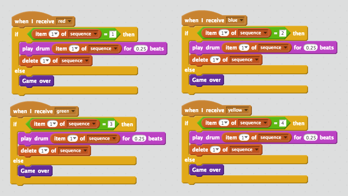

---
title: Memory
level: Scratch 2
language: ro-RO
stylesheet: scratch
embeds: "*.png"
materials: ["Club Leader Resources/*"]
...

## Community Contributed Project { .challenge .pdf-hidden }
Acest proiect a fost creat de către Erik și fiica sa Ruth. Dacă dorești să contribui cu un proiect [ia legătura cu noi pe Github] (https://github.com/CodeClub).

# Introducere { .intro }

În acest proiect vei crea un joc de memorie unde va trebui să memorezi și să repeți o secvență aleatorie de culori!

<div class="scratch-preview">
  <iframe allowtransparency="true" width="485" height="402" src="http://scratch.mit.edu/projects/embed/34874510/?autostart=false" frameborder="0"></iframe>
  
</div>

# Pasul 1: Culori aleatorii { .activity }

În primul rând haide să creăm un personaj care poate să-și schimbe la întâmplarea culoarea pentru ca un jucător să o memoreze.

## Lista de activități { .check }

+ Începe un nou proiect Scratch și șterge sprite-ul pisică. Poți găsi editorul de Scratch online la <a href="http://jumpto.cc/scratch-new">jumpto.cc/scratch-new</a>.

+ Alege un personaj și un fundal. Personajul tău nu trebuie să fie o persoană, dar trebuie să poată apărea în culori diferite.

	

+ În timpul jocului, vei asocia un număr diferit cu fiecare culoare:

	+ 1 = roșu;
	+ 2 = albastru;
	+ 3 = verde;
	+ 4 = galben.

	Pentru personaj creează patru costume diferite pentru fiecare dintre cele patru culori. Ai grijă să creezi costumele în ordinea corectă.

	

+ Pentru a crea o secvență aleatorie, trebuie să ai o __listă__. O listă este o variabilă care stochează o mulțime de date __în ordine__. Creează o listă nouă numită `sequence` {.blockdata}. Cum numai personajul tău trebuie să vadă lista, putem să facem click pe 'For this sprite only' (în traducere – ‘numai pentru sprite-ul acesta’).

	

	Acum poți să vezi o listă goală în colțul din stânga-sus a scenei. Deasemenea poți vedea multe blocuri noi pentru manipularea listelor.

	

+ Adaugă codul de mai jos la personajul tău. În felul acesta vei crea o listă cu 5 numere aleatorii și costumele lor:

	```blocks
		when flag clicked
		delete (all v) of [sequence v]
		repeat (5)
			add (pick random (1) to (4)) to [sequence v]
			switch costume to (item (last v) of [sequence v]
			wait (1) secs
		end
	```

	Observă că ai și golit lista la început.

## Provocare: Adaugă sunet {.challenge}
Testează proiectul de câteva ori. S-ar putea să vezi că uneori același număr a fost ales de câteva ori la rând. În felul acesta secvența este mai greu de memorat. Poți să creezi o lovitură de tobă de fiecare dată când personajul tău își schimbă costumul?

Poți să creezi un sunet diferit pentru fiecare număr care a fost ales? Codul aceasta va fi _foarte_ similar cu codul pe care l-ai scris pentru a schimba costumul personajului tău.

## Salvează proiectul { .save }

# Pasul 2: Repetă secvența { .activity }

Haide să adăugăm 4 butoane, pentru ca jucătorul să repete secvența pe care și-o amintește.

## Lista de activități { .check }

+ Adaugă 4 personaje (‘sprites’) la proiect, care vor deveni butoane. Editează cele 4 personaje, astfel încât să fie unul pentru fiecare 4 culori.

	

+ Când faci click pe toba roșie, va trebui să transmiți un mesaj pentru personajul tău, ca să-l anunți că s-a făcut click pe butonul roșu. Adaugă codul de mai jos pentru toba roșie:

	```blocks
		when this sprite clicked
		broadcast [red v]
	```

+ Când personajul tău recepționează mesajul, trebuie să verifice dacă numărul 1 este la început de listă (cea ce înseamnă că roșu este culoarea următoare din secvență). Dacă e correct, poți scoate numărul din listă, deoarece a fost ghicit corect. Dacă nu a fost ghicit corect jocul s-a terminat!

	```blocks
		when I receive [red v]
		if <(item (1 v) of [sequence v])=[1]> then
			delete (1 v) of [sequence v]
		else
			say [Game over!] for (1) secs
			stop [all v]
		end
	```

+ Ai putea afișa de asemenea unele lumini intermitente în momentul în care lista este goală, deoarece asta înseamnă că întreaga secvență a fost ghicită corect. Adaugă acest cod în scriptul personajului tău la sfârșitul blocului `when flag clicked` {.blockevents}:

	```blocks
		wait until < (length of [sequence v]) = [0]>
		broadcast [won v] and wait
	```

+ Click pe scenă și adaugă codul de mai jos pentru a schimba culoarea fundalului în momentul în care jucătorul a câștigat.

	```blocks
		when I receive [won v]
		play sound [drum machine v]
		repeat (50)
			change [color v] effect by (25)
			wait (0.1) secs
		end
		clear graphic effects
	```

## Provocare: Creează 4 butoane {.challenge}
Repetă pașii de mai sus pentru butonul albastru, cel verde și cel galben. Ce cod va rămâne nemodificat și ce cod se schimbă pentru fiecare buton?

Poți să adaugi sunete pentru momentul în care faci click pe butoane.

Nu uita să testezi codul pe care l-ai adăugat! Poți să memorezi o secvență de 5 culori? Este secvența diferită de fiecare dată?

## Salvează proiectul { .save }

# Pasul 3: Nivele multiple { .activity .new-page }

Până acum jucătorul are numai 5 culori de memorat. Haide să îmbunătățim jocul și să creăm secvențe mai lungi.

## Lista de activități { .check }

+ Creează o nouă variabilă numită `score` {.blockdata}.

	

+ Această variabilă `score` {.blockdata} va fi utilizată pentru a decide lungimea secvenței pe care jucătorul o are de memorat. Deci vom începe cu scorul (și lungimea secvenței) care va fi 3. Adaugă blocul de cod de mai jos la `when flag clicked` {.blockevents} în scriptul personajului:

	```blocks
		set [score v] to [3]
	```

+ În loc să ai o secvență de 5 culori tot timpul, vei vrea acum variabila `score` {.blockdata} să determine lungimea secvenței. Modifică ciclul `repeat` {.blockcontrol} al personajului (pentru a crea o secvență) cu:

	```blocks
		repeat (score)
		end
	```

+ Dacă secvența este ghicită corect, adaugă 1 la scor pentru a mări lungimea secvenței.

	```blocks
		change [score v] by (1)
	```

+ În final, trebuie să adaugi un ciclu `forever` {.blockcontrol} în jurul codului care generează o secvență pentru a avea o nouă secvență pe fiecare nivel nou. Codul ar trebui să arate ca cel de mai jos:

	```blocks
		when flag clicked
		set [score v] to [3]
		forever
			delete (all v) of [sequence v]
			repeat (score)
				add (pick random (1) to (4)) to [sequence v]
				switch costume to (item (last v) of [sequence v]
				wait (1) secs
			end
			wait until < (length of [sequence v]) = [0]>
			broadcast [won v] and wait
			change [score v] by (1)
		end
	```

+ Pune-ți prietenii să-ți testeze jocul. Adu-ți aminte să ascunzi lista `sequence` {.blockdata} înainte de ai lăsa să se joace!!

## Salvează proiectul { .save }

# Pasul 4: Cel mai mare scor { .activity }

Haide să salvăm cel mai mare scor pentru a te putea juca cu mai mulți prieteni.

## Lista de activități { .check }

+ Adaugă 2 variabile noi la proiect. Numeștele `high score` {.blockdata} și `name` {.blockdata}.

+ Dacă jocul se termină (apăsând o tastă greșită) trebuie să verifici dacă scorul jucătorului este mai mare decât cel mai mare scor curent. Dacă da, trebuie să salvezi scorul ca și cel mai mare scor înregistrat și să ții minte numele jucătorului. Cam așa ar trebui să arate codul pentru butonul roșu:

	```blocks
		when I receive [red v]
		if <(item (1 v) of [sequence v])=[1]> then
			delete (1 v) of [sequence v]
		else
			say [Game over!] for (1) secs
			if < (score) > (high score) > then
				set [high score v] to (score)
				ask [High score! What is your name?] and wait
				set [name v] to (answer)
			end
			stop [all v]
		end
	```

+ Vei avea nevoie să adaugi acest cod și la celelalte 3 butoane! Ai observant că codul pentru sfârșitul jocului este exact la fel pentru fiecare dintre cele 4 butoane?

	

+ Dacă vreodată vei avea nevoie să modifici acest cod, de exemplu dacă vrei să adaugi sunet sau să schimbi mesajul, va trebui să-l schimbi de 4 ori! Asta poate fi enervant și o pierdere de timp.

	În schimb, poți să-ți definești blocul tău pe care să-l reutilizezi în proiect! Pentru a face asta, click `more blocks` {.blockmoreblocks}, și apoi 'Make a block'. Numește acest nou bloc 'Game over'.

	

+ Adaugă codul din blocul `else` {.blockcontrol} din scriptul butonului roșu la noul bloc care apare:

	

+ Ai creat prima ta _ funcție _ numită `Game over` {.blockmoreblocks}, pe care o poți utiliza oriunde vrei. Copiază noul bloc `Game over` {.blockmoreblocks} în cele 4 scripturi pentru butoane.

	

+ Adaugă acum sunet când un buton greșit a fost apăsat. Trebuie să adaugi acest cod o singură data la blocul `Game over` {.blockmoreblocks} pe care l-ai creat anterior, și nu de 4 ori!

	

## Provocare: Creează mai multe blocuri {.challenge}
Ai remarcat dacă există și alt cod comun pentru cele 4 butoane?



Poți crea un nou bloc care va fi utilizat pentru fiecare buton?

## Salvează proiectul { .save }

## Provocare: Un nou costum {.challenge}
Ai remarcat că jocul începe cu personajul tău afișând una dintre cele 4 culori și va afișa întotdeauna ultima culoare afișată din secvență daca jucătorul repetă secvența?

Poți să adaugi un costum alb care va fi întotdeauna afișat la început de joc și când jucătorul încearcă să copieze secvența?


## Salvează proiectul { .save }

## Provocare: Nivel de dificultate {.challenge}
Poți să permiți unui jucător să aleagă între modurile 'ușor' (utilizând numai toba roșie și cea albastră) și cel 'normal' (care utilizează toate cele 4 tobe)?

Poți și să adaugi un mod 'greu', care va utiliza și o a cincea tobă!

## Salvează proiectul { .save }

