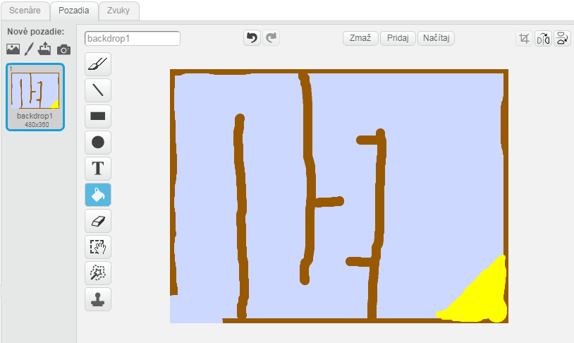
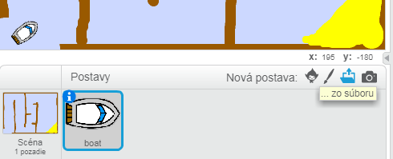
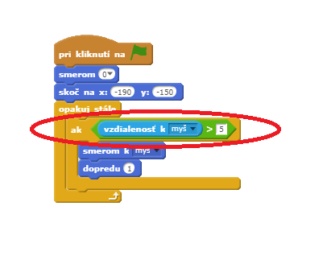
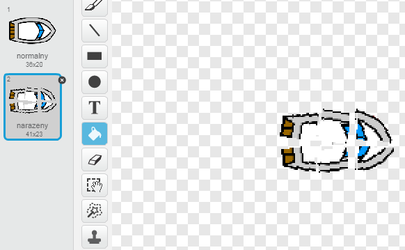
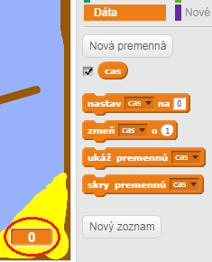
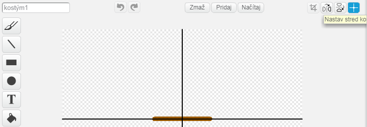
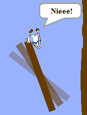
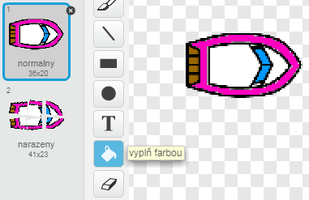

---
title: Preteky lodí
level: Scratch 1
language: sk-SK
stylesheet: scratch
embeds: "*.png"
materials: ["Club Leader Resources/*","Project Resources/*"]
...

# Úvod { .intro }

V tomto projekte sa naučíš ako vytvoriť hru, v ktorej budeš použitím myši navigovať loďku na pustý ostrov.

<div class="scratch-preview">
  <iframe allowtransparency="true" width="485" height="402" src="http://scratch.mit.edu/projects/embed/63957956/?autostart=false" frameborder="0"></iframe>
  
</div>

# 1. krok: Plánovanie hry { .activity }

## Zoznam úloh { .check }

+ Začni vytvorením nového Scratch projektu, v ktorom odstrániš postavu mačky, aby bol projekt prázdny. Do online Scratch editoru sa môžeš dostať kliknutím na <a  target="_blank" href="http://jumpto.cc/scratch-new">tento odkaz</a>.

+ Klikni na pozadie scény a vytvor si svoj level. Mal by si pridať tieto veci:
	+ Drevené steny, ktorým sa musí loďka vyhnúť;
	+ Pustý ostrov, na ktorý sa musí dostať.

	Takto by to malo vyzerať:

	 

# 2. krok: Ovládanie loďky { .activity }

## Zoznam úloh { .check }

+ Ak ti dal učiteľ zdrojový priečinok, klikni na ‘Načítaj postavu zo súboru’ a pridaj ‘boat.png’ obrázok. Mal by si natočiť, zmenšiť a dať postavu na začiatočnú pozíciu.

	

	Ak nemáš boat.png obrázok, môžeš si ho nakresliť.

+ Takto budeš ovládať loďku pomocou myši. Pridaj tento kód k postave loďky:

```blocks
po kliknutí na ⚑
natoč sa smerom (0 v)
choď na pozíciu x:(-190) y:(-150)
stále opakuj
	natoč sa ku [kurzor myši v]
	posuň sa o (1) krokov
end
```

+ Otestuj loďku kliknutím na vlajku a pohybom myši. Nasleduje loďka myš?
	

+ Čo sa stane, ak loďka dosiahne kurzor myši?

	Aby si to napravil, potrebuješ pridať `ak` {.blockcontrol} blok do svojho kódu. Loďka sa musí pohnúť len ak je vzdialená od kurzora viac ako 5 pixelov.

		

+ Otestuj loďku znova, aby si sa presvedčil, či je problém odstránený.

## Ulož svoj projekt { .save }

# 3. krok: Narazenie! { .activity .new-page }

Tvoja loďka sa môže plaviť cez drevené bariéry. Naprav to!

## Zoznam úloh { .check }

+ Budeš potrebovať 2 kostýmy pre tvoju loďku. Jeden normálny a jeden reprezentujúci poškodenú loďku. Skopíruj prvý kostým a pomenuj ich 'normalny' a 'narazeny'.

+ Klikni na 'normalny' kostým a vyber nástroj 'označ'. Rozkúskuj časti loďky a pridaj im aj rotáciu. Teraz loďka vyzerá ako po náraze. 

	

+ Pridaj tento kód k loďke, dovnútra `opakuj stále` {.blockcontrol} bloku. Zapríčiní to poškodenie keď sa loďka dotkne niektorej drevenej steny:

```blocks
ak <dotýka sa farby [#603C15]?> tak
	zmeň kostým na [narazeny v]
	hovor [Nieee!] ďalších (1) sekúnd
	zmeň kostým na [normalny v]
	natoč sa smerom (0 v)
	choď na pozíciu x:(-215) y:(-160)
end
```


Tento kód je vo vnútri `opakuj stále` {.blockcontrol} bloku, takže kód stále kontroluje, či loďka nenarazila.

+ Mal by si si byť istý, že tvoja loďka má stále na začiatku nastavený 'normalny' kostým.

	+ Teraz keď sa skúšaš plaviť pomedzi drevené bariéry, mal by si vidieť, že loďka sa po náraze vráti späť na štart.

	

## Ulož svoj projekt { .save }

## Výzva: Víťazstvo! {.challenge}
Dokážeš pridať ďalší  `ak` {.blockcontrol} blok do svojho kódu tak, aby hráč vyhral keď sa dostane na ostrov?

Keď loďka dosiahne žltý ostrov, mal by vyskočit text 'YEAH!' a potom by sa mala hra zastaviť. Potrebuješ k tomu tento kód:
```blocks
hovor [YEAH!] ďalších (1) sekúnd
zastav [všetko v]
```


## Ulož svoj projekt { .save }

## Výzva: Zvukové efekty {.challenge}
Môžeš pridať zvukové efekty do svojej hry, keď loďka narazí, alebo keď dosiahne ostrov na konci. Dokonca môžeš pridať hudbu do pozadia (pozri predchádzajúci projekt 'Rock Band', ktorý ti môže pomôcť).

## Ulož svoj projekt { .save }

# 4. krok: Preteky na čas { .activity }

Poďme pridať časovač do tvojej hry, aby hráč dosiahol ostrov čo najrýchlejšie.

## Zoznam úloh { .check }

+ Pridaj novú premennú `cas` {.blockdata} do tvojej scény. Môžeš taktiež zmeniť zobrazenie svojej premennej. Ak potrebuješ pomôcť, pozri sa na projekt 'Balloons'.

	

+ Pridaj tento kód do svojej  __scény__, aby časovač mohol počítať pokiaľ loďka nedosiahne ostrov:
```blocks
po kliknutí na ⚑
nastav [cas v] na [0]
stále opakuj
	počkaj (0.1) sekúnd
	zmeň [cas v] o (0.1)
end
```

+ To je všetko! Otestuj svoju hru a sleduj ako rýchlo dosiahneš ostrov!
	

## Ulož svoj projekt { .save }

# 5. krok: Prekážky a vylepšenia { .activity }

Táto hra je _príliš_ jednoduchá - poďme pridať doplnky, aby bola zaujímavejšia.

## Zoznam úloh { .check }

+ Najprv poďme pridať nejaké 'vylepšenia' do hry, ktoré zrýchlia loďku. Uprav scénu pozadia a pridaj nejaké biele zrýchľujúce šípky.

	

+ Teraz môžeš pridať kód do scény loďky k `opakuj stále` {.blockcontrol} bloku, ktorý pridá  2 _extra_ kroky keď sa loďka dotkne šípky.
```blocks
ak <dotýka sa farby [#FFFFFF]?> tak
	posuň sa o (3) krokov
end
```

+ Môžeš taktiež pridať rotačnú bránu, ktorej sa musí loďka vyhnúť. Pridaj novú postavu nazvanú 'brána', ktorá vyzerá nasledovne:

	

	Buď si istý, že farba brány je rovnaká ako drevené bariéry. 

+ Nastav stred brány.

	

+ Pridaj kód k tvojej bráne do `opakuj stále` {.blockcontrol} bloku, aby sa otáčala pomaly.

+ Otestuj hru. Mal by si tam mať otáčajúcu bránu, ktorej sa musíš vyhnúť. 

	

## Ulož svoj projekt { .save }

## Výzva: Viac prekážok! {.challenge .new-page}
Dokážeš pridať viac prekážok do svojej hry? Tu sú nejaké nápady:

+ Mohol by si pridať zelený sliz, ktorý spomalí hráča, keď sa ho dotkne. Môžeš na to použiť  `čakaj` {.blockcontrol} blok:
```blocks
počkaj (0.05) sekúnd
```


+ Môžeš pridať pohybujúce sa objekty ako napríklad žralok alebo poleno!


Tento blok ti môže pomôcť:
```blocks
posuň sa o (1) krokov
ak narazíš na okraj, odraz sa
```


Ak tvoj nový objekt nie je hnedý, budeš musieť pridať ku kódu loďky toto:

```blocks
ak <<dotýka sa farby [#603C15]?> alebo <dotýka sa [zralok v]?>> tak
end
```


## Ulož svoj projekt { .save }

## Výzva: Viac lodiek! {.challenge .new-page}
Dokážeš spustiť hru na závod pre 2 hráčov?

+ Skopíruj loďku, premenuj na 'Hráč 2' a zmeň jej farbu.



+ Zmeň začiatočnú pozíciu druhého hráča týmto kódom:

```blocks
choď na pozíciu x:(-190) y:(-150)
```

+ Zmaž kód, ktorý používa myš na ovládanie loďky:
```blocks
ak <(vzdialenosť od [kurzor myši v]) > [5]> tak
	natoč sa ku [kurzor myši v]
	posuň sa o (1) krokov
end
```

...a nahraď ho kódom, ktorý by ovládal loďku pomocou šípok.

Tento kód potrebuješ aby sa loďka hýbala dopredu:

```blocks
ak <je kláves [šípka hore v] stlačený?> tak
	posuň sa o (1) krokov
end
```

Takisto budeš potrebovať kód pre `zatočenie` {.blockmotion} loďky, keď stláčaš šípky vpravo a vľavo.

## Ulož svoj projekt { .save }

## Výzva: Viac levelov! {.challenge .new-page}
Dokážeš vytvoriť dodatočné pozadia, z ktorých by si mohol hráč vyberať?
```blocks
po stlačení klávesu [medzerník v]
nasledujúce pozadie
```

## Ulož svoj projekt { .save }
