---
title: Hovoriaci robot
level: Scratch 1
language: sk-SK
stylesheet: scratch
embeds: "*.png"
materials: ["Club Leader Resources/*"]
...

# Úvod{ .intro }

V tomto projekte sa naučíš ako naprogramovať svojho vlastného hovoriaceho robota!

<div class="scratch-preview">
  <iframe allowtransparency="true" width="485" height="402" src="http://scratch.mit.edu/projects/embed/26762091/?autostart=false" frameborder="0"></iframe>
  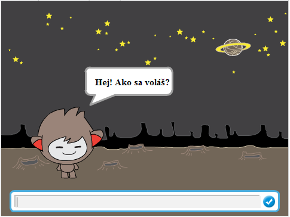
</div>

# 1.krok: Hovoriaci robot { .activity }

## Zoznam úloh { .check }

+ Predtým ako začneš vytvárať robota, potrebuješ vybrať jeho osobnosť. 
	+ Aké sú ich mená?
	+ Kde budú bývať?
	+ Sú šťastní, vážni, zábavní, plachí alebo priateľskí?

+ Začni vytvorením nového Scratch projektu, v ktorom odstrániš postavu mačky, aby bol projekt prázdny. Do online Scratch editoru sa môžeš dostať kliknutím na <a href="http://jumpto.cc/scratch-new">jumpto.cc/scratch-new</a>.

+ Vyber si jednu z týchto postáv a pridaj ju do projektu:

	

+ Vyber si pozadie, ktoré pasuje k osobnosti tvojho robota. Tu je príklad, hoci tvoj nemusí vyzerať rovnako:

	

## Ulož svoj projekt { .save }

# 2.krok: Rozprávajúci robot { .activity }

Teraz máš robota s osobnosťou, naprogramuj ho aby sa s tebou rozprával. 

## Zoznam úloh { .check }

+ Klikni na postavu robota a pridaj tento kód:

	```blocks
		po kliknutí na mňa
		spýtaj sa [Hej! Ako sa voláš?] a počkaj
		hovor [Aké pekné meno!] ďalších (2) sekúnd
	```

+ Klikni na robota a otestuj ho. Po tom, ako sa ťa spýta na meno, napíš ho do obdlžníka v spodnej časti pozadia.

	

+ Tvoj robot odpovie jednoducho `Aké pekné meno!` zakaždým. Môžeš ale zosobniť robotovu odpoveď použitím uživateľovej odpovede. Zmeň kód robota. Bude vyzerať takto:

	```blocks
		po kliknutí na mňa
		spýtaj sa [Hej! Ako sa voláš?] a počkaj
		hovor <spoj [Ahoj] a (odpoveď)> ďalších (2) sekúnd
	```

	Aby si vytvoril posledný blok, potrebuješ presunúť zelený `spoj` {.blockoperators} blok, a vložiť ho do  `hovor` {.blocklooks} bloku.

	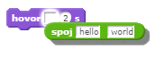

	Potom môžeš zmeniť text  `hello` na `Ahoj`, a presunúť svetlo modrý blok `odpoveď` {.blocksensing}  (zo 'zisťovacej' sekcie) do textu `world`.

	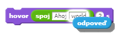

+ Otestuj tento nový program. Funguje ako by si očakával? Môžeš odstrániť nejaké problémy, ktoré nastali?  

+ Používateľské meno si môžeš uložiť do premennej, aby si ho mohol neskôr opätovne použiť. Vytvor novú premennú `meno` {.blockdata}. Ak si zabudol ako to spraviť, projekt 'Balóny' ti pomôže.

+ Informácia, ktorú si vložil je už uložená v premennej `odpoved` {.blocksensing}. Choď do zisťovacej skupiny blokov a zaškrtni štvorček vedľa premennej. Aktuálna hodnota v premennej `odpoved` {.blocksensing} by mala byť zobrazená v ľavom hornom rohu.

+ Už keď si raz vytvoril novú premennú, musíš si byť istý, že tvoj kód robota vyzerá takto:

	```blocks
		po kliknutí na mňa
		spýtaj sa [Hej! Ako sa voláš] a počkaj
		nastav [meno v] na (odpoveď)
		hovor <spoj [Ahoj] a (meno)> ďalších (2) sekúnd
	```

+ Ak otestuješ svoj program ešte raz, zbadáš, že odpoveď je uložená v premennej `meno` {.blockdata} a je zobrazená v hornom ľavom rohu pozadia. Premenná `meno` {.blockdata} by mala teraz obsahovať rovnakú hodnotu ako premenná `odpoved` {.blocksensing} .

	

	Ak však nechceš vidieť premenné na tvojom pozadí, môžeš odkliknúť zaškrtávacie pole vedľa premennej v bloku 'Scenáre' a skryť ju.

## Ulož svoj projekt { .save }

## Výzva: Viacero otázok { .challenge }

Naprogramuj robota, aby sa spýtal ďalšiu otázku. Vieš uložiť odpoveď do premennej?

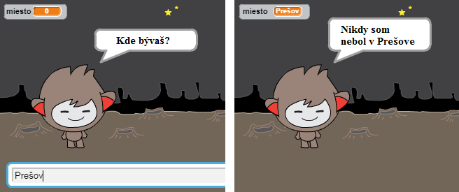

## Ulož svoj projekt { .save }

# 3.krok: Robenie rozhodnutí { .activity }

Môžeš naprogramovať robota aby sa sám rozhodol čo spraviť, len na základe používateľových odpovedí.

## Zoznam úloh { .check }

+ Poďme vytvoriť robota, ktorý by sa spýtal otázku na ktorú sa dá odpovedať buď `áno` alebo `nie`. Tu je príklad, ale pokiaľ chceš, tak môžeš zmeniť otázku:

	```blocks
		po kliknutí na mňa
		spýtaj sa [Hej! Ako sa voláš] a počkaj
		nastav [meno v] na (odpoveď)
		hovor <spoj [Ahoj] a (meno)> ďalších (2) sekúnd
		spýtaj sa <spoj [Cítiš sa dobre] a (meno)> a počkaj
		ak ((odpoveď) = [áno]) tak
		   hovor [To je výborne!] ďalších (2) sekúnd
		end


	```

	Pozri, teraz si uložil užívateľovo meno do premennej. Môžeš ju teraz použiť koľkokrát chceš. 

+ Aby si otestoval program správne, potrebuješ ho otestovať dvakrát - raz napíšeš odpoveď `nie` a raz odpoveď `áno`. Mal by si dostať odpoveď od robota len `ak` {.blockcontrol} tvoja odpoveď bola `áno`.

+ Problém s robotom je ale taký, že nedá žiadnu odpoveď, ak používateľova odpoveď je `nie`. Vyriešiš to tak, že zmeníš `ak` {.blockcontrol} blok na `ak/inak` {.blockcontrol} blok, takže tvoj kód teraz vyzerá takto:

	```blocks
		po kliknutí na mňa
		spýtaj sa [Hej! Ako sa voláš] a počkaj
		nastav [meno v] na (odpoveď)
		hovor <spoj [Ahoj] a (meno)> ďalších (2) sekúnd
		spýtaj sa <spoj [Cítiš sa dobre] a (meno)> a počkaj
		ak ((odpoveď) = [áno]) tak
		   hovor [To je výborne!] ďalších (2) sekúnd
		inak
		   hovor [Ó nie!] ďalších (2) sekúnd
		end


	```

+ Ak otestuješ svoj kód, uvidíš, že si dostal odpoveď keď si odpovedal  `áno` alebo `nie`. Tvoj robot by mal odpovedať `To je výborne!` pokiaľ je tvoja odpoveď `áno`, ale odpovie `Ó nie!` ak napíšeš hocičo iné okrem `áno` .

	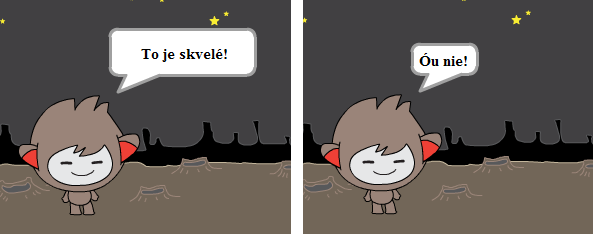

+ Môžeš vložiť hocijaký kód dovnútra `ak` {.blockcontrol} alebo `inak` {.blockcontrol} bloku, nie len kód, pomocou ktorého tvoj robot rozpráva. Napríklad, môžeš zmeniť jeho oblečenie na základe odpovede.

	Ak si pozrieš kostýmy robota, môžeš vidieť, že ich má viacero k dispozícií.  (Ak nie, môžeš mu vždy nejaké pridať!)

	

	Tieto kostýmy môžeš použiť vrámci jeho odpovede, pridaním tohto kódu:

	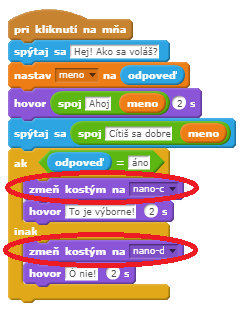

+ Otestuj program a mal by si vidieť, že robotov výraz sa mení na základe odpovede, ktorú zadáš.

	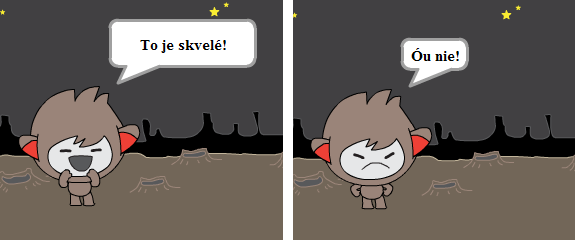

## Ulož svoj projekt { .save }

## Výzva: Viacero rozhodnutí { .challenge }

Naprogramuj robota, aby sa spýtal ďalšiu otázku - niečo podobné ako odpovede `áno` alebo `nie`. Dokážeš odpovedať na jeho otázku?

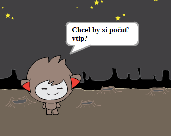

## Ulož svoj projekt { .save }

# 4.krok: Zmena priestoru { .activity }

Môžeš tiež naprogramovať robota tak, aby zmenil svoj priestor.

## Zoznam úloh { .check }

+ Pridaj ďalšie pozadie do tvojej scény, napríklad pozadie 'mesiaca'.

	

+ Teraz naprogramuj robota aby zmenil priestor pridaním tohto kódu k robotovi:

	```blocks
		spýtaj sa [Idem na Mesiac. Chceš ísť so mnou?] a počkaj
		ak ((odpoveď) = [áno]) tak
		   zmeň pozadie na [mesiac v]
		end


	```

+ Potrebuješ si byť istý, že tvoj robot je mimo, keď sa s ním začínaš rozprávať. Pridaj tento blok na vrch ku kódu tvojho robota:

	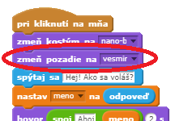

+ Otestuj program a odpovedz `áno` aby si sa dostal na mesiac. Uvidíš, že pozadie robota sa zmení.

	

+ Zmení sa pozadie robota, ak napíšeš `nie`? Čo ak napíšeš `Nie som si istý`?

+ Môžeš pridať tento kód dovnútra tvojho `ak` {.blockcontrol} bloku, aby tvoj robot skákal hore dolu 4 krát, ak odpoveď je `áno`:

	```scratch
	opakuj (4) krát
	   zmeň y o (10)
	   počkaj (0.1) sekúnd
	   zmeň y o (-10)
	   počkaj (0.1) sekúnd
	end


	```

	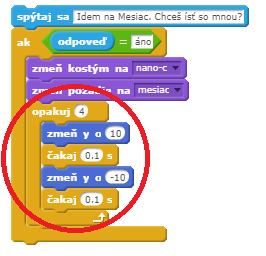

+ Otestuj svoj kód ešte raz. Skáče robot hore dolu ak odpovieš `áno`?

## Ulož svoj projekt { .save }

## Výzva: Vytvor si svojho vlastného hovoriaceho robota {.challenge}
Použi všetko, čo si sa naučil pre ukončenie práce s interaktívnym robotom. Tu sú nejaké nápady:

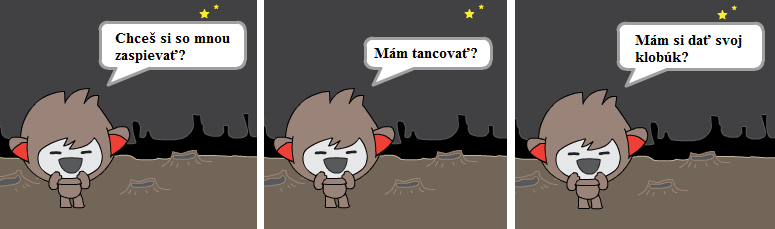

Akonáhle si už ukončil svoju prácu s robotom, nechaj svojich priateľov, nech s nim konverzujú! Páči sa im tvoja povaha? Zbadali nejaké problémy?

## Ulož svoj projekt { .save }
