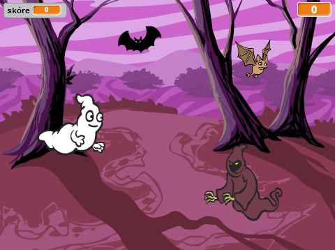
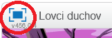
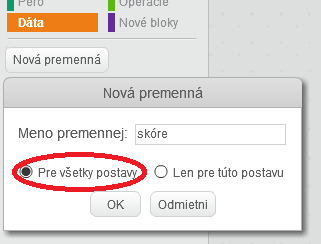
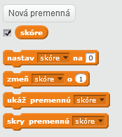
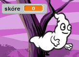
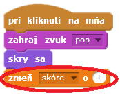
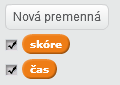
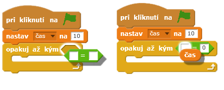
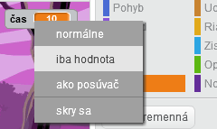

---
title: Lovci duchov
level: Scratch 1
language: sk-SK
stylesheet: scratch
embeds: "*.png"
materials: ["Club Leader Resources/*"]
...

## Poznámka: { .challenge .pdf-hidden }
Projekt 'Balóny' bol presunutý do sekcie [Ďalšie Scratch projekty](http://projects.codeclub.org.uk/en-GB/03_scratch_bonus/index.html).

# Úvod { .intro }

Chystáš sa urobiť hru na chytanie duchov!

<div class="scratch-preview">
  <iframe allowtransparency="true" width="485" height="402" src="http://scratch.mit.edu/projects/embed/60787262/?autostart=false" frameborder="0"></iframe>
  
</div>

# 1. krok: Animácia ducha { .activity }

## Zoznam úloh { .check }

+ Začni vytvorením nového _Scratch_ projektu, v ktorom vymažeš postavu mačky, tak aby bol tvoj projekt prázdny. Online editor môžeš nájsť na stránke <a href="http://jumpto.cc/scratch-new">jumpto.cc/scratch-new</a>.

+ Pridaj postavu ducha a vhodnú scénu.

	

+ Pridaj nasledujúci kód k duchovi, tak aby sa opakovane objavoval a mizol:

	```blocks
		po kliknutí na ⚑
		stále opakuj
			skry sa
			počkaj (1) sekúnd
			ukáž sa
			počkaj (1) sekúnd
		end
	```

+ Otestuj svojho ducha kliknutím na zelenú vlajku.

## Ulož svoj projekt { .save }

# 2. krok: Náhodní duchovia { .activity }

Tvojho ducha je naozaj ľahké chytiť, pretože sa nepohybuje!

## Zoznam úloh { .check }

+ Namiesto státia na tej istej pozícii, môžeš nechať _Scratch_ vybrať náhodné súradnice pre _x_ a _y_. Pridaj tento blok `choď na pozíciu` {.blockmotion} ku kódu ducha, tak aby to vyzeralo nasledovne: 

	```blocks
		po kliknutí na ⚑
		stále opakuj
			skry sa
			počkaj (1) sekúnd
			choď na pozíciu x:(vyber náhodné číslo od (-150) do (150)) y:(vyber náhodné číslo od (-150) do (150))
			ukáž sa
			počkaj (1) sekúnd
		end
	```

+ Znova otestuj svojho ducha a všimni si, že sa zakaždým objavuje na inom mieste.

## Ulož svoj projekt { .save }

## Výzva: Väčšia náhodnosť {.challenge}
Dokážeš nastaviť ducha pomocou bloku `čakaj` {.blockcontrol} tak, aby čakal náhodne dlhý čas, kým sa objaví? Môžeš použiť blok `nastav veľkosť na` {.blocklooks}, aby mal duch zakaždým inú veľkosť?

## Ulož svoj projekt { .save }

# 3. krok: Chytanie duchov { .activity }

Umožni hráčovi chytať duchov!

## Zoznam úloh { .check }

+ Aby hráč mohol chytiť ducha, pridaj nasledujúci kód:

	```blocks
		po kliknutí na mňa
		skry sa
	```

+ Otestuj svoj projekt. Dokážeš chytiť duchov, keď sa objavia? Ak sa ti zdá chytanie duchov náročné, môžeš si hru spustiť na celej obrazovke pomocou tohto tlačidla:

	

## Výzva: Pridanie zvuku { .challenge }
Dokážeš pridať zvuk, ktorý sa prehrá vždy, keď chytíš ducha?

## Ulož svoj projekt { .save }

# 4. krok: Pridanie skóre { .activity .new-page }

Urob hru zaujímavejšou pridaním počítania skóre.

## Zoznam úloh { .check }

+ Na uchovanie skóre hráča potrebuješ miesto, kde ho uložíš. __Premenná__ je miesto na ukladanie údajov, ktoré sa môžu meniť, ako skóre.

	Na vytvorenie novej premennej klikni na záložku 'Scenáre', vyber `Dáta` {.blockdata} a klikni na 'Nová premenná'.

	

	Napíš 'skóre' ako meno premennej. Zvoľ túto premennú dostupnú 'Pre všetky postavy' a klikni 'OK' na jej vytvorenie. Následne uvidíš množstvo blokov kódu, ktoré môžeš využívať na prácu s touto premennou `skóre` {.blockdata}.

	

	Skóre uvidíš v ľavom hornom rohu scény. 

	

+ Po štarte novej hry (po kliknutí na zelenú vlajku) musíš skóre nastaviť na 0:

	```blocks
	po kliknutí na ⚑
	nastav [skóre v] na [0]
	```

+ Akonáhle chytíš ducha, je potrebné zvýšiť skóre o 1:

	

+ Zahraj si hru a pochytaj pár duchov. Zmenilo sa tvoje skóre? 

## Ulož svoj projekt { .save }

# 5. krok: Pridanie časovača { .activity }

Môžeš urobiť hru ešte zaujímavejšou tým, že hráčovi dáš iba 10 sekúnd na chytenie čo najväčšieho počtu duchov. 

## Zoznam úloh { .check }

+ Použi ďalšiu premennú na uchovanie zostávajúceho času. Vytvor novú premennú nazvanú 'čas':

	

+ Časovač by mal pracovať takto:

	+ Časovač by mal začať na 10 sekundách;
	+ Časovač by mal odpočítavať po sekundách;
	+ Hra by sa mala zastaviť, keď časovač dosiahne 0.

	Tu je kód, ktorý to vykoná. Pridaj ho do svojej __Scény__:

	```blocks
		po kliknutí na ⚑
		nastav [čas v] na [10]
		opakuj pokiaľ nenastane <(čas) = [0]>
			počkaj (1) sekúnd
			zmeň [čas v] o (-1)
		end
		zastav [všetko v]
	```

	Tu vidíš ako pridať kód `opakuj pokiaľ nenastane`{.blockcontrol}`čas`{.blockdata}`= 0`{.blockoperators}:

	

+ Presuň premennú 'čas' do pravého horného rohu scény. Môžeš kliknúť na premennú pravým tlačidlom myši a vybrať 'iba hodnota' na zmenu jej zobrazenia.

	

+ Požiadaj svojho kamaráta, aby tvoju hru otestoval. Aké bolo jeho skóre? Ak je tvoja hra príliš ľahká, môžeš:

	+ Dať hráčovi menej času;
	+ Nechať duchov objavovať sa menej často;
	+ Urobiť menších duchov.

	Otestuj hru viac krát, kým nie si spokojný s nastavením obtiažnosti. 

## Ulož svoj projekt { .save }

## Výzva: Viac objektov {.challenge}
Môžeš do hry pridať ďalšie objekty?


Popremýšľaj o objektoch, ktoré pridáš: 

+ Aký je veľký?
+ Bude sa objavovať menej často alebo častejšie než duchovia?
+ Aký bude vydávať zvuk pri chytení?
+ Koľko skóre ti jeho chytenie pripočíta alebo odpočíta?

Ak potrebuješ pomoc pri pridávaní ďalšieho objektu, môžeš použiť vyššie uvedené kroky.

## Ulož svoj projekt { .save }
