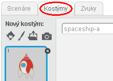
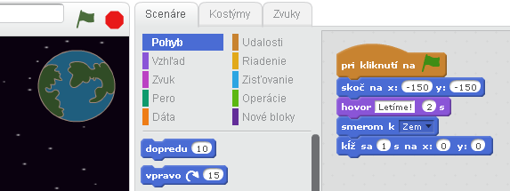
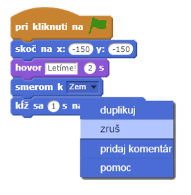
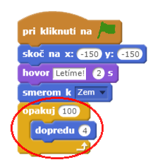
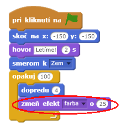
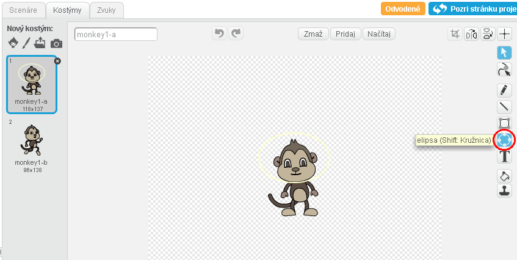
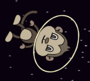
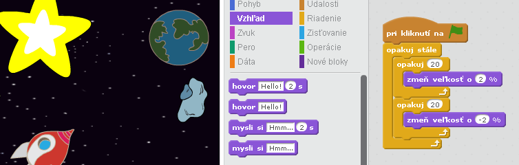

---
title: Stratený vo vesmíre
level: Scratch 1
language: sk-SK
stylesheet: scratch
embeds: "*.png"
materials: ["Club Leader Resources/*"]
...

# Úvod { .intro }

Ideš sa naučiť ako naprogramovať vlastnú animáciu. 

<div class="scratch-preview">
  <iframe allowtransparency="true" width="485" height="402" src="http://scratch.mit.edu/projects/embed/26818098/?autostart=false" frameborder="0"></iframe>
  
</div>

# 1. krok: Animácia vesmírnej lode { .activity .new-page}

Urob vesmírnu loď, ktorá letí smerom k Zemi!

## Zoznam úloh { .check }

+ Začni vytvorením nového _Scratch_ projektu, v ktorom vymažeš postavu mačky, tak aby bol tvoj projekt prázdny. Online editor môžeš nájsť na stránke <a href="http://jumpto.cc/scratch-new">jumpto.cc/scratch-new</a>.

+ Pridaj postavy vesmírnej lode (ang. 'spaceship') a Zeme (ang. 'earth') na svoju scénu. Taktiež pridaj hviezdy (ang. 'stars') ako pozadie. Tvoja scéna by mala vyzerať takto:

	

+ Klikni na postavu vesmírnej lode a potom na záložku 'Kostýmy'.

	

+ Pomocou nástroja šípky označ obrázok. Následne otoč obrázok na stranu.

	

+ Pridaj tento kód k postave vesmírnej lodi: 

	

	Zmeň čísla v blokoch kódu na čísla, ktoré sú znázornené na obrázku vyššie.

+ Klikni na blok kódu, čím ho spustíš. Mal by si sledovať ako sa vesmírna loď otáča a pohybuje smerom k stredu scény.

	

	Pozície `x:(0) y:(0)` {.blockmotion} označujú stred scény. Pozície `x:(-150) y:(-150)` {.blockmotion} označujú roh scény vľavo dole a pozície `x:(150) y:(150)` {.blockmotion} vpravo hore.

	

	Ak chceš vedieť súradnice bodu na scéne, presuň sa myšou na túto pozíciu a poznač si súradnice zobrazené pod scénou.

	

+ Vyskúšaj svoju animáciu. Klikni na zelenú vlajku priamo nad scénou.

	

## Výzva: Zlepšenie animácie {.challenge}
Zmeň čísla vo svojom kóde pre animáciu:
+ Nech sa vesmírna loď pohybuje až kým sa nedotkne Zeme.
+ Nech vesmírna loď pri pohybe k Zemi spomaľuje.

Budeš musieť zmeniť čísla v tomto bloku:

```blocks
	(1) sekúnd sa presúvaj na pozíciu x:(0) y:(0)
```

## Ulož svoj projekt { .save }

# 2. krok: Animácia pomocou cyklu { .activity .new-page }

Iným spôsobom ako animovať vesmírnu loď je prikázať jej, aby sa pohybovala po malých častiach viac krát za sebou.

## Zoznam úloh { .check }

+ Vymaž blok kódu `presúvaj sa na pozíciu` {.blockmotion}. Klikni pravým tlačidlom myši na blok kódu a vyber 'zruš'. Vymazať blok kódu môžeš aj jeho presunutím preč z oblasti pre kód do oblasti pre bloky.

	

+ Pridaj nasledujúcu časť namiesto vymazaného kódu:

	

	Blok `opakuj` {.blockcontrol} sa používa na opakovanie niečoho veľa krát a je tiež známy ako __cyklus__.

+ Vyskúšaj svoj kód kliknutím na zelenú vlajku. Mal by si vidieť, že sa vesmírna loď pohybuje rovnako ako predtým.

+ Do cyklu môžeš pridať viac blokov, čím urobíš hru zaujímavejšou. Pridaj do cyklu blok `zmeň efekt farba o 25` {.blocklooks} (zo sekcie 'Vzhľad') na opakované menenie farby vesmírnej lode počas pohybu:

	

+ Klikni na vlajku, aby si vyskúšal animáciu.

	

+ Urob svoju vesmírnu loď menšou, čím viac sa bude približovať k Zemi.

	

+ Otestuj svoju animáciu. Čo sa stane, ak klikneš na zelenú vlajku druhý krát? Štartuje tvoja vesmírna loď vo správnej veľkosti? Môžeš použiť nasledujúci blok na opravu animácie:

	```scratch
	nastav veľkosť na (100)%
	```

## Ulož svoj projekt { .save }

# 3. krok: Vznášajúca sa opica { .activity .new-page }

Pridaj do svojej animácie opicu, ktorá sa stratila vo vesmíre! 

## Zoznam úloh { .check }

+ Začni pridaním postavy opice (ang. monkey) z knižnice.

	

+ Ak klikneš na novú postavu opice a následne na 'Kostýmy', môžeš zmeniť to, ako opica vyzerá. Klikni na nástroj 'elipsa' a nakresli bielu helmu okolo hlavy opice.

	

+ Teraz klikni na 'Scenáre' a pridaj túto časť kódu k opici, aby sa stále  pomaly otáčala:

	```blocks
		po kliknutí na ⚑
		stále opakuj
		    otoč sa o ↻ (1) stupňov
		end
	```

	Blok `opakuj stále` {.blockcontrol} je cyklus, ktorý ale nikdy nekončí.

+ Otestuj postavu opice kliknutím na zelenú vlajku. Na ukončenie animácie klikni na červené tlačidlo vedľa vlajky.

	

# 4. krok: Odrážajúce sa asteroidy { .activity .new-page }

Pridaj do svojej animácie pár vznášajúcich sa vesmírnych kameňov.

## Zoznam úloh { .check }

+ Pridaj kameň (v ang. 'rock') do svojej animácie.

	

+ Pridaj k postave kameňa tento kód, aby sa kameň odrážal od okrajov scény:

	```scratch
	po kliknutí na ⚑
	natoč sa ku [Zem v]]
	stále opakuj
		posuň sa o (2) krokov
		ak narazíš na okraj, odraz sa
	```

+ Klikni na vlajku, aby si otestoval asteroid. Odráža sa od okrajov scény?

# 5. krok: Žiariace hviezdy { .activity .new-page }

Nakombinuj cykly, aby si vytvoril žiariace hviezdy.

## Zoznam úloh { .check }

+ Pridaj hviezdu (v ang. 'star') do svojej animácie.

	

+ Pridaj k postave hviezdy tento kód:

	

+ Otestuj svoju animáciu kliknutím na zelenú vlajku. Čo robí kód? Hviezda sa 20 krát zväčší a potom sa 20 krát zmenší na pôvodnú veľkosť. Tieto dva cykly sú vnútri cyklu `opakuj stále` {.blockcontrol}, takže sa animácia stále opakuje.

## Ulož svoj projekt { .save }

## Výzva: Vytvor svoju vlastnú animáciu {.challenge}
Zastav animáciu a klikni na 'Súbor', potom na 'Nový' na vytvorenie nového projektu.

Použi to, čo si sa naučil v tomto projekte, aby si vytvoril vlastnú animáciu. Môže to byť čokoľvek. Tu je pár príkladov:


## Ulož svoj projekt { .save }
