---
title: Skicár
level: Scratch 1
language: sk-SK
stylesheet: scratch
embeds: "*.png"
materials: ["Club Leader Resources/*","Project Resources/*"]
...

# Úvod { .intro }

V tomto projekte si vytvoríš svoj vlastný program na kreslenie!

<div class="scratch-preview">
  <iframe allowtransparency="true" width="485" height="402" src="http://scratch.mit.edu/projects/embed/63473366/?autostart=false" frameborder="0"></iframe>
  
</div>

# 1.krok: Vytvorenie ceruzky { .activity }

Vytvor ceruzku, ktorou budeš môcť kresliť na scénu.

## Zoznam úloh { .check }

+ Začni vytvorením nového _Scratch_ projektu, v ktorom vymažeš postavu mačky, aby bol tvoj projekt prázdny. Online editor môžeš nájsť na stránke <a target="_blank" href="http://jumpto.cc/scratch-new">jumpto.cc/scratch-new</a>.

+ Pridaj ceruzku do svojho projektu.

	 

+ Klikni na 'Kostýmy' a vymaž kostým 'pencil-b'.

	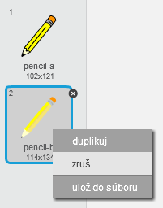 

+ Premenuj kostým na 'ceruzka-modrá' a použi nástroj 'vyfarbi útvar' na zafarbenie ceruzky na modro. 

	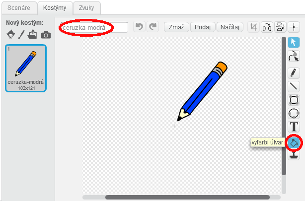 

+ Na kreslenie budeš používať myš. Aby ceruzka neustále nasledovala myš, použi blok `stále opakuj` {.blockcontrol} a vlož tento kód k ceruzke:

	```blocks
		po kliknutí na ⚑
		stále opakuj
		  choď na [myš v]
		end
	```

+ Vyskúšaj svoj kód kliknutím na zelenú vlajku a pohybovaním myši po scéne. Funguje to ako si očakával?

+ Všimol si si, že myš nasleduje stred ceruzky a nie jej špičku?

	

	Aby si to napravil, klikni na kostým 'ceruzka-modrá' a následne klikni na 'Nastav stred kostýmu'.

	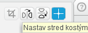

+ Všimni si krížik, ktorý sa objavil na kostýme. Klikni tesne pod špičku ceruzky, čím nastavíš tento bod ako stred kostýmu.

	

+ Klikni na záložku 'Scenáre' a vyskúšaj ceruzku znova. Funguje lepšie než predtým?

+ Teraz nechaj ceruzku kresliť, `ak` {.blockcontrol} je stisnuté tlačidlo myši. Tento kód pridaj k postave ceruzky:

	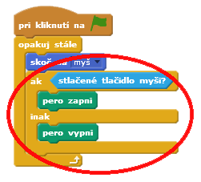	

+ Znova otestuj svoj kód. Tentokrát pohybuj myšou po scéne so stlačeným tlačidlom. Dokážeš kresliť so svojou ceruzkou?

	

## Ulož svoj projekt { .save }

# 2. krok: Farbičky { .activity }

Pridaj do svojho projektu ceruzky rôznych farieb, aby si používateľ mohol medzi nimi vyberať!

## Zoznam úloh { .check }

+ Klikni na postavu ceruzky, potom na 'Kostýmy' a duplikuj kostým 'ceruzka-modrá'.

	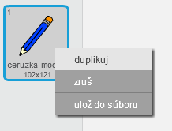

+ Premenuj nový kostým na 'ceruzka-zelená' a vymaľuj ju na zeleno.

	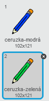

+ Vytvor dve nové postavy, ktoré budú slúžiť na výber modrej a zelenej ceruzky.

	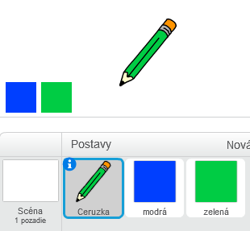

+ Keď klikneš na zelené tlačidlo, `pošli všetkým správu` {.blockevents}, na ktorú zareaguje ceruzka a zmení farbu kostýmu.

	Najprv pridaj tento kód k zelenému tlačidlu:

	```blocks
		po kliknutí na mňa
		pošli všetkým správu [zelená v]
	```

	Keď chceš vytvoriť blok `pošli všetkým správu` {.blockevents}, klikni na šípku dole a zvoľ 'nová správa...'.

	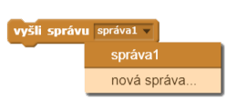

	Potom môžeš napísať 'zelená' na vytvorenie novej správy.

	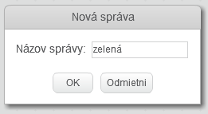

+ Teraz môžeš povedať postave ceruzky čo má urobiť, ak takúto správu dostane. Nasledujúci kód vlož k postave ceruzky:

	```blocks
		po obdržaní správy [zelená v]
		zmeň kostým na [ceruzka-zelená v]
		nastav farbu pera na [#00ff00]
	```

	Pre nastavenie farby v bloku, klikni na farebný štvorček v bloku `nastav farbu pera` {.blockpen} a následne klikni na zelené tlačidlo v scéne, aby sa nastavila rovnaká farba.

+ Teraz môžeš urobiť to isté pre modré tlačidlo pridaním nasledujúceho kódu k modrému tlačidlu:

	```blocks
		po kliknutí na mňa
		pošli všetkým správu [modrá v]
	```

	...a pridaním tohto kódu k postave ceruzky:

	```blocks
		po obdržaní správy [modrá v]
		zmeň kostým na [ceruzka-modrá v]
		nastav farbu pera na [#0000ff]
	```

+ Nakoniec potrebuješ povedať svojej ceruzke, aký kostým a farbu má zvoliť pri zmazaní plochy a začatí nového projektu. Pridaj tento kód na začiatok kódu ceruzky za blok `po kliknutí na ⚑` {.blockevents} (pred cyklus  `stále opakuj` {.blockcontrol}):

	```blocks
		zmaž plochu
		zmeň kostým na [ceruzka-modrá v]
		nastav farbu pera na [#0000ff]
	```

	Ak chceš, môžeš si na začiatok zvoliť aj inú farbu ceruzky!

+ Vyskúšaj svoj projekt. Môžeš prepínať medzi modrými a zelenými ceruzkami?

	

## Ulož svoj projekt { .save }

# 3. krok: Chyby { .activity .new-page }

Niekedy sa stávajú chyby, preto pridaj do svojho projektu tlačidlo 'zmazať' a gumu!

## Zoznam úloh { .check }

+ Pridaj tlačilo na vymazanie plochy scény. Urobíš to pridaním písmena X s názvom postavy 'X-block' na scénu a zafarbením ho na červeno.

	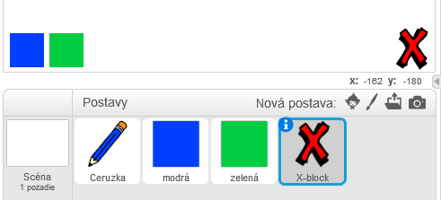

+ Pridaj nasledujúci kód k svojmu novému tlačidlu na vymazávanie plochy po jeho kliknutí.

	```blocks
		po kliknutí na mňa
		zmaž plochu
	```

	Všimni si, že na vyčistenie plochy nepotrebuješ posielať správu ako tomu bolo predtým.

+ Vytvor gumu. Ak ti tvoj vedúci klubu dal zdrojový priečinok, klikni na načítanie '...zo súboru' a pridaj obrázok 'eraser.svg'.

	
	
	Ak obrázok 'eraser.svg' nemáš, nakresli si namiesto toho novú bielu ceruzku!

+ Do scény pridaj svoj obrázok gumy aj tlačidla 'zmazať'. Tvoja scéna by mala vyzerať takto:

	

+ K postave gumy pridaj nasledujúci kód, aby si povedal ceruzke, že sa má zmeniť na gumu.

	```blocks
		po kliknutí na mňa
		pošli všetkým správu [guma v]
	```

+ Keď ceruzka dostane túto správu, môžeš z nej urobiť gumu zmenením kostýmu na kostým gumy a zmenou farby na rovnakú farbu ako má scéna!

	```blocks
		po obdržaní správy [guma v]
		zmeň kostým na [guma v]
		nastav farbu pera na [#FFFFFF]
	```

+ Otestuj svoj projekt, aby si videl či guma a vyčistenie plochy scény fungujú.

	

+ Je tu ešte jeden problém s ceruzkou. Teraz dokážeš kresliť kdekoľvek na scéne, vrátane tlačidiel na výber farby!

	

	Na napravenie tohto problému musíš povedať ceruzke, aby kreslila iba ak je stlačené tlačidlo myši _a_ ak je y-pozícia myši väčšia ako -120 (`súradnica myši y`{.blocksensing}`> -120`{.blockoperators}). Zmeň blok `ak` {.blockcontrol} ceruzky takto:

	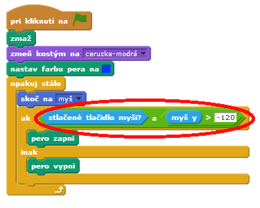

+ Otestuj svoj projekt. Teraz by si nemal byť schopný kresliť v blízkosti tlačidiel pre výber.

	

## Ulož svoj projekt { .save }

# 4. krok: Zmena šírky ceruzky { .activity .new-page }

Umožni používateľovi kresliť rôzne hrubou ceruzkou.

## Zoznam úloh { .check }

+ Najprv pridaj novú premennú s názvom 'šírka'. Ak nevieš ako, pozri si projekt 'Lovci duchov', ktorý by ti mohol pomôcť.

+ Pridaj tento riadok _dovnútra_ cyklu `stále opakuj` {.blockcontrol} v kóde ceruzky:

	```blocks
		nastav hrúbku pera na (šírka)
	```

	Tvoja hrúbka ceruzky sa teraz bude opakovane nastavovať na hodnotu premennej 'šírka'.

+ Môžeš meniť číslo uložené v premennej kliknutím pravým tlačidlom myši na premennú v scéne a vybratím 'ako posúvač'.

	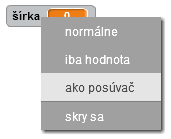

	Teraz môžeš potiahnutím posuvníka pod premennou zmeniť jej hodnotu.

	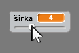

+ Vyskúšaj projekt a sleduj, či dokážeš zmeniť hrúbku ceruzky.

	

	Ak chceš, môžeš nastaviť minimálnu a maximálnu hodnotu šírky ceruzky. Ak to chceš urobiť, klikni pravým tlačidlom myši na premennú a vybratím 'nastav min a max posúvača'. Nastav minimálnu a maximálnu hodnotu premennej na niečo rozumnejšie, ako 1 a 20.

	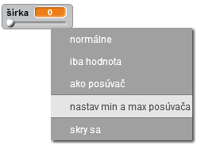

	Pokračuj v testovaní premennej šírky, kým nebudeš spokojný.

## Ulož svoj projekt { .save }

## Výzva: Skratky { .challenge }
Môžeš si vytvoriť klávesové skratky pre nejaký príkaz. Napríklad:

+ m = prepnutie na modrú ceruzku
+ z = prepnutie na zelenú ceruzku
+ g = zmena ceruzky na gumu
+ x = vymazanie plochy

Môžeš dokonca dovoliť používateľovi zmeniť šírku ceruzky pomocou šípok na klávesnici!

## Ulož svoj projekt { .save }

## Výzva: Viac ceruziek { .challenge }
Môžeš pridať červenú, žltú, čiernu ceruzku do svojho projektu. Nezabudni k nim pridať aj klávesové skratky!

Dokážeš použiť svoje farebné ceruzky na kreslenie obrázkov?


