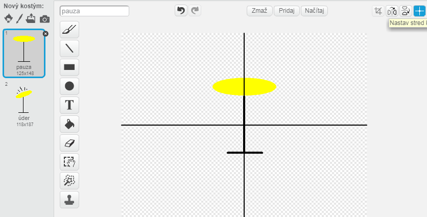

---
title: Rocková skupina — Poznámky pre vedúcich klubu
language: sk-SK
embeds: "*.png"
...

#Úvod:
V tomto projekte sa deti naučia ako pridať zvuky a pesničky k ich projektom, ako aj programovať kostýmy postáv. 

#Zdroje
Pre tento projekt by mal byť použitý Scratch 2. Scratch 2 je dostupný aj online na [jumpto.cc/scratch-on](http://jumpto.cc/scratch-on) alebo aj offline na [jumpto.cc/scratch-off](http://jumpto.cc/scratch-off).

Kompletnú verziu tohto projektu môžeš nájsť <a target="_blank"href="http://scratch.mit.edu/projects/26741186/#editor">online</a>, alebo si ju môžeš stiahnuť kliknutím na odkaz 'Download Project Materials' v tomto projekte, ktorý obsahuje:

+ RockBand.sb2

#Učebné ciele
+ Postavy;
+ Kostýmy;
+ Postupné bloky kódu;
+ Udalosti;
+ Zvuk a hudba.

#Výzvy
+ "Zlepšenie bubnovania" - Zmena zvuku postavy a pridanie udalostí;
+ "Zmena kostýmu speváka" - pridanie a regulácia kostýmov postavy;
+ "Vytvorenie vlastnej skupiny" - použitie naučených vedomostí pre vytvorenie nových nástrojov.

#Často kladené otázky
+ Pri vytváraní vlastných postáv, môže dojsť k tomu, že postava 'skáče' po kliknutí, keď zmení kostým. Je to preto, že 2 kostýmy nie sú centrované v rovnakom mieste.

	Pre vyriešenie problému klikni na 'Nastav stred kostýmu' na _oboch_ postavách, a buď si istý, že sú centrované na rovnaký bod v oboch kostýmoch.

	

+ Na Linuxe pravý klik na odstránenie postavy nemusí fungovať. V tomto prípade podržanie klávesy shift a ľavé kliknutie zobrazí menu na odstránenie postavy.