---
title: Rocková skupina
level: Scratch 1
language: sk-SK
stylesheet: scratch
embeds: "*.png"
materials: ["Club Leader Resources/*"]
...

# Úvod { .intro }

V tomto projekte sa naučíš ako naprogramovať hudobné nástroje!

<div class="scratch-preview">
  <iframe allowtransparency="true" width="485" height="402" src="http://scratch.mit.edu/projects/embed/26741186/?autostart=false" frameborder="0"></iframe>
  
</div>

# 1. krok: Postavy{ .activity }

Predtým ako začneš animovať, potrebuješ pridať nejakú 'vec' ktorá bude animovaná. V Scratch-i, sa tieto 'veci' nazývajú __postavy__. 

## Zoznam úloh { .check }

+ Najprv otvor Scratch editor. Online Scratch editor nájdeš na <a target="_blank" href="http://jumpto.cc/scratch-new">jumpto.cc/scratch-new</a>. Vyzerá takto:

	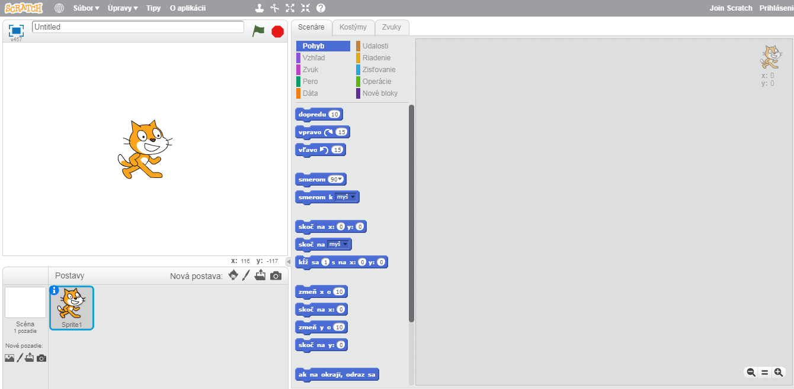

+ Postava mačky, ktorú môžeš vidieť je maskotom Scratch-u. Poď sa jej zbaviť. Klikni na ňu pravým tlačidlom a potom klikni na 'zruš'.

	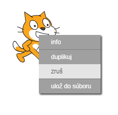

+ Teraz klikni na 'Vybrať postavu z knižnice', aby si otvoril zoznam všetkých postáv, ktoré má Scratch.

	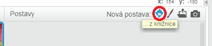

+ Posuň sa nižšie, pokiaľ nezbadáš postavu bubna. Klikni na bubon a následne na 'OK' aby si ho pridal do projektu.

	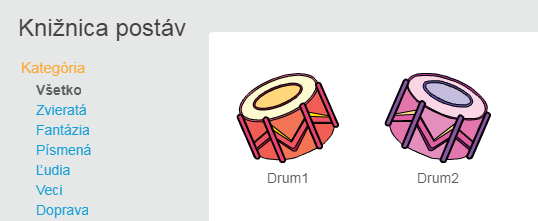

+ Klikni na 'zmenši' ikonku a potom klikni na bubon niekoľko krát, aby sa zmenšil.

	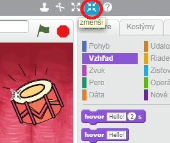

## Ulož svoj projekt { .save }

Daj svojmu programu meno, ktoré napíšeš do textového okienka v hornom ľavom rohu.
Teraz klikni na 'Súbor' a potom na 'Ulož do počítača' aby si uložil projekt.

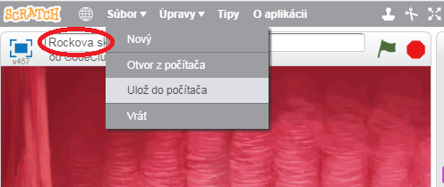

# 2. krok: Scéna { .activity }

__Scéna__ je miesto naľavo, kde svojmu projektu dodávaš život. Je to ako miesto predstavenia, ako skutočné pódium!

## Zoznam úloh { .check }

+ Teraz je pozadie biele a vyzerá trochu nudne! Poď mu pridať pozadie kliknutím na 'Vybrať pozadie z knižnice'.

	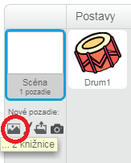

+ Klikni na 'Interiér' naľavo, teraz na pozadie a nakoniec na 'OK'.

	

+ Tvoja scéna by mala vyzerať takto:

	

# 3. krok: Výroba bubna { .activity }

Poď naprogramovať bubon, aby vydával zvuk po buchnutí.

## Zoznam úloh { .check }

+ Bloky kódu môžeš nájsť v štítku 'Scenáre'. Všetky sú farebne odlíšené!

	Klikni na postavu bubna a potom presuň tieto 2 bloky do oblasti kódu napravo. Buď si istý, že sú spolu prepojené (ako lego):

	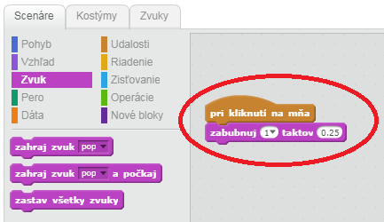

+ Klikni na bubon, aby si vyskúšal svoj nový hudobný nástroj!

+ Taktiež môžeš zmeniť to ako bude bubon vyzerať, keď naňho klikneš. Vytvor nový kostým kliknutím na štítok 'Kostýmy'. Tu vidíš obrázok bubna.

	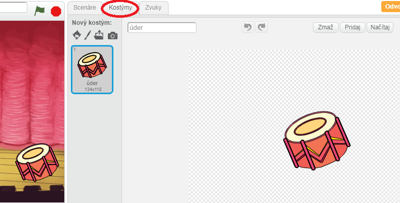

+ Pravým tlačidlom klikni na kostým a následne na 'duplikovať', aby si vytvoril kópiu kostýmu.

	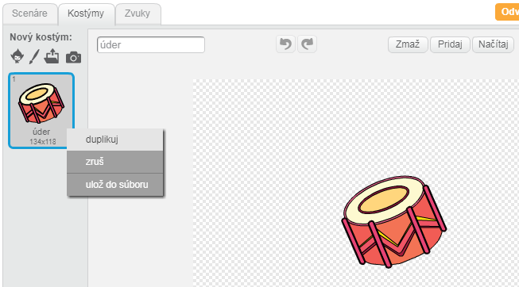

+ Klikni na nový kostým (nazvaný 'bubon2') a potom vyber nástroj 'čiara' a nakresli čiary, ktoré by znázorňovali zvuk bubna.

	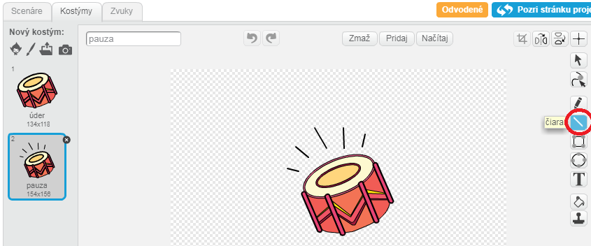

+ Názvy kostýmov nie sú teraz veľmi nápomocné. Premenuj 2 kostýmy na  'úder' a 'pauza' prepísaním mena v textovom okienku.

	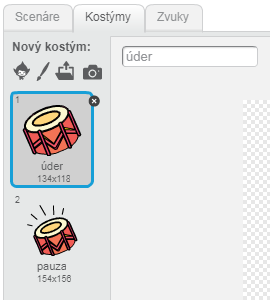

+ Teraz máš 2 rôzne kostýmy pre bubon, môžeš si vyberať ktorý bude zobrazovaný! Pridaj tieto 2 bloky k svojmu bubonu:

	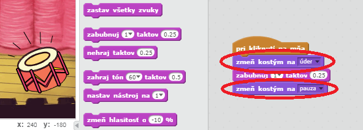

	Blok kódu, ktorý mení kostýmy je v sekcii `Vzhľad` {.blocklooks}.

+ Otestuj bubon. Keď naňho klikneš, mal by vyzerať akoby bolo po ňom buchnuté!

## Ulož svoj projekt { .save }

##Výzva: Vylepšenie bubna { .challenge }

+ Dokážeš zmeniť zvuk, ktorý vydáva bubon po kliknutí?

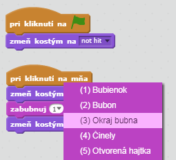

+ Vieš prinútiť ⧸⧸bubon⧸⧸bubon,⧸⧸ aby vydal zvuk po stlačení medzerníka? Budeš potrebovať tento blok `udalosti` {.blockevents}:

```blocks
	po stlačení klávesu [medzerník v]
```

Môžeš kopírovať existujúci kód pravým klikom a následne kliknutím na 'duplikovať'.

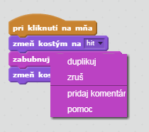

## Ulož svoj projekt { .save }

# 4. krok: Pridanie speváčky { .activity .new-page }

⧸⧸Poďme⧸⧸Poď⧸⧸ pridať speváčku do tvojej skupiny!

## Zoznam úloh { .check }

+ Pridaj ďalšie 2 postavy do ⧸⧸scény;⧸⧸scény:⧸⧸ speváčku a mikrofón.

	

+ Predtým ako bude tvoja speváčka spievať, potrebuješ pridať zvuk pre tvoju postavu. Buď si istý, že si vybral speváčku a potom klikni na sekciu 'Zvuk' a klikni na 'Vybrať z knižnice':

	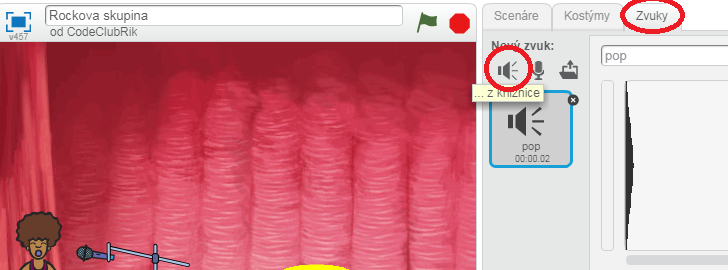

+ Keď klikneš na 'Hlasy', na ľavej strane, potom môžeš vybrať vhodný zvuk k svojej postave.

	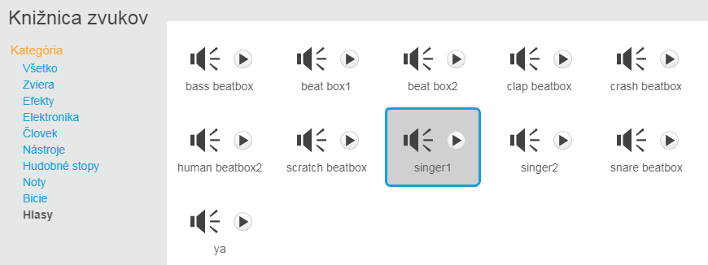

+ Teraz bol zvuk pridaný, môžeš pridať tento kód k speváčke:

	```blocks
		po kliknutí na mňa
		zahraj zvuk [singer1 v] a počkaj
	```

+ Klikni na speváčku, aby si si overil, že spieva.

## Ulož svoj projekt { .save }

##Výzva: Zmena kostýmu speváčky { .challenge }
Dokážeš upraviť speváčku aby vyzerala akože ⧸⧸spieva⧸⧸spieva,⧸⧸ keď na ňu klikneš? Ak ⧸⧸potrebujes pomôcť⧸⧸potrebuješ pomôcť,⧸⧸ môžeš použiť inštrukcie pri vytváraní bubna.


Zapamätaj si, že musíš otestovať, či tvoj nový kód funguje správne!

## Ulož svoj projekt { .save }

##Výzva: Vytvor si vlastnú skupinu { .challenge }
Použi, čo si sa doteraz naučil v tomto ⧸⧸projekte⧸⧸projekte,⧸⧸ aby si vytvoril vlastnú ⧸⧸skupinu!⧸⧸kapelu!⧸⧸ Môžeš vytvoriť hocijaký nástroj, ktorý sa ti páči. Pozri si ale, aké sú dostupné zvuky a ⧸⧸nástroje a vytvor niečo zaujímavé.⧸⧸nástroje, aby si dostal nejak nápady.⧸⧸

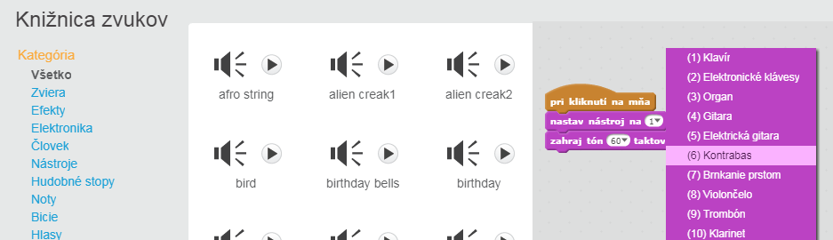

Tvoje nástroje ⧸⧸nemusia byť rozumne vybrané. Napríklad môžeš vytvoriť zvuk klavíra po kliknutí na koláčik!⧸⧸ale nemusia mať zmysel. Napríklad, môžeš si vytvoriť piano z koláčov! ⧸⧸


Tak ako môžeš použiť existujúce postavy, môžeš si aj vlastné nakresliť.

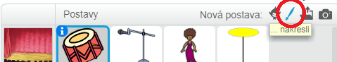

Ak máš mikrofón, môžeš nahrať svoje vlastné zvuky. Dokonca ak máš kameru, použi ju na úder do bubna!

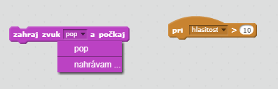

## Ulož svoj projekt { .save }
<!--se_discussion_list:{"9HEycis69bZ3hze9lQQIZFMn":{"selectionStart":3682,"type":"conflict","selectionEnd":3699,"discussionIndex":"9HEycis69bZ3hze9lQQIZFMn"},"EY0QL70Wz5eAdz7N7HLtGCkB":{"selectionStart":4055,"type":"conflict","selectionEnd":4069,"discussionIndex":"EY0QL70Wz5eAdz7N7HLtGCkB"},"v9KpXxgde6TVk2tXMdfA9cLH":{"selectionStart":4162,"type":"conflict","selectionEnd":4180,"discussionIndex":"v9KpXxgde6TVk2tXMdfA9cLH"},"ZqziP17KvOT9siisp1vR0sva":{"selectionStart":4907,"type":"conflict","selectionEnd":4926,"discussionIndex":"ZqziP17KvOT9siisp1vR0sva"},"1S4iPItzNdWj8PS82a8GsRjQ":{"selectionStart":4949,"type":"conflict","selectionEnd":4990,"discussionIndex":"1S4iPItzNdWj8PS82a8GsRjQ"},"zimVAOK8iXlBD3CiCFkG9cik":{"selectionStart":5265,"type":"conflict","selectionEnd":5288,"discussionIndex":"zimVAOK8iXlBD3CiCFkG9cik"},"84u0G883wS4vOYDf8X21vV31":{"selectionStart":5313,"type":"conflict","selectionEnd":5334,"discussionIndex":"84u0G883wS4vOYDf8X21vV31"},"J4sCoYrM0yeEfoIWYijqJ8xX":{"selectionStart":5424,"type":"conflict","selectionEnd":5501,"discussionIndex":"J4sCoYrM0yeEfoIWYijqJ8xX"},"Njl9B7ZXQwNcBfiqVDQSDDdo":{"selectionStart":5549,"type":"conflict","selectionEnd":5715,"discussionIndex":"Njl9B7ZXQwNcBfiqVDQSDDdo"}}-->