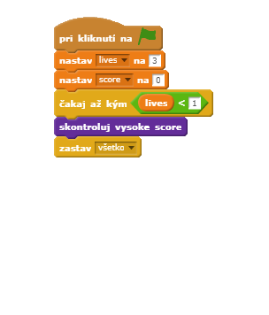

---
title: Pochytaj bodky
level: Scratch 2
language: sk-SK
stylesheet: scratch
embeds: "*.png"
materials: ["Club Leader Resources/*", "Project Resources/*"]
beta: true
...

# Úvod { .intro }

V tomto projekte sa naučíš, ako vytvoriť hru, v ktorej musíš pospájať farebné bodky so správnou časťou ovládača. 

<div class="scratch-preview">
  <iframe allowtransparency="true" width="485" height="402" src="http://scratch.mit.edu/projects/embed/44942820/?autostart=false" frameborder="0"></iframe>
  
</div>

# 1. krok: Vytvorenie ovládača { .activity }

Začni s vytvorením ovládača, pomocou ktorého budeš zbierať bodky.

## Zoznam úloh { .check }

+ Začni vytvorením nového _Scratch_ projektu, v ktorom odstrániš postavu  mačky, aby bol projekt prázdny. Do online _Scratch_ editoru sa môžeš dostať kliknutím na <a href="http://jumpto.cc/scratch-new">jumpto.cc/scratch-new</a>.

+ Ak ti dal učiteľ 'Zdrojovy' priečinok, klikni na 'Načítaj postavu zo súboru' a pridaj  'controller.svg' obrázok. Mal by si psotavu presunúť do stredu scény.

	
	
	Ak tento obrázok nemáš, môžeš si ho nakresliť sám!
	
+ Zatoč ovládačom doprava, keď stlačíš šípku doprava:

	```blocks
	po kliknutí na ⚑
	stále opakuj
		ak <je kláves [šípka vpravo v] stlačený?> tak
			otoč sa o ↻ (3) stupňov
		end
	end

	```
+ Otestuj ovládač -- mal by sa otáčať doprava.

## Ulož svoj projekt { .save }

## Výzva: Rotácia doľava {.challenge}
Dokážeš doplniť funkciu otáčania doľava pre tvoj ovládač? 

## Ulož svoj projekt { .save }

# 2. krok: Zbieranie bodiek { .activity }

Poďme pridať nejaké bodky, ktoré môžeš s ovládačom zbierať.

## Zoznam úloh { .check }

+ Vytvor novú postavu s názvom 'cervena'. Táto postava by mala byť reprezentovaná malou červenou bodkou.

	

+ Pridaj tento scenár k tvojej 'cervenej' bodke aby si mohol vytvoriť nový klon každých niekoľko sekúnd:

	```blocks
	po kliknutí na ⚑
	počkaj (2) sekúnd
	stále opakuj
		naklonuj [seba v]
		počkaj (vyber náhodné číslo od (5) do (10)) sekúnd
	end

	```

+ Keď vytvoríš klon bodky, potrebuješ ho umiestniť do jedného zo štyroch rohov.

	

	Aby si to mohol spraviť, najprv vytvor zoznam premenných s názvom `zaciatocne pozicie` {.blockdata} a klikni na `(+)` pre pridanie hodnôt `-180` a `180`.

	

+ Tieto 2 zoznamy položiek môžeš použiť pre náhodný výber rohu danej scény. Pridaj tento kód k postave 'bodky' , a tak sa každý nový klon bodky vytvorí v ľubovoľnom rohu a potom sa bude pomaly blížiť k ovládaču.

	```blocks
	keď štartujem ako klon
	choď na pozíciu x:(prvok (random v) z [zaciatocne pozicie v]) y:(prvok (random v) z [zaciatocne pozicie v])
	natoč sa ku [ovladac v]
	ukáž sa
	opakuj pokiaľ nenastane <dotýka sa [ovladac v]?>
		posuň sa o (1) krokov
	end
	```
	Kód vyššie vyberie buď `-180` alebo `180` pre x _a_ y pozície, čo znamená, že každý klon vyštartuje z jedného rohu danej scény.

+ Otestuj svoj projekt. Mal by si vidieť veľa červených bodiek, ktoré sa objavujú v rohoch scény a pohybujú sa pomaly do stredu k ovládaču.

	

+ Vytvor 2 nové premenné:`zivot` {.blockdata} a `score` {.blockdata}.

+ Pridaj kód do scény, kde nastavíš`zivot` {.blockdata} na hodnotu 3 a `score` {.blockdata} na hodnotu 0, ktoré sa zobrazia pri spustení hry.

+ Teraz potrebuješ pridať kód na koniec tvojej červenej bodky k časti: `keď štartujem ako klon` {.blockcontrol} , tu bude 1 pridaná k  `score` {.blockdata} hráča ak sú farby rovnaké, ak nie, tak 1 bude odobraná z premennej`zivot` {.blockdata} .

	```blocks
	posuň sa o (5) krokov
	ak <dotýka sa farby [#FF0000]?> tak
		zmeň [score v] o (1)
		zahraj zvuk [pop v]
	inak
		zmeň [zivot v] o (-1)
		zahraj zvuk [laser1 v]
	end
	zmaž tento klon
	```

+ Tento kód pridaj na koniec scenára v časti scéna. Spôsobí koniec hry, keď hráč stratí všetky životy:

	```blocks
	počkaj kým nenastane <(zivot) < [1]>
	zastav [všetko v]
	```

+ Otestuj svoju hru aby si si bol istý, že kód funguje podľa očakávania.

## Ulož svoj projekt { .save }

## Výzva: Viac bodiek {.challenge}
Zduplikuj svoju  'cervenu' bodku dvakrát, a zmeň im mená na 'zlta' a 'modra'.


Uprav tieto postavy (vrátane ich kódu), tak aby každá farebná bodka bola totožná s farbou na ovládači. Nezabudni otestovať projekt, aby si si bol istý, že získavaš score a strácaš životy v pravý čas, a že tvoja hra nie je príliš jednoduchá, alebo naopak príliš ťažká!


## Uložte svoj projekt { .save }

# 3. krok: Zvyšovanie náročnosti { .activity .new-page}

Urob hru zložitejšou, čím dlhšie hráč prežíva, tým je oneskorenie objavovania sa bodiek menšie.

## Zoznam úloh { .check }

+ Vytvoríš novú premennú s názvom `oneskorenie` {.blockdata}.

+ Na tvojej scéne vytvor nový skript, ktorý nastaví oneskorenie na vysoké číslo a potom pomaly znižuj čas oneskorenia. 

	```blocks
		po kliknutí na ⚑
			nastav [oneskoreniev] na (8)
			opakuj pokiaľ nenastane <(oneskorenie) = (2)>
				počkaj (10) sekúnd
				zmeň [oneskorenie v] o (-0.5)
			end
	```

	Všimni si, že je to veľmi podobné tomu ako pracuje herný časovač. 

+ Nakoniec, môžeš použiť túto premennú `oneskorenie` {.blockdata} vo svojich postavách červených, žltých a modrých bodiek. Odstráň kód, ktorý očakáva náhodný počet sekúnd medzi vytváraním klonov a nahraď ho tvojou novou premennou  `oneskorenie` {.blockdata} :

	```blocks
		počkaj (oneskorenie) sekúnd
	```

+ Vyskúšaj tvoju novú premennú `oneskorenie` {.blockdata} a skontroluj, či sa oneskorenie medzi bodkami pomaly znižuje. Funguje to takto pre všetky 3 farebné bodky? Vidíš hodnotu premennej  `oneskorenie` {.blockdata} sa znižovať?

## Ulož svoj projekt { .save }

## Výzva: Rýchlejší pohyb bodiek {.challenge}
Môžeš zlepšiť svoju hru pridaním premennej `rychlost` {.blockdata} tak, aby sa bodky začali pohybovať po krokoch a stále rýchlejšie a rýchlejšie? Bude to fungovať veľmi podobne ako premenná `oneskorenie` {.blockdata} použitá vyššie a môžeš použiť tento kód, ktorý ti pomôže.

## Ulož svoj projekt { .save }

# 4. krok: Vysoké skóre { .activity }

Ulož si svoje vysoké skóre, aby hráči mohli vidieť akí sú dobrí. 

## Zoznam úloh { .check }

+ Vytvor novú premennú s názvom `vysoke score` {.blockdata}.

+ Vyber si svoju scénu a vytvor nový vlastný blok nazvaný  `skontroluj vysoke score` {.blockmoreblocks}.

	

+ Tesne pred koniec hry vlož svoj vlastný blok. 

	

+ Pridaj kód do vlastného bloku, aby si uložil aktuálne skóre v premennej `score` {.blockdata} ako najvyššie skóre v premennej `vysoke score` {.blockdata} pomocou `ak` {.blockcontrol} ak je to najvyššie skóre:

	```blocks
		blok [skontroluj vysoke score]
		ak <(score) > (vysoke score)> tak
			nastav [vysoke score v] na (score)
		end
	```

+ Vyskúšaj kód, ktorý si pridal. Zahraj si svoju hru a over, či sa  `vysoke score` {.blockdata} správne aktualizuje.

## Ulož svoj projekt { .save }

## Výzva: Zlepši svoju hru! {.challenge}
Môžeš popremýšľať ako zlepšiť svoju hru. Tak napríklad môžeš vytvoriť špeciálne bodky, ktoré:

+ zdvojnásobia tvojho skóre;
+ bodky spomalia;
+ skryjú sa všetky ostatné bodky na obrazovke!

## Ulož svoj projekt { .save }

## Výzva: Herné menu {.challenge}
Môžeš do hry pridať menu (s tlačidlami)? Môžeš pridať obrazovku s inštrukciami alebo samostatnú obrazovku na zobrazenie vysokého skóre. Ak potrebuješ pomoc, pomôže ti projekt "Brain Game". 
