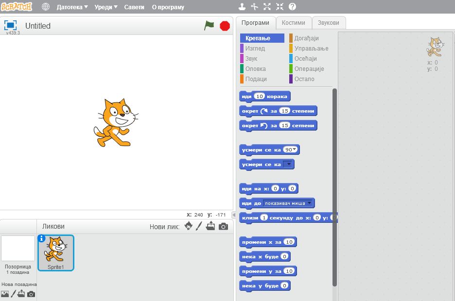
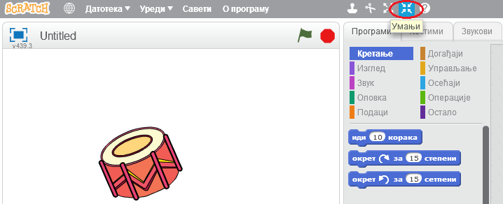
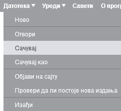
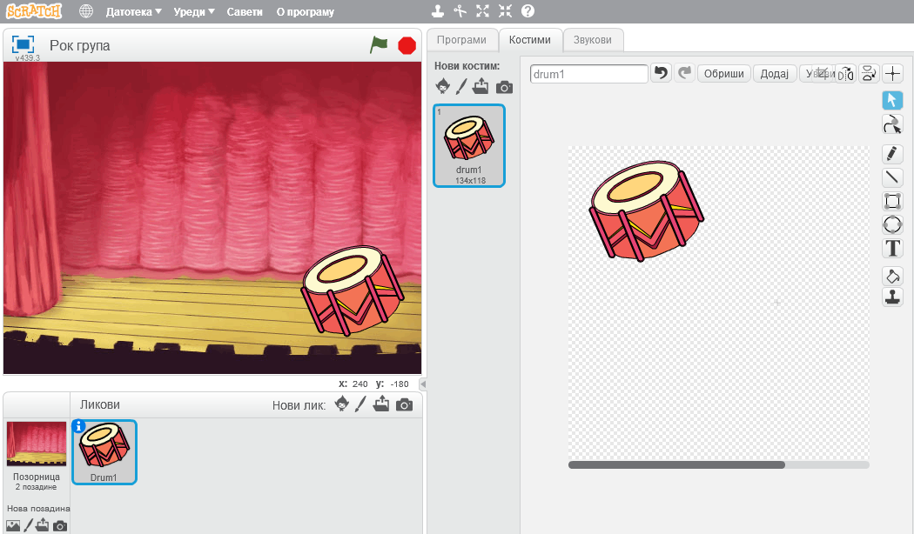
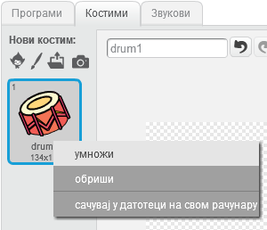
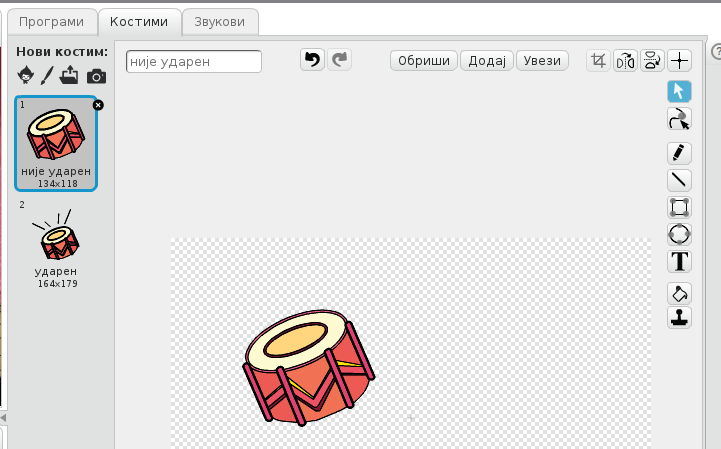
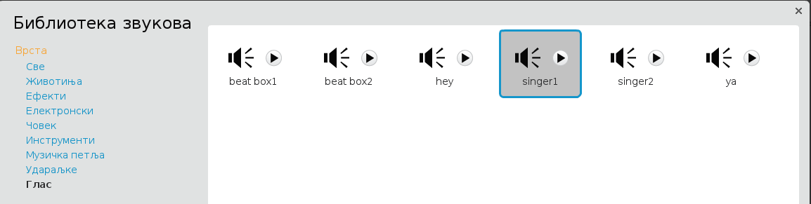
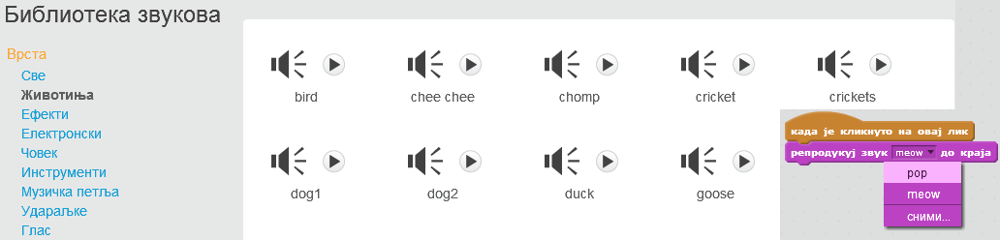

---
title: Рок група
level: Scratch 1
language: sr-SP
stylesheet: scratch
embeds: "*.png"
materials: ["Club Leader Resources/*.*"]
...

# Увод { .intro }

У овом пројекту научићеш како да програмираш сопствене музичке уређаје!

# Корак 1: Ликови { .activity }

Пре него што започнеш анимирање, мораш да додаш оно што ћеш анимирати. У Скрачу, то се зове лик (или спрајт). 

## Упутство { .check }

+ Прво отвори програм Скрач; он изгледа овако:

	

+ Мачка коју видиш је маскота Скрача. Отараси је се тако што ћеш притиснути десни тастер миша и изабрати 'обриши'.

	

+ Затим кликни на 'Изабери лик из библиотеке' да би отворио списак свих Скрач ликова.

	

+ Померај се док не угледаш спрајт бубња. Кликни на бубањ, а затим на 'У реду' да би га додао у пројекат.

	

+ Притисни икону 'умањи', a затим неколико пута кликни на бубањ да би га смањио.

	

## Сачувај пројекат { .save }

Кликни на 'Датотека' а затим на 'Сачувај' да би сачувао пројекат. Мораћеш некако да га назовеш, на пример, Рок група.



# Корак 2: Позорница { .activity }

Позорница или сцена је област са леве стране, тамо где твој пројекат настаје.

## Упутство { .check }

+ Тренутно је сцена бела и изгледа прилично досадно! Хајде да јој додамо позадину тако што ћемо кликнути на 'Одабери позадину из библиотеке'.

	

+ Кликни 'Унутра' са леве стране, a затим кликни на позадину сцене и на крају на 'У реду'.

	

+ Твоја сцена би сада требало да изгледа овако:

	

# Корак 3: Направи бубањ { .activity }

Хајде да напишемо код који ће учинити да се бубањ зачује када се у њега удари.

## Упутство { .check }

+ Блокове кода можеш да пронађеш на картици 'Програми', и сви они су у различитим бојама! 

	Кликни на лик бубња, a затим превуци два блока у област где се ставља код са десне стране, при том водећи рачуна да они буду међусобно повезани (као лего коцке):

	

+ Кликни на бубањ да би испробао нов инструмент!

+ Можеш и да промениш изглед бубња када се на њега кликне, тако што ћеш направити нов костим (изглед) за њега. Кликни на картицу 'Костими' и појавиће се слика бубња.

	

+ Десним тастером миша кликни на костим, а затим кликни 'умножи' да би направио копију костима.

	

+ Кликни на нов костим ('drum2'), a затим изабери алат - линију и нацртај линије тако да изгледа као да бубањ производи звук.

	

+ Имена костима тренутно нису нарочито добра; преименуј два костима у 'није ударен' и 'ударен' тако што ћеш откуцати ново име за сваки костим у поље за текст.

	

+ Сада када имаш два различита костима за бубањ, можеш да бираш који од њих ће бити приказан! Додај следећа два блока у код за бубањ:

	

	Блок кода за мењање костима налази се у одељку `Изглед` {.blocklooks}.

+ Испробај бубањ. Када га кликнеш, бубањ би требало да изгледа као да је неко ударио у њега!

## Сачувај пројекат { .save }

##Изазов: Побољшај бубањ { .challenge }

+ Можеш ли да промениш звук који бубањ прави када се на њега кликне?


+ Можеш ли да учиниш да се бубањ зачује када се притисне тастер за размак? Мораћеш да употребиш овај блок који се налази у одељку `Догађаји` {.blockevents}:

```blocks
	када је дирка [размак v] притиснута
```

Постојећи код можеш да копираш тако што ћеш га кликнути десним тастером миша и изабрати 'умножи'.


## Сaчувај пројекат { .save }

# Корак 4: Направи певачицу { .activity .new-page }

Хајде да нашој групи придружимо певачицу!

## Упутство { .check }

+ Додај још два лика у сцену: певачицу и микрофон.

	

+ Да би твоја певачица запевала, спрајту мораш да додаш звук. Прво изабери певачицу, затим кликни картицу 'Звукови', и на крају кликни 'Изабери звук из библиотеке':

	

+ Ако кликнеш на 'Глас' са леве стране, моћи ћеш да изабереш звук који ће се додати лику.

	

+ Пошто си додао звук, можеш певачици да додаш следећи код:

	```blocks
		када је кликнуто на овај лик
		репродукуј звук [singer1 v] до краја
	```

+ Кликни на певачицу да би се уверио да пева.

## Сачувај пројекат { .save }

##Изазов: Промени изглед певачице { .challenge }
Можеш ли да учиниш да се изглед певачице промени тако да изгледа као да пева када се кликне? Ако ти треба помоћ, употреби упутство за прављење бубња од малопре.


Не заборави да провериш да ли код који си додао ради!

## Сачувај пројекат { .save }

##Изазов: Направи своју групу { .challenge }
Употреби оно што си научио у овом пројекту да би направио сопствени бенд! Можеш да направиш било који инструмент, али погледај које инструменте и звуке имаш на располагању да би добио идеје.



Инструменти не морају да буду баш верног изгледа ... на пример, могао би да направиш клавир од мафина!


Не мораш да користиш само постојеће ликове - можеш да нацрташ и сопствене.


Ако имаш микрофон, можеш да снимиш сопствене звуке!


## Сачувај пројекат { .save }
