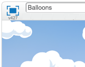

---
title: Балони — Упутство за учитеље
language: sr-SP
embeds: "*.png"
materials: [""]
...

#Увод:
У овом пројекту деца ће учити како се променљиве користе за чување података у програму.

#Ресурси
За овај пројекат неопходан је Scratch 2. Ова апликацијa се може користити онлајн на адреси [jumpto.cc/scratch-on](http://jumpto.cc/scratch-on), или преузети са адресе [jumpto.cc/scratch-off](http://jumpto.cc/scratch-off) и користити тамо где не постоји веза са Интернетом.

Завршену верзију овог пројекта можете пронаћи на адреси <a href="http://scratch.mit.edu/projects/26745384/#editor">online</a>, или је преузети преко линка 'Download Project Materials' за пројекат који садржи:

+ Balloons.sb2

#Наставни циљеви
+ Променљиве;
+ Случајни бројеви;
+ Клонирање ликова.

#Изазови
+ "Још случајности" - коришћење случајних бројева;
+ "Још објеката" - примена наученог за прављење нових објеката у игри.

#Честа питања
+ Ако деца имају проблема да пробуше балоне а да их не вуку мишем, игру могу да играју у режиму приказа преко целог екрана, у коме се балони не могу вући мишем.

