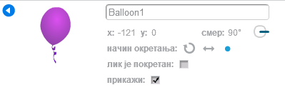
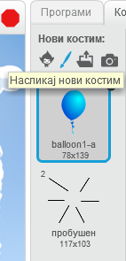
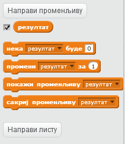
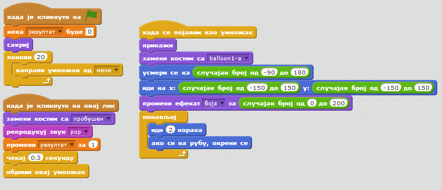
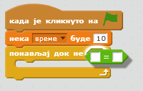
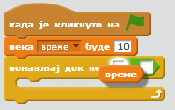
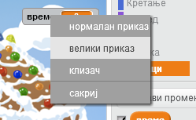
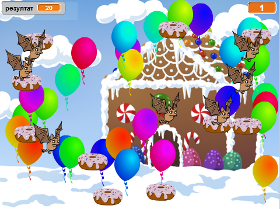

---
title: Балони
level: Scratch 1
language: sr-SP
stylesheet: scratch
embeds: "*.png"
materials: ["Ресурси за учитеља/*.*"]
...

# Увод { .intro }

Правићеш игру у којој искачу балони!

# Корак 1: Анимирај балон { .activity }

## Упутство { .check }

+ Започни нов Скрач пројекат и обриши мачку тако да позорница буде празна.

+ Додај нов лик - балон, као и одговарајућу позадину на сцену.

	

+ Додај следећи код за балон, тако да скаче по екрану:

	```blocks
		када је кликнуто на ⚑
		иди на x:(0) y:(0)
		усмери се ка (45 v)
		понављај
			иди (1) корака
			ако си на рубу, окрени се
		end
	```

+ Испробај балон. Да ли се креће преспоро? Промени бројеве у коду ако желиш да га мало убрзаш.

+ Јеси ли приметио и да се балон окреће док се помера на екрану?

	

	Балони не лете тако! Да би то поправио, кликни на лик балона, a затим кликни на плаву икону `i` {.blockmotion} за информације.

	
	У одељку 'начин окретања' кликни на тачку да би спречио да се балон окреће.

	

+ Испробај опет програм да би се уверио да је проблем решен.

## Сачувај пројекат { .save }

# Корак 2: Насумични балони { .activity }

## Кораци { .check }

+ Са кодом који си му управо придружио, твој балон ће увек почињати са истог места и кретаће се истим путем. Кликни на заставицу неколико пута да би покренуо програм, и видећеш да увек ради исто.

+ Уместо да увек користиш исту позицију x и y, можеш да кажеш Скрачу да изабере неки случајан број. Измени код за балон тако да изгледа овако:

	```blocks
		када је кликнуто на ⚑
		иди на x:(случајан број од (-150) до (150)) y:(случајан број од (-150) до (150))
		усмери се ка (45 v)
		понављај
			иди (1) корака
			ако си на рубу, окрени се
		end
	```

+ Ако сада кликнеш на зелену заставицу неколико пута, требало би да видиш да се балон сваки пут појављује на различитом месту.

+ Случајан број могао би да употребиш и да би насумично изабрао боју балона:

	```blocks
		промени ефекат [боја v] за (случајан број од (0) до (200))
	```

	

	Шта се дешава ако овај код ставиш на почетак твог програма? Да ли се нешто другачије дешава ако код ставиш _унутар_ петље `понављај` {.blockcontrol}? Шта ти се више свиђа?

## Сачувај пројекат { .save }

## Изазов: Још случајности {.challenge}
Можеш ли да учиниш да балон почиње да се креће у насумичном правцу (између -90 и 180)?

## Сачувај пројекат { .save }

# Корак 3: Балони који искачу { .activity }

Хајде да омогућимо играчу да буши балоне!

## Кораци { .check }

+ Кликни на лик балона, a затим кликни на картицу 'Костими'. Можеш да обришеш све костиме, тако да остане само један костим за балон. Додај нов костим тако што ћеш кликнути на 'Насликај нови костим' и направити нов костим који ћеш назвати 'пробушен'.

	

+ Учини да се балон појављује у одговарајућем костиму када игра почне. Твој код би требало да изгледа овако:

	```blocks
		када је кликнуто на ⚑
		замени костим са [balloon1-a v]
		усмери се ка (случајан број од (-90) до (180))
		иди на x:(случајан број од (-150) до (150)) y:(случајан број од (-150) до (150))
		промени ефекат [боја v] за (случајан број од (0) до (200))
		понављај
			иди (1) корака
			ако си на рубу, окрени се
		end
	```

+ Да би омогућио играчу да пробуши балон, додај следећи код:

	```blocks
		када је кликнуто на овај лик
		замени костим са [пробушен v]
		репродукуј звук [pop v]
	```

+ Испробај пројекат. Можеш ли да пробушиш балон? Да ли програм ради као што очекујеш? Мораћеш да побољшаш код тако да када се кликне на балон, он кратко време приказује костим 'пробушен', а затим нестаје? Све то можеш да оствариш тако што ћеш променити код блока `када је кликнуто на овај лик` {.blockevents} овако:

	```blocks
		када је кликнуто на овај лик
		замени костим са [пробушен v]
		репродукуј звук [pop v]
		чекај (0.3) секунду
		сакриј
	```

+ Сада када балон нестаје када се кликне на њега, требаће ти и блок `прикажи` {.blocklooks} на почетку кода `када је кликнуто на ⚑` {.blockevents}.

+ Покушај поново да пробушиш балон, да би проверио да ли игра ради како очекујеш. Ако имаш потешкоћа да пробушиш балон а да га не вучеш мишем, игру можеш да играш преко целог екрана тако што ћеш кликнути на ово дугме:

	

## Сачувај пројекат { .save }

# Корак 4: Додавање резултата { .activity .new-page }

Хајде да учинимо игру занимљивијом тако што ћемо пратити освојене поене.

## Кораци { .check }

+ Да би пратио резултат играча, требаће ти место где ћеш га ставити. _Променљива_ је место где се чувају подаци који могу да се мењају, као што је резултат.

	Да би направио нову променљиву, кликни на картицу 'Програми', изабери `Подаци` {.blockdata} и затим кликни на 'Направи променљиву'.

	

	Откуцај 'резултат' као име променљиве, обезбеди да буде видљива свим ликовима, и на крају кликни на 'У реду' да би направио променљиву. Након тога појавиће се много блокова кода које ћеш моћи да користиш са твојом променљивом `резултат` {.blockdata}.

	

	Такође ћеш у горњем левом углу екрана видети резултат.

	

+ Када се почне нова игра (кликом на заставицу), резултат играча би требало да се постави на 0. Додај следећи код испред блока `када је кликнуто на ⚑` {.blockevents} за балон:

	```blocks
	нека [резултат v] буде [0]
	```

+ Кад год се балон пробуши, резултат треба да увећаш за 1:

	```blocks
		када је кликнуто на овај лик
		замени костим са [пробушен v]
		репродукуј звук [pop v]
		чекај (0.3) секунду
		промени [резултат v] за (1)
		сакриј
	```

+ Покрени програм поново и кликни на балон. Да ли се резултат мења?

## Сачувај пројекат { .save }

# Корак 5: Много балона { .activity }

Бушење једног балона и није нека игра. Хајде да их додамо још много!

Једноставан начин да додаш много балона јесте да десним тастером миша кликнеш на лик балона и изабереш 'умножи'. То је у реду ако само желиш да их буде неколико, али шта ако треба да их буде 20, или 100? Да ли ћеш стварно да кликћеш 'умножи' толико пута?

## Кораци { .check }

+ Много бољи начин да добијеш много балона јесте да _клонираш_ лик балона.

	Превуци код `када је кликнуто на ⚑` {.blockevents} балона (осим блока `резултат` {.blockdata}) изван догађаја (немој да га бришеш), и уместо њега додај код за прављење 20 клонова балона.

	Сада можеш да закачиш код који си управо уклонио на догађај `када се појавим као умножак` {.blockevents}. Требало би да замениш и блок `сакриј` {.blocklooks} у коду за клик на балон блоком `обриши овај умножак` {.blockcontrol}.

	Код за балон сада би требало да изгледа овако:

	

+ Испробај пројекат! Када се сада кликне заставица, лик главног балона ће се сакрити, а затим самог себе клонирати 20 пута. Када се свих 20 клонова покрену, сваки од њих ће насумично скакати по екрану, као и пре. Покушај сада да пробушиш 20 балона!

## Сачувај пројекат { .save }

# Корак 6: Додај тајмер { .activity }

Игру можеш да учиниш занимљивијом тако што ћеш играчу дати само 10 секунди да пробуши што је могуће више балона.

## Кораци { .check }

+ Можеш да употребиш још једну променљиву у којој ћеш чувати преостало време. Кликни на позорницу и направи нову променљиву која ће се звати 'време':

	

+ Ево како би тајмер требало да ради:

	+ Tајмер треба да почне од 10 секунди;
	+ Тајмер треба да одбројава сваку секунду;
	+ Игра би требало да се заврши када тајмер стигне до 0.

	Ево кода који то ради; њега треба да додаш у _позорницу_:

	```blocks
		када је кликнуто на ⚑
		нека [време v] буде [10]
		понављај док не <(време) = [0]>
			чекај (1) секунду
			промени [време v] за (-1)
		end
		заустави [све v]
	```

	Да би додао код `понављај док не`{.blockcontrol}`време`{.blockdata}`= 0`{.blockoperators}, прво мораш да повучеш зелени блок `=` {.blockoperators} у блок `понављај док` {.blockcontrol}:

	

	Затим можеш да превучеш променљиву `време` {.blockdata} у блок `=` {.blockoperators}:

	

+ Превуци промељиву 'време' на десну страну сцене. Можеш и да кликнеш на приказ променљиве десним тастером миша и да изабереш 'велики приказ' да би променио начин на који се приказује време.

	

+ Испробај игру. Колико поена можеш да освојиш? Ако је игра превише лака, можеш да:

	+ Даш играчу мање времена;
	+ Имаш више балона;
	+ Учиниш да се балони крећу брже;
	+ Смањиш балоне.

	Испробај игру неколико пута док не будеш задовољан тиме колико је тешка за играње.

## Сачувај пројекат { .save }

## Изазов: Још објеката {.challenge}
Можеш ли да додаш још објеката у игру? Можеш да додаш "добре" објекте, на пример крофне, које ће ти донети много поена, или "лоше" објекте, на пример слепе мишеве, који ће одузимати поене.



Мораћеш да размислиш о објектима које додајеш. Размисли о томе:

+ Колико ће бити таквих објеката?
+ Колико је велик? Како се креће?
+ Колико поена ће играч освојити (или изгубити) када га кликне?
+ Хоће ли се кретати спорије или брже од балона?
+ Како ће изгледати/звучати када се кликне?

Ако ти треба помоћ да додаш објекат, погледај поново претходне кораке у овом упутству!

## Сачувај пројекат { .save }
