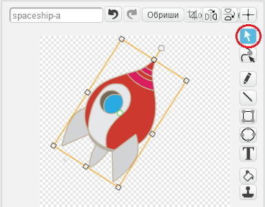

---
title: Изгубљени у свемиру — Упутство за учитеље
language: sr-SP
embeds: "*.png"
materials: [""]
...

#Увод:
У овом пројекту деца ће учити како се комбинују блокови кода да би се направила једноставна анимација.

#Ресурси
Пројекат захтева Скрач 2, који се може користити онлајн [jumpto.cc/scratch-on](http://jumpto.cc/scratch-on) или преузети са адресе [jumpto.cc/scratch-off](http://jumpto.cc/scratch-off) и користити када не постоји веза са Интернетом.

Завршену верзију пројекта можете пронаћи на адреси <a href="http://scratch.mit.edu/projects/26818098/#editor">online</a>, или преузети кликом на дугме 'Download Project Materials' у овом пројекту, и она садржи:

+ LostInSpace.sb2

Постоји и верзија пројекта са већ учитаним спољашњим ресурсима. Она се може пронаћи онлајн на адреси [jumpto.cc/space-resources](http://jumpto.cc/space-resources), или у материјалима за пројекат који се преузимају, а садржи:

+ LostInSpaceResources.sb2 

#Наставни циљеви
+ Петље:
	+ `понови` {.blockcontrol} петље;
	+ `понављај` {.blockcontrol} петље.

#Изазови
+ "Побољшај своју анимацију" - мењање бројева у кратком програму;
+ "Направи сопствену анимацију" - примена наученог да би се направила нова анимација.

#Честа питања
+ Децу ћете можда морати да подсетите да ресетују позицију, величину и друге ефекте лика на почетку анимације. Tо могу лако постићи тако што ће на почетак анимације додати неки од следећих блокова:

```blocks
	иди на x:(0) y:(0)
```

```blocks
	нека величина буде (100)%
```

```blocks
	уклони графичке ефекте
```

+ Спрајт свемирског брода ће се померати са стране ако се не заротира за 90 степени у смеру казаљке на сату. Ротирање свемирског брода налази се у упутствима за пројекат, али се свемирски брод може заменити другим ликом ако ротирање изазива проблеме.

	
