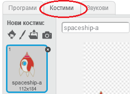
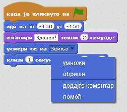
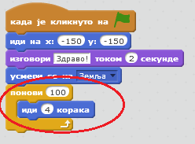
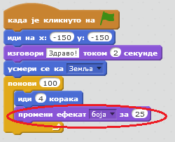
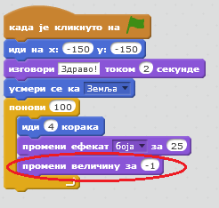
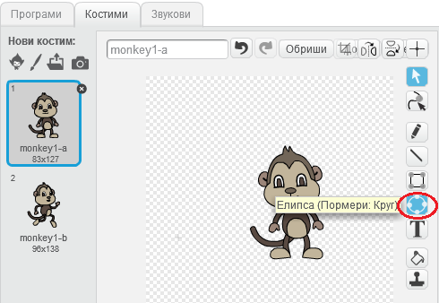
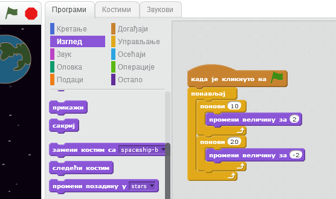

---
title: Изгубљени у свемиру
level: Scratch 1
language: sr-SP
stylesheet: scratch
embeds: "*.png"
materials: ["Ресурси за учитеље/*.*"]
...

# Увод { .intro }

Научићеш како да програмираш сопствену анимацију!

# Корак 1: Анимирање свемирског брода { .activity .new-page}

Хајде да направимо свемирски брод који лети према Земљи!

## Упутство { .check }

+ Отвори нов Скрач пројекат и обриши лик мачке тако да пројекат буде празан.

+ Додај ликове свемирског брода (наћи ћеш га у одељку Превоз, 'Spaceship') и Земље (Ствари, 'Earth') у сцену. Требало би да сцени додаш и звездану позадину ('Stars'). Ево како би требало да изгледа сцена:

	

+ Кликни на лик свемирског брода који си додао, a затим кликни на картицу 'Костими'.

	

+ Употреби стрелицу да би одабрао слику. Затим кликни на ручицу која означава ротирање, и окрећи слику док не буде окренута са стране.

	

+ Додај следећи код за лик свемирског брода:

	

	Промени бројеве у блоковима кода тако да буду исти као на горњој слици.

+ Ако кликнеш на блокове кода да би их извршио, требало би да видиш да свемирски брод говори, окреће се и креће ка центру сцене.

	

	Позиција екрана `x:(0) y:(0)` {.blockmotion} је центар сцене. Позиција као што је `x:(-150) y:(-150)` {.blockmotion} је према доњем левом углу сцене, а позиција попут `x:(150) y:(150)` {.blockmotion} је близу горњег десног угла.

	

	Ако ти је потребно да сазнаш координате одређене тачке на сцени, помери миша на позицију коју желиш и прочитај координате које ће бити приказане испод сцене.

	

+ Испробај анимацију тако што ћеш кликнути на зелену заставицу одмах изнад сцене.

	

## Изазов: Побољшај своју анимацију{.challenge}
Можеш ли да промениш бројеве у коду за анимацију тако да се свемирски брод:
+ Помера док не додирне Земљу?
+ Помера спорије према Земљи?

Мораћеш да мењаш бројеве у овом блоку:

```scratch
	клизи (1) секунду до x:(0) y:(0)
```

## Сачувај пројекат { .save }

# Корак 2: Анимирање помоћу петљи { .activity .new-page }

Други начин да се анимира свемирски брод јесте да му се каже да се помера помало, али много пута.

## Упутство { .check }

+ Из кода обриши блок `клизи` {.blockmotion} тако што ћеш десним тастером миша кликнути на блок, а затим изабрати 'уклони'. Код можеш да обришеш и тако што ћеш га превући са области у којој се пише, назад у област где се налазе блокови кода.

	

+ Када уклониш код, уместо њега додај следећи код:

	

	Блок `понови` {.blockcontrol} се користи да би се нешто поновило много пута; то се зове и петља.

+ Ако кликнеш на заставицу да би испробао нов код, видећеш да ради мање-више исто као и претходни код.

+ У петљу можеш да додаш и други код, да би урадио нешто занимљиво. Додај у петљу блок `промени ефекат боја за 25` {.blocklooks} (пронаћи ћеш га у одељку 'Изглед'), да би се боја свемирског брода мењала непрестано док се он креће:

	

+ Кликни на заставицу да би видео нову анимацију.

	

+ Можеш и да смањујеш свемирски брод док се креће према Земљи.

	

+ Испробај анимацију коју си направио. Шта се дешава ако поново кликнеш на заставицу? Да ли свемирски брод креће у правој величини? Да би поправио анимацију, можеш да употребиш следећи код:

	```scratch
		нека величина буде (100) %
	```

## Сачувај пројекат { .save }

# Корак 3: Плутајући мајмун { .activity .new-page }

Хајде да у анимацију додамо мајмуна који се изгубио у свемиру! 

## Упутство { .check }

+ Почни тако што ћеш додати лик мајмуна из библиотеке.

	

+ Ако кликнеш на лик мајмуна, а затим на 'Костими', можеш да промениш изглед мајмуна. Кликни на алат 'Елипса' и нацртај празан простор у облику кациге око главе мајмуна.

	

+ Сада кликни на 'Програми' и мајмуну додај следећи код тако да се полако врти укруг заувек:

	```scratch
		када је кликнуто на ⚑
		понављај
			окрет удесно за (1) степени
		end
	```

	Блок `понављај` {.blockcontrol} је још једна врста петље, али овај пут она се никада не завршава.

+ Кликни на заставицу да би испробао мајмуна. Мораћеш да кликнеш на дугме стоп (поред заставице) да би зауставио анимацију.

	

# Корак 4: Астероиди који скакућу { .activity .new-page }

Хајде да додамо плутајуће свемирско камење у анимацију.

## Упутство { .check }

+ Додај лик камена (Ствари, 'rocks') у анимацију.

	

+ Додај камењу следећи код да би скакутало у сцени:

	```scratch
		када је кликнуто на ⚑
		усмери се ка [Земља v]
		понављај
			иди (2) корака
			ако си на рубу, окрени се
	```

+ Кликни на заставицу да би испробао камен. Да ли скакуће по сцени?

# Корак 5: Сјајне звезде { .activity .new-page }

Хајде да комбинујемо петље да бисмо направили звезду која сија.

## Упутство { .check }

+ Додај лик звезде ('star') у анимацију

	

+ Додај следећи код звезди:

	

+ Кликни на заставицу да би испробао анимацију звезде. Шта ради овај код? Звезда се помало увећава 20 пута, а затим се помало смањује 20 пута, до своје првобитне величине. Те две петље налазе се унутар петље `понављај` {.blockcontrol}, тако да се анимација понавља.

## Сачувај пројекат { .save }

## Изазов: Направи сопствену анимацију {.challenge}
Заустави анимацију брода, кликни 'Датотека' а затим 'Ново' да би започео нов пројекат.

Искористи оно што си научио у овом пројекту да би направио соптвену анимацију. То може да буде било шта, али покушај да буде занимљива. Ево неких примера:


## Сачувај пројекат { .save }
