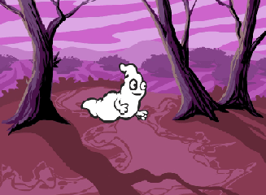
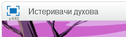
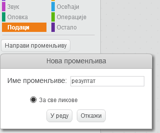
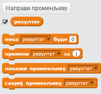
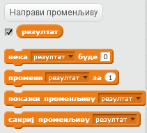
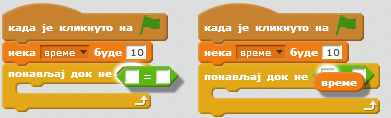

---
title: Истеривачи духова
level: Scratch 1
language: sr-SP
stylesheet: scratch
embeds: "*.png"
materials: ["Ресурси за учитеља/*.*"]
...

## Напомена: { .challenge .pdf-hidden }
Пројекат 'Балони' је премештен у одељак [Додатни Скрач пројекти](http://projects.codeclub.org.uk/en-GB/03_scratch_bonus/index.html).

# Увод { .intro }

Правићемо игру у којој ћемо јурити духове!

# Корак 1: Анимирај духа { .activity }

## Упутство { .check }

+ Отвори нов Скрач пројекат и обриши лик мачке тако да пројекат буде празан.

+ Додај нов спрајт духа и погодну позадину за сцену.

	

+ Додај следећи код духу тако да се стално појављује и нестаје:

	```blocks
		када је кликнуто на ⚑
		понављај
   			сакриј
   			чекај (1) секунду
   			прикажи
   			чекај (1) секунду
		end
	```

+ Испробај код за духа тако што ћеш кликнути на зелену заставицу.

## Сачувај пројекат { .save }

# Корак 2: Насумични духови { .activity }

Твог духа је стварно лако ухватити зато што се не помера!

## Кораци { .check }

+ Уместо да стално стоји у истој позицији, можеш да кажеш Скрачу да бира случајне x и y координате. Додај блок `иди на` {.blockmotion} у код за духа тако да изгледа овако:

	```blocks
		када је кликнуто на ⚑
			понављај
   				сакриј
   				чекај (1) секунду
   				иди на x:(случајан број од (-150) до (150)) y:(случајан број од (-150) до (150))
   				прикажи
   				чекај (1) секунду
		end
	```

+ Поново испробај духа и требало би да приметиш да се сваки пут појављује на другом месту.

## Сачувај пројекат { .save }

## Изазов: Још насумичније {.challenge}
Можеш ли да наместиш да дух `чекај` {.blockcontrol} случајно време пре него што се појави? Како би употребио блок `нека величина буде` {.blocklooks} тако да дух има случајну, променљиву величину кад год се појави?

## Сачувај пројекат { .save }

# Корак 3: Хватање духова { .activity }

Хајде да омогућимо играчу да хвата духове!

## Кораци { .check }

+ Да би играч могао да хвата духове, додај следећи код:

	```blocks
		када је кликнуто на овај лик
		сакриј
	```

+ Испробај пројекат. Можеш ли да ухватиш духове када се појаве? Ако тешко хваташ духове, можеш да играш игру преко целог екрана тако што ћеш кликнути на ово дугме:

	

## Изазов: Додај звук { .challenge }
Можеш ли да испрограмираш да се зачује звук кад год се ухвати дух?

## Сачувај пројекат { .save }

# Корак 4: Додај резултат { .activity .new-page }

Хајде да учинимо игру занимљивијом тако што ћемо бројати колико духова је ухваћено.

## Кораци { .check }

+ Да би пратио резултат играча, потребно ти је место где ћеш чувати тренутни резултат. Место у коме се чувају подаци који се мењају, на пример тренутни резултат играча, зове се __променљива__.

	Да би направио нову променљиву, кликни на картицу 'Програми', изабери `Подаци` {.blockdata} и на крају кликни на 'Направи променљиву'.

	

	Унеси 'резултат' као име за променљиву, постарај се да сви ликови могу да је виде и кликни 'OK' да би је направио. Након тога ћеш видети много блокова кода који се могу користити са променљивом `резултат` {.blockdata}.

	

	Такође ћеш у горњем левом углу сцене видети резултат.

	

+ Када се почне нова игра (тако што ће се кликнути на заставицу), требало би да резултат играча буде 0:

	```blocks
	када је кликнуто на ⚑
	нека [резултат v] буде [0]
	```

+ Кад год ухвати духа, резултат играча мораш да повећаш за 1:

	

+ Покрени програм поново и ухвати неколико духова. Да ли се резултат мења?

## Сачувај пројекат { .save }

# Корак 5: Додај тајмер { .activity }

Можеш да учиниш игру занимљивијом тако што ћеш играчу дати само 10 секунди да ухвати што више духова.

## Кораци { .check }

+ Можеш да употребиш још једну променљиву у којој ћеш чувати преостало време. Кликни на сцену и направи нову променљиву 'време':

	

+ Ево како би тајмер требало да ради:

	+ Почетна вредност тајмера треба да буде 10 секунди;
	+ Тајмер би требало да одбројава сваку секунду;
	+ Игра мора да се заврши када тајмер одброји до 0.

	Ево кода који то ради; додај га у __сцену__:

	```blocks
		када је кликнуто на ⚑
		нека [време v] буде [10]
		понављај док не <(време) = [0]>
   			чекај (1) секунду
   			промени [време v] за (-1)
		end
		заустави [све v]
	```

	Ево како ћеш додати код `понављај док не`{.blockcontrol}`време`{.blockdata}`= 0`{.blockoperators}:

	

+ Превуци приказ променљиве 'време' на десну страну позорнице. Можеш и да кликнеш на приказ променљиве десим тастером миша и да изабереш 'велики приказ' да би променио начин приказа времена.

	

+ Замоли другара да испроба твоју игру. Колико поена могу да освоје? Ако је игра сувише лака, можеш да:

	+ Даш играчу мање времена;
	+ Учиниш да се духови појављују ређе;
	+ Смањиш духове.

	Испробај игру неколико пута док не будеш задовољан тиме колико је тешка за играње.

## Сачувај пројекат { .save }

## Изазов: Још објеката {.challenge}
Можеш ли да додаш још објеката у игру?


Мораћеш да размислиш о објектима које додајеш. Размисли о томе:

+ Колики су?
+ Да ли ће се појављивати чешће или ређе од духова?
+ Како ће изгледати и звучати када се ухвате?
+ Колико поена ће се добијати (или губити) када се ухвате?

Ако ти је потребна помоћ за додавање новог објекта, врати се на претходне кораке!

## Сачувај пројекат { .save }
