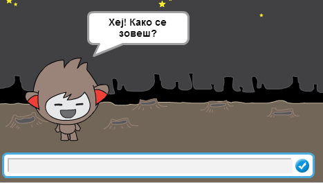
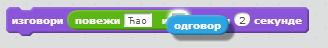
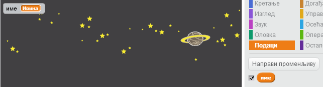
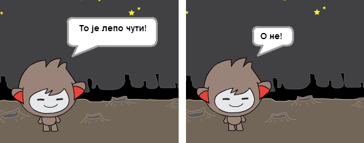
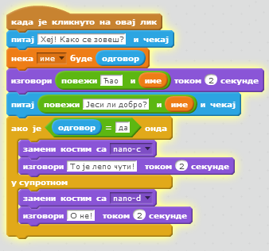
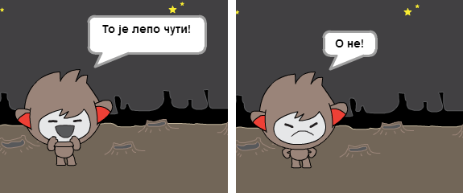
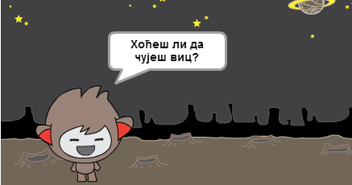
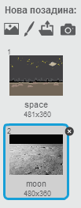
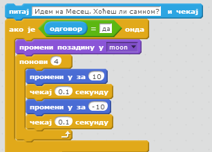
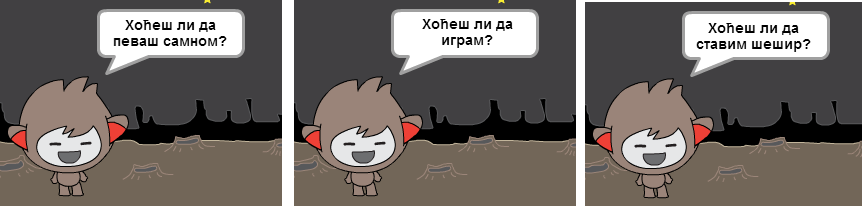

---
title: Робот који разговара
level: Scratch 1
language: sr-SP
stylesheet: scratch
embeds: "*.png"
materials: ["Ресурси за учитеља/*.*"]
...

# Увод { .intro }

Научићете да програмирате сопственог робота који разговара!

# Корак 1: Твој робот који разговара { .activity }

## Упутство { .check }

+ Пре него што почнеш да правиш робота који разговара, мораш да одлучиш какав ће он бити.
	+ Како ће се звати?
	+ Где ће живети?
	+ Хоће ли бити задовољан, озбиљан, забаван, стидљив или дружељубив?

+ Отвори нов Скрач пројекат и обриши лик мачке тако да пројекат буде празан.

+ Изабери један од ликова за робота и додај га у пројекат:

	

+ Изабери позадину која се слаже са особинама твог робота. Ево једног примера; твој, наравно, не мора да изгледа овако:

	

## Сачувај пројекат { .save }

# Корак 2: Робот који прича { .activity }

Сада када имаш робота, хајде да га испрограмирамо тако да прича са тобом.

## Упутство { .check }

+ Кликни на робота и додај следећи код:

	```blocks
		када је кликнуто на овај лик
		питај [Хеј! Како се зовеш?] и чекај
		изговори [Какво лепо име!] током (2) секунде
	```

+ Кликни на робота да би га испробао. Када те упита за име, откуцај га у поље на дну сцене.

	

+ Твој робот сваки пут одговара са `Какво лепо име!`. Можеш да прилагодиш његов одговор тако што ћеш искористити одговор корисника. Промени код за робота тако да изгледа овако:

	```blocks
		када је кликнуто на овај лик
		питај [Хеј! Како се зовеш?] и чекај
		изговори <повежи [Ћао ] и (одговор)> током (2) секунде
	```

	Да би направио последњи блок, мораћеш прво да превучеш на зелени блок `повежи` {.blockoperators}, a затим да га превучеш на блок `изговори` {.blocklooks}.

	

Затим можеш да измениш текст `hello` у `Ћао `, и да превучеш светлоплави блок `одговор` {.blocksensing} (из одељка 'Осећаји') на текст `world`.

	

+ Испробај нов програм. Да ли ради као што очекујеш? Можеш ли да решиш проблеме које примећујеш? (Савет: покушај да понегде додаш размак!)

+ Можда би могао да сачуваш име корисника у некој променљивој да би могао касније поново да га употребиш. Направи нову променљиву и назови је `име` {.blockdata}. Ако си заборавио како се то ради, погледај у пројекту 'Балони'.

+ Податак који си унео већ се чува у посебној променљивој `одговор` {.blocksensing}. Отвори групу блокова Осећаји и кликни на блок одговора тако да буде потврђен. Тренутна вредност променљиве `одговор` {.blocksensing} требало би да се појави у горњем левом углу сцене.

+ Пошто си направио нову променљиву, провери да ли код за твог робота изгледа овако:

	```blocks
		када је кликнуто на овај лик
		питај [Хеј! Како се зовеш?] и чекај
		нека [име v] буде (одговор)
		изговори <повежи [Ћао ] и (име)> током (2) секунде
	```

+ Ако поново испробаш програм, приметићеш да се одговор чува у променљивој `име` {.blockdata} и да се приказује у горњем левом углу сцене. Променљива `име` {.blockdata} би сада требало да садржи исту вредност као променљива `одговор` {.blocksensing}.

	

	Ако не желиш да променљиве буду приказане на сцени, можеш да кликнеш на знак за потврду поред назива променљивих на картици 'Програми' да би их сакрио.

## Сачувај пројекат { .save }

## Изазов: Још питања { .challenge }

Програмирај свог робота да постави неко друго питање. Можеш ли да сачуваш одговор у променљивој?


## Сачувај пројекат { .save }

# Корак 3: Одлучивање { .activity }

Можеш да програмираш робота да одлучи шта ће урадити на основу одговора које добије од корисника.

## Упутство { .check }

+ Хајде да роботу кажемо да постави питање на које корисник може да одговори са `да` или `не`. Ево једног примера, али ти можеш да смислиш и неко друго питање:

	```blocks
		када је кликнуто на овај лик
		питај [Хеј! Како се зовеш?] и чекај
		нека [име v] буде (одговор)
		изговори <повежи [Ћао ] и (име)> током (2) секунде
		питај <повежи [Јеси ли добро? ] и (име)> и чекај
		ако је ((одговор) = [да]) онда 
		изговори [То је лепо чути!] током (2) секунде
		end
	```

	Примети да сада када си сачувао име корисника у променљивој можеш да га користиш кад год желиш.

+ Да би правилно испробао програм, мораћеш да га пробаш двапут - једном тако што ћеш унети `не` као одговор, и други пут тако што ћеш унети `да`. Одговор од контроле `ако је` {.blockcontrol} робота би требало да добијеш само када одговориш `да`.

+ Сада је проблем са роботом то што не даје никакав одговор када корисник одговори `не`. То можеш да поправиш тако што ћеш блок `ако је` {.blockcontrol} заменити блоком `ако је/у супротном` {.blockcontrol}, тако да код изгледа овако:

	```blocks
		када је кликнуто на овај лик
		питај [Хеј! Како се зовеш?] и чекај
		нека [име v] буде (одговор)
		изговори <повежи [Ћао ] и (име)> током (2) секунде
		питај <повежи [Јеси ли добро?] и (име)> и чекај
		ако је ((одговор) = [да]) онда
   		изговори [То је лепо чути!] током (2) секунде
		у супротном
   		изговори [O не!] током (2) секунде
		end

	```

+ Ако испробаш код, уверићеш се да сада добијаш одговор без обзира да ли изабереш `да` или `не`. Твој робот би требало да одговори са `То је лепо чути!` када одговориш `да`, а са `O не!` ако унесеш било шта другачије од `да`.

	

+ Унутар блокова `ако је` {.blockcontrol} или `у супротном` {.blockcontrol} можеш да ставиш било какав код, а не само онај који ће учинити да твој робот прича. На пример, можеш да промениш костим за робота тако да буде прилагођен одговору.

	Ако прегледаш костиме за робота, приметићеш да их има неколико. (Ако их нема, увек можеш сам да их додаш!)

	

	Ове костиме можеш да употребиш за одговор робота тако што ћеш додати следећи код:

	

+ Испробај програм и видећеш да се лице робота мења у зависности од твог одговора.

	

## Сачувај пројекат { .save }

## Изазов: Још одлучивања { .challenge }

Програмирај робота тако да пита још нешто на шта може да се одговори са `да` или `не`. Можеш ли да натераш робота да одговори у складу са твојим одговором?



## Сачувај пројекат { .save }

# Корак 4: Премештање { .activity }

Робота можеш да програмираш тако да мења место.

## Упутство { .check }

+ Додај још једну позадину у сцену, на пример позадину месеца ('moon').

	

+ Сада можеш да програмираш робота да промени место тако што ћеш му додати следећи код:

	```blocks
		питај [Идем на Месец. Хоћеш ли самном?] и чекај
		ако је ((одговор) = [да]) онда
   		промени позадину у [moon v]
		end
	```

+ Мораћеш да се постараш и да робот буде напољу када почнеш да разговараш са њим. Додај следећи блок на почетак кода за робота:

	

+ Испробај програм и одговори `да` када те робот упита да ли желиш да путујеш на Месец. Требало би да видиш да се робот померио.

	

+ Да ли се робот премешта када одговориш `не`? Шта ако откуцаш `Нисам сигуран`?

+ Можеш и да додаш следећи код у блок `ако је` {.blockcontrol} да би робот скочио горе доле 4 пута ако је одговор `да`:

	```scratch
		понови (4)
   		промени y за (10)
   		чекај (0.1) секунду
   		промени y за (-10)
   		чекај (0.1) секунду
		end
	```

	

+ Испробај код опет. Да ли робот скаче горе доле када одговориш `да`?

## Сачувај пројекат { .save }

## Изазов: Направи свог робота {.challenge}
Искористи оно што си научио да би довршио интерактивног робота. Ево неких предлога:



Када завршиш робота који говори, позови своје другаре да разговарају са њим! Да ли им се свиђа? Јесу ли приметили неке проблеме?

## Сачувај пројекат { .save }

## Community Contributed Translation { .challenge .pdf-hidden }

This project was translated by Irina Branovic. Our amazing translation volunteers help us give children around the world the chance to learn to code.  You can help us reach more children by translating a Code Club project via [Github](https://github.com/CodeClub/curriculum_documentation/blob/master/contributing.md) or by getting in touch with us at hello@codeclubworld.
