* * *

title: Рок-гурт level: Scratch 1 language: uk-UA stylesheet: scratch embeds: "*.png" materials: ["Club Leader Resources/*"]

# Передмова {.intro}

У цьому проекті ви навчитеся кодувати ваші власні музичні інструменти!

<div class="scratch-preview">
  crwMD_Iframe_0 
</div>

# Крок 1: Спрайти {.activity}

Перш ніж розпочати процес формування анімації, потрібно вибрати "предмет" для анімації. У Скретчі такі предмети називаються **спрайтами**.

## Завдання для виконання {.check}

+ Найперше, відкрийте редактор Скретч. Ви можете знайти онлайн-редактор на [jumpto.cc/scratch-new](http://jumpto.cc/scratch-new). Він виглядає так:
    
    

+ Спрайт кота, який створився автоматично, — це талісман Скретч. Давайте позбудемось від нього, клацнувши по ньому правою кнопкою миші та вибравши функцію "вилучити".
    
    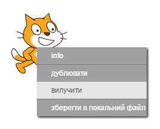

+ Далі, натисніть кнопку "Оберіть спрайт із бібліотеки", щоб відкрити список всіх спрайтів Скретч.
    
    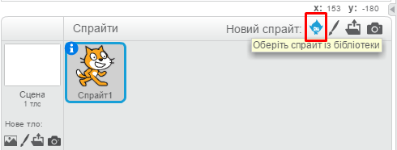

+ Прокручуйте вниз, доки не побачите спрайт барабану. Натисніть на барабан, а тоді на кнопку "ОК", щоб додати його до вашого проекту.
    
    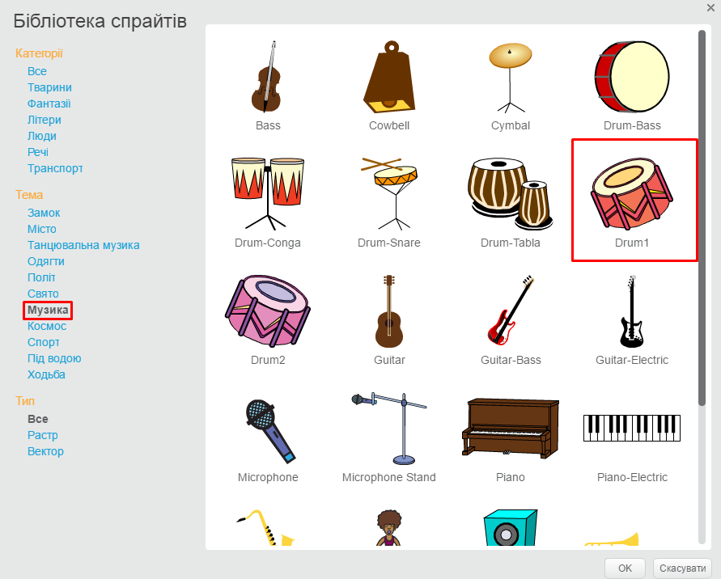

+ Натисніть на піктограму "Зменшити" та клацніть на барабані кілька разів, щоб зменшити його розмір.
    
    

## Збережіть свій проект {.save}

Дайте ім'я вашій програмі, ввівши його в текстове поле у верхньому лівому куті.

Щоб зберегти проект, ви можете натиснути "Файл", а потім "Зберегти".

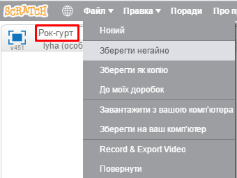

# Крок 2: Сцена {.activity}

**Сцена** — це область ліворуч, на якій ваш проект оживає. Думайте про неї як місце дійства, яким є справжня сцена!

## Завдання для виконання {.check}

+ Зараз сцена біла і виглядає доволі непримітно! Давайте додамо фон до сцени, натиснувши "Оберіть тло з бібліотеки".
    
    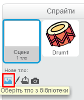

+ Натисніть ліворуч "У приміщенні'", а потім виберіть будь-який малюнок зі сценою і натисніть кнопку "OK".
    
    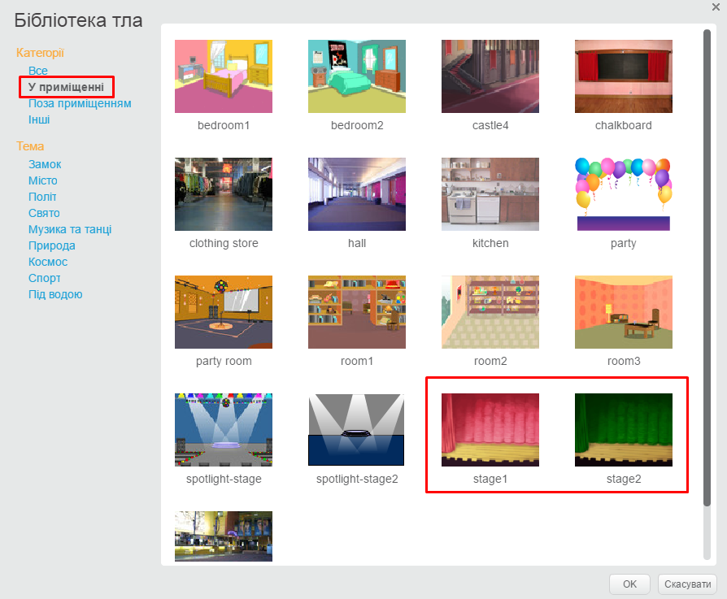

+ Тепер ваша сцена має виглядати приблизно так:
    
    

# Крок 3: Створення барабана {.activity}

Давайте закодуємо барабан так, щоб він видавав звуки, коли по ньому вдаряють.

## Завдання для виконання {.check}

+ На вкладці "Скрипти" знайдіть блоки коду. Бачите, всі вони забарвлені різними кольорами!
    
    Натисніть на спрайт барабана і перетягніть ці 2 блоки до області коду праворуч, переконавшись, що вони з'єднаються один з одним (як в конструкторі Лего):
    
    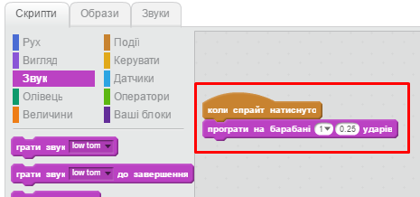

+ Клацніть на барабан, щоб випробувати новий інструмент!

+ До того ж, можна змінювати вигляд барабана при натисканні, попередньо створивши новий образ. Перейдіть на вкладку "Образи", і ви побачите зображення барабана.
    
    

+ Клацніть правою кнопкою миші на цьому костюмі і виберіть "Дублювати", щоб створити копію костюма.
    
    

+ Натисніть на новий костюм (під назвою "drum2"), потім виберіть інструмент "Лінія" і намалюйте декілька ліній, так щоб вони нагадували барабан, який видає звук.
    
    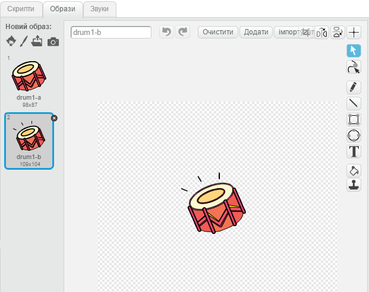

+ Зараз назви костюмів не надто допомагають. Перейменуйте 2 костюми на "без ударяння" та 'ударяння', ввівши нове ім'я кожного костюма у текстовому полі.
    
    

+ Тепер, коли у вас є 2 різні костюми для барабана, ви можете вибрати, який костюм відображатиметься! Додайте ці 2 блоки до барабана:
    
    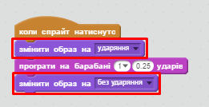
    
    Блок коду для зміни костюма знаходиться в групі `Вигляд` {.blocklooks}.

+ Випробуйте ваш барабан. При натисненні барабан повинен виглядати так, ніби по ньому вдарили!

## Збережіть свій проект {.save}

## Виклик: Вдосконалюємо барабан {.challenge}

+ Чи зможете ви змінити звук, який видає барабан при натисканні?

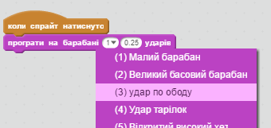

+ Чи вийде у вас отримати звук при натисненні пробілу? Вам знадобиться ось цей блок з групи `Події`{.blockevents}:

```blocks
    when [space v] key pressed
```

Ви можете скопіювати існуючий код, клацнувши правою кнопкою миші на ньому і натиснувши "дублювати".

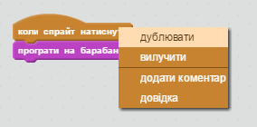

## Збережіть свій проект {.save}

# Крок 4: Створення співака {.activity.new-page}

Давайте додамо до вашої групи співака!

## Завдання для виконання {.check}

+ Додайте ще 2 спрайти до сцени: співака і мікрофон.
    
    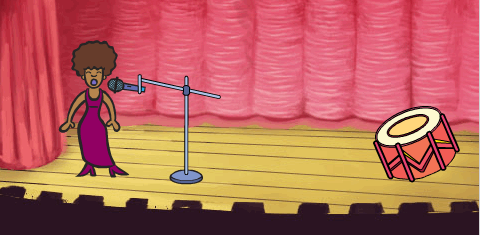

+ Перш ніж ви зможете змусити вашого героя співати, вам потрібно додати до нього звук. Переконайтеся, що ви натиснули на спрайт співака, тоді перейдіть на вкладку "Звуки" і натисніть "Оберіть звук із бібліотеки":
    
    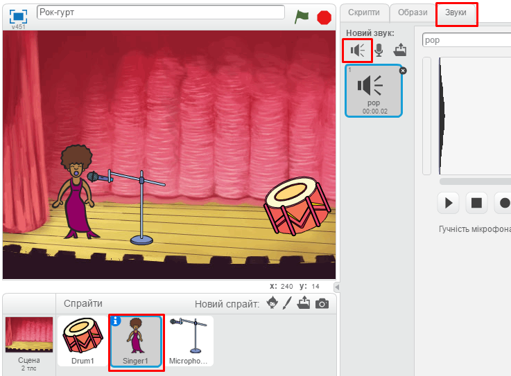

+ Якщо зліва натиснути "Вокал", ми зможемо вибрати найліпший голос для співака.
    
    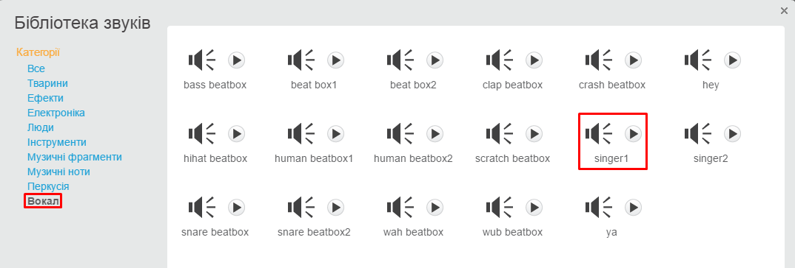

+ Тепер, коли звук вже доданий, є можливість використовувати його в скрипті співака:
    
    ```blocks
    when this sprite clicked
    play sound [singer1 v] until done
```

+ Клацніть по співаку, аби переконатися, що він співає при натисканні.

## Збережіть свій проект {.save}

## Виклик: Змінюємо костюм співака {.challenge}

Чи вийде у вас зробити так, щоб персонаж змінював вигляд, коли співає? Якщо вам потрібна допомога, використайте попередню інструкцію для створення барабана.


Не забудьте перевірити, чи працює ваш новий код!

## Збережіть свій проект {.save}

## Виклик: Створи свій власний гурт {.challenge}

Використовуйте здобуті у цьому проекті навички, щоб сформувати свій власний гурт! Ви можете створити будь-які інструменти, але спершу подивіться на доступні звуки та інструменти, щоб зорієнтуватись.

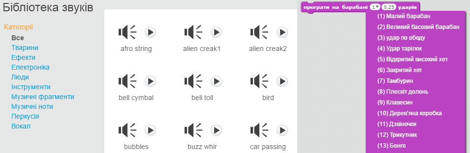

Проте, ваші інструменти не обов'язково повинні бути практичними. Наприклад, ви могли б створити фортепіано, зроблене з кексів!


Ви маєте змогу не лише використовувати вже існуючі зображення, але й малювати свої власні.

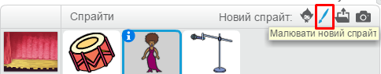

За наявності мікрофона можна записувати власні звуки, або навіть використовувати веб-камеру, щоб вдаряти по ваших інструментах!


## Збережіть свій проект {.save}