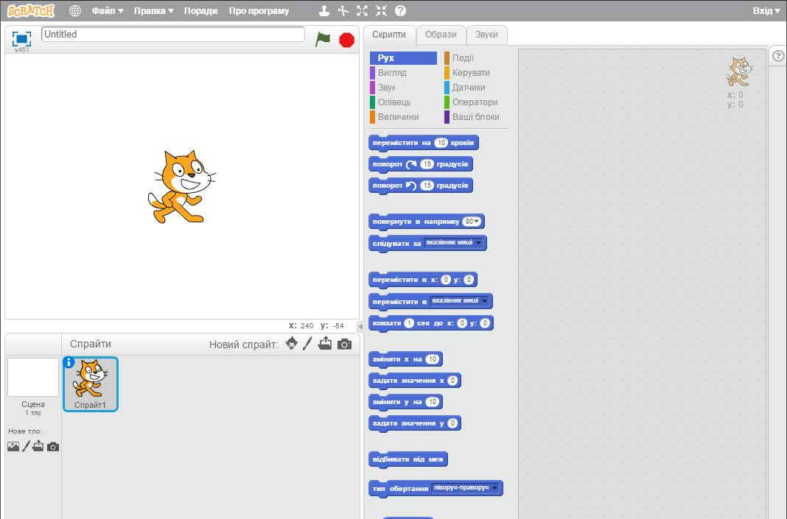
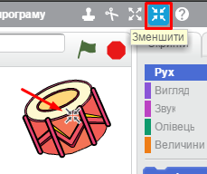
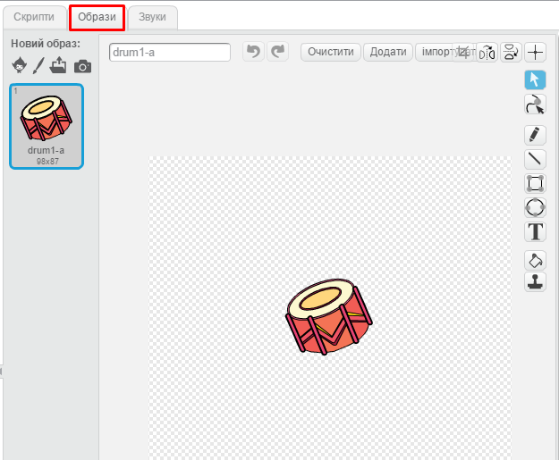
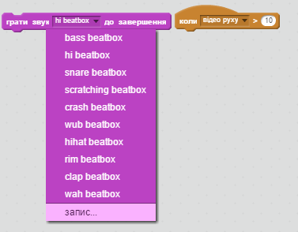

* * *

title: Рок-гурт level: Scratch 1 language: uk-UA stylesheet: scratch embeds: "*.png" materials: ["Club Leader Resources/*"]

# Передмова {.intro}

У цьому проекті ви дізнаєтеся, як запрограмувати власні музичні інструменти!

<div class="scratch-preview">
  crwMD_Iframe_0 
</div>

# Крок 1: Спрайти {.activity}

Перш ніж розпочати процес формування анімації, потрібно додати "предмет" для анімації. Такі "предмети" в Скретчі називаються **спрайтами**.

## Завдання для виконання {.check}

+ Спочатку, відкрийте Скретч-редактор. Онлайн Скретч-редактор знаходиться за посиланням [jumpto.cc/scratch-new](http://jumpto.cc/scratch-new). Він має такий вигляд:
    
    

+ Спрайт кота, який створився автоматично, — це талісман Скретч. Позбудьмось його, клацнувши по ньому правою кнопкою миші та вибравши функцію "вилучити".
    
    

+ Далі, натисніть кнопку "Оберіть спрайт із бібліотеки", щоби відкрити список усіх спрайтів Скретч.
    
    

+ Прокручуйте вниз, доки не побачите спрайт барабана. Натисніть на барабан, а тоді на кнопку "ОК", щоби додати його до вашого проекту.
    
    

+ Натисніть на піктограму "Зменшити" та клацніть на барабані кілька разів, щоби зменшити його розмір.
    
    

## Збережіть свій проект {.save}

Дайте ім’я вашій програмі, ввівши його в текстове поле у верхньому лівому куті.

Щоби зберегти проект, ви можете натиснути "Файл", а потім "Зберегти".


# Крок 2: Сцена {.activity}

**Сцена** — це ділянка ліворуч, на якій ваш проект оживає. Думайте про неї, як про місце дійства, яким є справжня сцена!

## Завдання для виконання {.check}

+ Зараз сцена біла й має доволі непримітний вигляд! Додаймо фон до сцени, натиснувши "Оберіть тло з бібліотеки".
    
    

+ Натисніть ліворуч "У приміщенні'", а потім виберіть будь-який малюнок зі сценою, і натисніть кнопку "OK".
    
    

+ Тепер ваша сцена буде приблизно такою:
    
    

# Крок 3: Створення барабана {.activity}

Запрограмуймо барабан так, щоби він видавав якісь звуки, коли по ньому вдаряють.

## Завдання для виконання {.check}

+ На вкладці "Скрипти" знайдіть блоки коду. Зверніть увагу, вони всі різнокольорові!
    
    Натисніть на спрайт барабана й перетягніть ці 2 блоки до ділянки коду праворуч, переконавшись, що вони з’єднаються один з одним (як у конструкторі Лего):
    
    

+ Клацніть на барабан, щоби випробувати новий інструмент!

+ До того ж, можна змінити вигляд барабана, коли по ньому натискають. Щоб зробити це, додайте до нього новий образ. Перейдіть на вкладку "Образи", і ви побачите барабан.
    
    

+ Клацніть правою кнопкою миші на цьому костюмі і виберіть "Дублювати", щоб створити копію костюма.
    
    

+ Натисніть на новий костюм (під назвою "drum2"), потім виберіть інструмент "Лінія" й намалюйте декілька ліній, так щоби вони скидалися на те, ніби барабан видає звук.
    
    

+ Зараз назви костюмів не надто корисні. Перейменуйте ці 2 костюми на "без ударяння" та "ударяння", ввівши нове ім’я кожного костюма в текстове поле.
    
    

+ Тепер, коли ви маєте 2 різні костюми для барабана, ви можете обирати, який костюм відображатиметься! Додайте ці 2 блоки до барабана:
    
    
    
    Блок коду для зміни костюма міститься в розділі `Вигляд` {.blocklooks}.

+ Випробуйте ваш барабан. При натисненні барабан повинен виглядати так, ніби по ньому вдарили!

## Збережіть свій проект {.save}

## Виклик: Вдосконалюємо барабан {.challenge}

+ Як ви можете змінити звук, який видає барабан при натисканні?


+ Чи можете ви зробити так, щоб барабан видавав звук при натисненні пробілу? Вам знадобиться ось цей блок із групи `Події`{.blockevents}:

```blocks
    when [space v] key pressed
```

Ви можете скопіювати існуючий код, клацнувши по ньому правою кнопкою миші й натиснувши "дублювати".


## Збережіть свій проект {.save}

# Крок 4: Створення солістки {.activity.new-page}

Додаймо до нашої групи солістку!

## Завдання для виконання {.check}

+ Додайте ще 2 спрайти до сцени: співачку й мікрофон.
    
    

+ Перш ніж ви зможете зробити так, щоб солістка заспівала, потрібно додати звук до спрайта. Переконайтеся, що ви вибрали солістку, тоді перейдіть на вкладку "Звуки" й натисніть "Оберіть звук із бібліотеки":
    
    

+ Якщо зліва натиснути "Вокал", ви зможете вибрати відповідний звук для цього спрайта.
    
    

+ Тепер, коли звук уже доданий, можна використати його в скрипті співачки:
    
    ```blocks
    when this sprite clicked
    play sound [singer1 v] until done
```

+ Клікніть по солістці, аби переконатися, що вона співає.

## Збережіть свій проект {.save}

## Виклик: Змінюємо костюм співака {.challenge}

Чи вийде у вас зробити так, щоби персонаж змінював вигляд, коли співає? Якщо вам потрібна допомога, використайте попередню інструкцію для створення барабана.


Не забудьте перевірити, чи працює ваш новий код!

## Збережіть свій проект {.save}

## Виклик: Створи свій власний гурт {.challenge}

Використовуйте здобуті в цьому проекті навички, щоби сформувати свій власний гурт! Ви можете створити будь-які інструменти, але спершу подивіться на доступні звуки та інструменти, щоби зорієнтуватись.


Проте, ваші інструменти не обов’язково мають бути практичними. Наприклад, ви могли б створити фортепіано, зроблене з кексів!


Ви можете не лише використовувати наявні зображення, але й малювати свої власні.


За наявності мікрофона можна записувати власні звуки, або навіть використовувати веб-камеру, щоби вдаряти по ваших інструментах!



## Збережіть свій проект {.save}