---
title: Перегони човнів
level: Scratch 1
language: uk-UA
stylesheet: scratch
embeds: "*.png"
materials: ["Club Leader Resources/*","Project Resources/*"]
...

# Вступ {.intro}

Ви дізнаєтесь, як зробити гру, в якій треба буде використовувати мишку, щоб перемістити човен в напрямку пустельного острову.

<div class="scratch-preview">
  <iframe allowtransparency="true" width="485" height="402" src="http://scratch.mit.edu/projects/embed/63957956/?autostart=false" frameborder="0"></iframe> 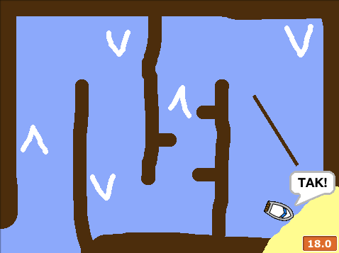
</div>

# Крок 1: Планування гри {.activity}

## Список завдань {.check}

+ Створіть новий проект у Скретч та видаліть спрайт кота, так щоб проект став пустим. Онлайн Скретч-редактор знаходиться за посиланням [jumpto.cc/scratch-new](http://jumpto.cc/scratch-new).

+ Натисніть на тло (фон) і заплануйте рівень. Ви повинні додати:
    
    + Дерево, яке човен повинен оминути;
    + Пустельний острів, до якого човен повинен дістатися.
    
    Ось так може виглядати гра:
    
    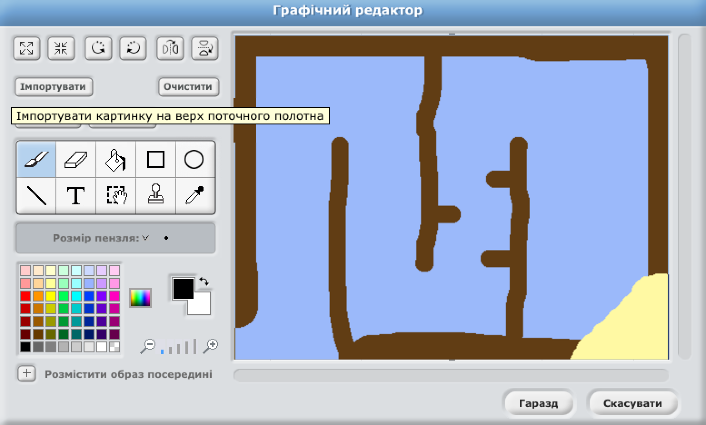

# Крок 2: Контроль човна {.activity}

## Завдання для виконання {.check}

+ Якщо тренер клубу дав вам доступ до папки "Ресурси", натисніть на кнопку "Завантажити спрайт з файлу" і додайте малюнок "boat.png". Ви повинні зменшити спрайт і помістити його у вихідне положення.
    
    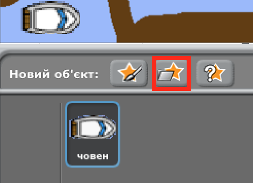
    
    Якщо у вас немає зображення "boat.png", можете натомість намалювати свій човен!

+ Ви будете керувати човном за допомогою миші. Додайте наступний код до свого човна:
    
    ```blocks
    коли натиснуто ⚑
повернути в напрямку (0 v)
перемістити в x:(-190) y:(-150)
завжди
   слідувати за [вказівник миші v]
   перемістити на (1) кроків
end
```

+ Протестуйте свій човен, натиснувши на значок із зеленим прапорцем і переміщаючи мишку. Чи пливе човен за мишкою?
    
    

+ Що відбувається, коли човен досягає вказівника миші?
    
    Щоб це зупинити, потрібно додати блок `якщо`{.blockcontrol} щоб човен рухався тільки тоді, коли він знаходиться на відстані 5 пікселів від вказівника миші.
    
    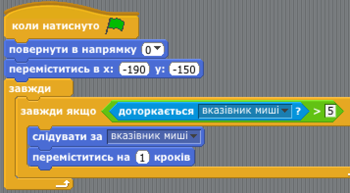

+ Протестуйте човен знову і перевірте чи проблема вирішилась.

## Збережіть проект {.save}

# Крок 3: Аварія! {.activity.new-page}

Човен може пропливати через дерев'яні бар'єри! Треба це поправити.

## Список завдань {.check}

+ Вам потрібно 2 образи для човна, один звичайний, інший - для випадків коли човен виходить з ладу. Образи потрібно назвати "звичайний" і "пошкоджений".

+ Натисніть на "пошкоджений" образ і скористайтесь інструментом "Вибрати" (Select), щоб захопити, переміщати і обертати частинки човна. Зробіть так, щоб човен мав вигляд розбитого.
    
    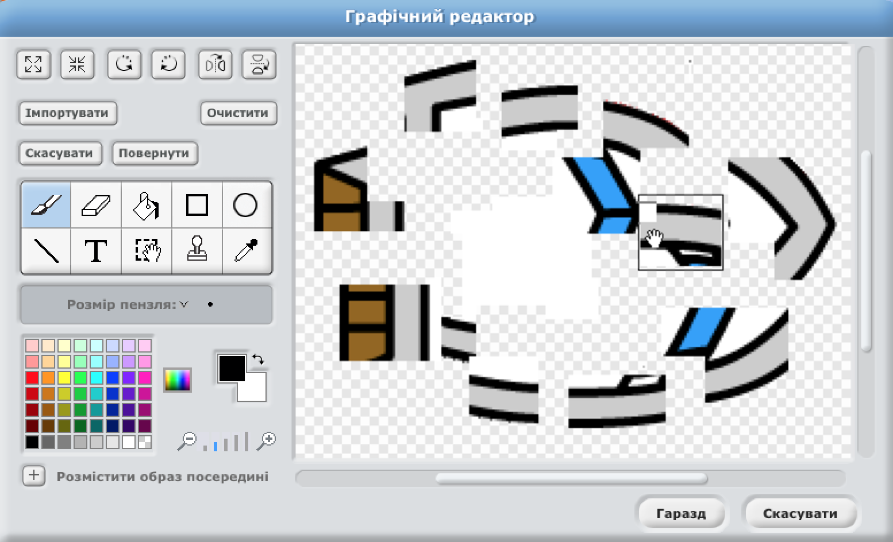

+ Додайте цей код до човна, всередині блоку `завжди` {.blockcontrol} щоб він розбивався, коли торкається будь-якого коричневого дерев'яного уламку:
    
    ```blocks
    if <touching color [#603C15]?> then
        змінити образ на [hit v]
        говорити [Noooooo!] (1) сек
        змінити образ на [normal v]
        повернути в напрямку (0 v)
        перемістити в x:(-215) y:(-160)
    end
```

Цей код знаходиться всередині блоку `завжди` {.blockcontrol} щоб твій код постійно перевіряв чи човен розбився.

+ Слід також потурбуватись, щоб човен завжди починав подорож у "звичайному" вигляді.

+ Тепер, коли ви спробуєте плисти через дерев'яні бар'єри, ви зможете побачити, що човен розбивається і рухається назад до початку.
    
    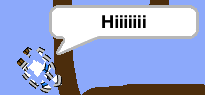

## Збережіть свій проект {.save}

## Виклик: Перемога! {.challenge}

Чи можете ви додати ще одне судження `if` {.blockcontrol} до коду човна, щоб гравець вигравав тоді, коли дістається до острову?

Коли човен досягає жовтого безлюдного острову, з'являється напис 'ТАК!' і гра припиняється. Ви повинні використовувати наступний код:

```blocks
    говорити [YEAH!] (1) сек
    зупинити [все v]
```

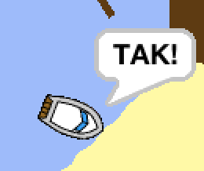

## Збережіть свій проект {.save}

## Виклик: Звукові ефекти {.challenge}

Ви можете додати до гри звукові ефекти, коли човен розбивається або досягає острова в кінці гри. Ви навіть можете додати фонову музику (якщо вам потрібна допомога з цим, подивиться попередній проект "Рок-група").

## Збережіть свій проект {.save}

# Крок 4: Обмеження часу {.activity}

Додаймо до гри таймер, щоб гравець спробував дістався безлюдного острову якомога швидше.

## Завдання для виконання {.check}

+ Додайте нову змінну з ім'ям {.blockdata} `час`. Також можна змінити відображення нової змінної. Якщо вам потрібна допомога, подивіться проект 'Повітряні кулі'.
    
    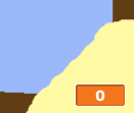

+ Додайте цей код до **етап**, щоб таймер лічив час доти, доки човен не дістанеться острову:
    
    ```blocks
    коли натиснуто ⚑
встановити [time v] в [0]
завжди
   чекати (0.1) секунд
   змінити [time v] на (0.1)
end
```

+ Готово! Протестуйте вашу гру і перевірте, як швидко ви можете дістатися безлюдного острова!
    
    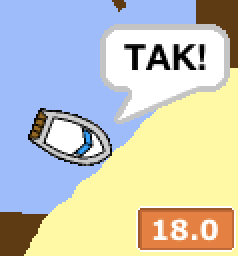

## Збережіть свій проект {.save}

# Крок 5: Перешкоди і бонуси {.activity}

Ця гра *занадто* проста - давайте зробимо її більш цікавою.

## Завдання для виконання {.check}

+ Спочатку додамо деякі активні елементи, які пришвидшать човен. Відредагуйте фонове зображення і додайте кілька білих стрілок.
    
    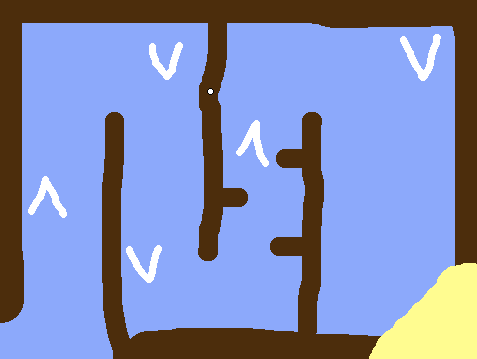

+ Тепер ви можете додати код для циклу вашого човна `forever` {.blockcontrol}, щоб він перемістився на 2 *додаткові* кроки при натисканні на білі стрілки.
    
    ```blocks
    if <touching color [#FFFFFF] ?> then
        перемістити на (3) кроків
    end
```

+ Можна також додати рухомі ворота, яких човен повинен уникнути. Додайте новий графічний об'єкт з ім'ям "ворота", який виглядає наступним чином:
    
    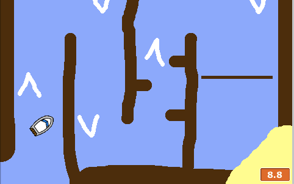
    
    Переконайтеся, що колір воріт співпадає з кольором іншіх дерев'яних перешкод.

+ Встановіть центр спрайту воріт.
    
    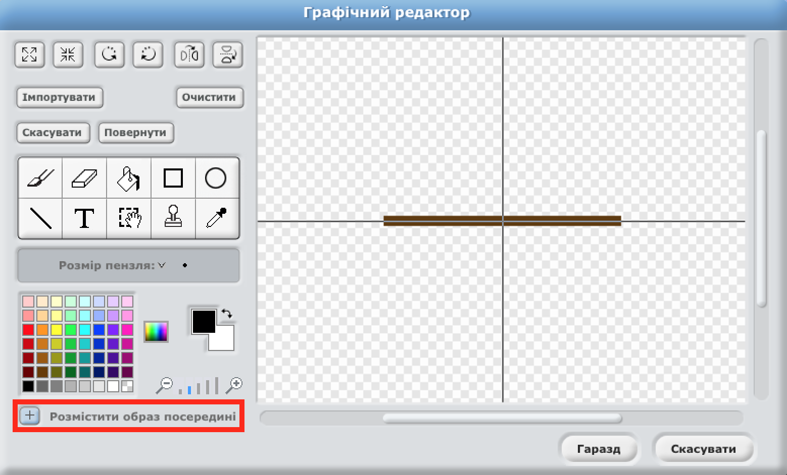

+ Для того, щоб ворота оберталися, додайте код `forever` {.blockcontrol}.

+ Протестуйте гру. Тепер в грі з'явилися ворота, які обертаються і яких треба уникати.
    
    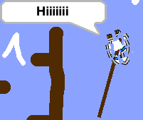

## Збережіть свій проект {.save}

## Виклик: Більше перешкод! {.challenge.new-page}

Чи можна додати більше перешкод для вашої гри? Нижче наводяться кілька ідей:

+ До фонового зображення можна додати зелені ділянки болота, які уповільнюють швидкість човна, коли він на них натрапляє. Для цього використовується блок {.blockcontrol} `wait`:

```blocks
    чекати (0.01) секунд
````

! [screenshot] (boat-algae.png)

+ You could add a moving object, like a log or a shark!

! [screenshot] (boat-obstacles.png)

These blocks may help you:

```blocks
перемістити на (1) кроків
відбивати від меж
````

If your new object isn't brown, you'll need to add to your boat code:

```blocks
if <  <touching color [#603C15] ?> or <touching [shark v] ?> > then
end
```

## Збережіть свій проект {.save}

## Виклик: Більше човнів! {.challenge.new-page}

Чи можна перетворити вашу гру в гонку між 2 гравцями?

+ Продублюйте код для створення човна, дайте йому ім'я "Гравець 2" і змініть його колір.

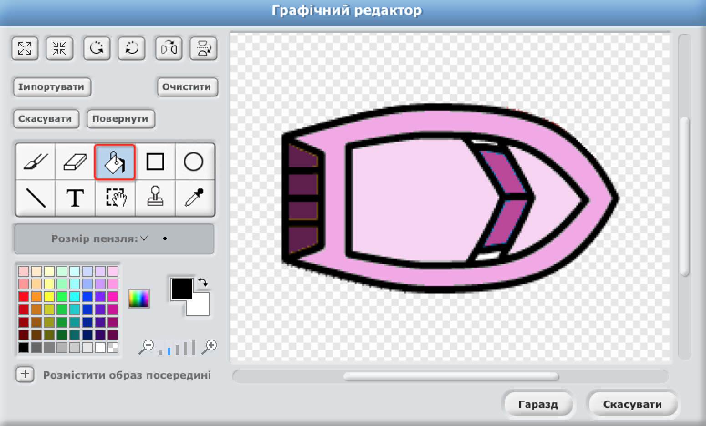

+ Змініть початкову позицію для Гравця 2, змінивши цей код:

```blocks
    Перейти до: x: (-190) у:(-150)
```

+ Видаліть код, що використовується для керування човном мишкою:

```blocks
    if < (відстань до [вказівник миші v]) > [5] > then
        слідувати за [вказівник миші v]
        перемістити на (1) кроків
    end

```

...і замініть його на код для керування човном за допомогою клавіш зі стрілками.

Для руху вперед використувуйте наступний код:

```blocks
    if < key [стрілка вгору v] pressed? > then
        перемістити на (1) кроків
    end
```

Аналогічно для повороту човна при натисканні лівої і правої клавіші стрілок використовуйте код `turn` {.blockmotion}.

## Збережіть свій проект {.save}

## Виклик: Більше рівнів! {.challenge.new-page}

Чи можете ви створити додаткові фонові зображення, а також дозволити гравцеві вибирати рівні?

```blocks
    коли натиснуто клавішу [пропуск v]
    наступне тло

```

## Збережіть свій проект {.save}