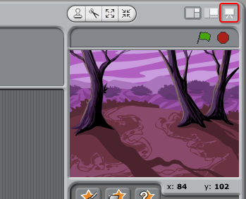

---
title: Мисливці за привидами — Примітки для керівників клубу
language: uk-UA
embeds: "*.png"
...

# Вступ:

В цьому проекті діти дізнаються, як використовувати змінні для зберігання даних у своїх програмах.

# Засоби

Для цього проекту слід використовувати Scratch 2. Scratch 2 можна використовувати онлайн за посиланням [jumpto.cc/scratch-on](http://jumpto.cc/scratch-on), або завантажити з [jumpto.cc/scratch-off](http://jumpto.cc/scratch-off) та використовувати в автономному режимі.

Завершену версію цього проекту можна знайти за посиланням [online](http://scratch.mit.edu/projects/60787262/#editor), або ж можна завантажити, натиснувши на посилання "Завантажити проектні матеріали", яке містить такі документи:

+ Ghostbusters.sb2

# Навчальні цілі

+ Змінні;
+ Випадкові числа.

# Завдання

+ "Більше хаотичності" - за допомогою використання випадкових чисел;
+ "Додавання звуку" - закріплення знань про звуки;
+ "Більше предметів" - застосування навичок для створення ше одного об'єкта гри.

# Питання, які часто ставляться

+ Якщо дітям важко натискати на привидів не перетягуючи їх, вони можуть грати в повноекранному режимі, в якому привиди нерухомі.

