---
title: Гра розуму
level: Scratch 2
language: uk-UA
stylesheet: scratch
embeds: "*.png"
materials: ["Club Leader Resources/*"]
...

# Передмова {.intro}

У цьому проекті ви дізнаєтеся, як створити гру-вікторину з відліком часу, в якій гравець має надати якомога більше правильних відповідей за 30 секунд.

<div class="scratch-preview">
  <iframe allowtransparency="true" width="485" height="402" src="http://scratch.mit.edu/projects/embed/42225768/?autostart=false" frameborder="0"></iframe> 
</div>

# Крок 1: Створення запитань {.activity}

Розпочнімо зі створення випадкових питань для гравця, на які він відповідатиме.

## Список дій {.check}

+ Створіть новий проект у Скретч та видаліть спрайт кота, так щоб проект став пустим. Онлайн Скретч-редактор знаходиться за посиланням [jumpto.cc/scratch-new](http://jumpto.cc/scratch-new).

+ Виберіть персонаж і фонове зображення для вашої гри. Ви можете вибрати будь-який! Ось приклад:
    
    

+ Створіть 2 нових змінні з іменами `число1` {.blockdata} і `число2` {.blockdata}. Ці змінні зберігатимуть 2 числа, які будуть перемножатися між собою.
    
    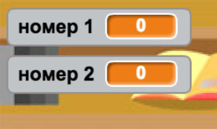

+ Додайте програмний код до вашого персонажу, встановіть для обох змінних значення `випадкове` {.blockoperators} - число від 2 до 12.
    
    ```blocks
    коли натиснуто ⚑
    встановити [number 1 v] в (випадкове від (2) до (12))
    встановити [number 2 v] в (випадкове від (2) до (12))
```

+ Потім можна попросити гравця дати відповідь і показати, була вона правильна чи ні.
    
    ```blocks
    коли натиснуто ⚑
    встановити [number 1 v] в (випадкове від (2) до (12))
    встановити [number 2 v] в (випадкове від (2) до (12))
    запитати (з'єднати (number 1) (з'єднати [x] (number 2))) і чекати
    if < (відповідь) = ((number 1) * (number 2)) > then
        говорити [yes! :)] for (2) secs
    інакше
        говорити [nope :(] (2) сек
    end
```

+ Повністю протестуйте свою програму, надавши одну правильну і одну неправильну відповідь.

+ Створіть цикл `завжди` {.blockcontrol} для цього фрагменту коду, щоб гравець отримав можливість відповісти на багато питань.

+ Створити таймер зворотного відліку на сторінці, використовуючи змінну з ім'ям {.blockdata} `час`. Якщо вам потрібна допомога, в проекті "Повітряні кулі" наведені інструкції для створення таймеру (див. Крок 6)!

+ Знову протестуйте свій проект - питання повинні ставитися гравцю доти, доки не закінчиться відлік часу.

## Збережіть свій проект {.save}

## Виклик: Зміна вигляду персонажу {.challenge}

Чи можете ви міняти вигляд вашого персонажу, щоб його зображення змінювалося в залежності від відповідей гравця?

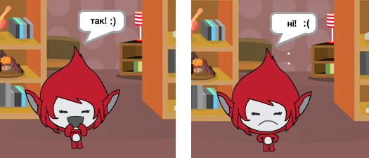

## Виклик: Збільшення рахунку {.challenge}

Як додати до гри рахунок? Ви можете додавати по балу за кожну вірну відповідь. Якщо ви сьогодні почуваєтесь особливо підступним, ви навіть можете скинути бали гравця до 0, якщо він відповів невірно!

## Збережіть свій проект {.save}

# Крок 2: Багаторазові ігри {.activity.new-page}

Додамо кнопку "Почати гру", щоб була можливість грати багато разів.

## Список дій {.check}

+ Створіть новий спрайт кнопки "Почати гру", яку має нажати гравець, щоб розпочати. Можете намалювати її самі, або відредагувати спрайт з біблотеки Scratch.
    
    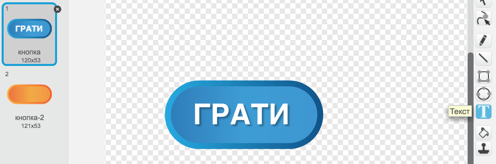

+ Додайте цей код до нової кнопки.
    
    ```blocks
    коли натиснуто ⚑
    показати

    коли спрайт натиснуто
    сховати
    оповістити [start v]
```

Цей код описує поведінку кнопки Почати гру. Коли гравець натисне кнопку, вона щезне, а замість неї з'явиться повідомлення, що гра починається.

+ Вам потрібно змінити код таки чином, щоб гра почалася не тоді, коли буде поставлений прапорець, а тоді, коли з'явиться повідомлення `почати` {.blockevents}.
    
    Замініть фрагмент коду `при натисканні прапорця` {.blockevents} на `коли натиснуто початок` {.blockevents}.
    
    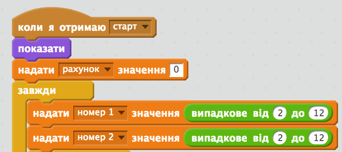

+ Встановіть зелений прапорець і натисніть на нову кнопку Почати гру, щоб перевірити, як вона працює. Ви побачите, що гра не почнеться, поки гравець не натисне кнопку.

+ Ви помітили, що таймер починає відлік не тоді, коли починається гра, а при встановлені зеленого прапорця?
    
    
    
    Ви можете вирішити цю проблему?

+ Натисніть на полі та замініть блок `зупинити все` {.blockcontrol} на повідомлення `кінець` {.blockevents}.
    
    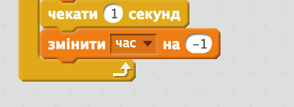

+ Тепер ви можете додати код до кнопки, щоб показати її знову в кінці кожної гри.
    
    ```blocks
    коли одержую [end v]
    показати
```

+ Також потрібно зупинити ваш персонаж, ставлячи питання в кінці кожної гри:
    
    ```blocks
    коли одержую [end v]
    зупинити [інші скрипти цього спрайту v]
```

+ Перевірте, як працює кнопка Почати гру, пройшовши пару ігор. Ви помітите, що кнопка Почати гру з'являється після кожного матчу. Щоб полегшити тестування, скоротіть час кожної гри, щоб вона тривала кілька секунд.
    
    ```blocks
    встановити [time v] в [10]
```

+ Можна навіть змінити вигляд кнопки, коли на неї наводиться вказівник миші.
    
    ```blocks
    коли натиснуто ⚑
показати
завжди
   if <touching [вказівник миші v] ?> then
   встановити ефект [вздуття v] в (30)
інакше
   встановити ефект [вздуття v] в (0)
end
end
```

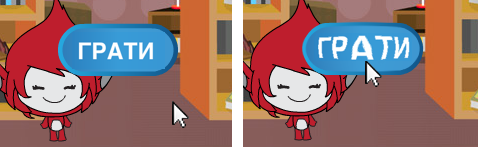

## Збережіть свій проект {.save}

## Виклик: Стартове зображення {.challenge}

Чи можете додати до своєї сцени ще один фон, який стане стартовим зображенням? Можете скористатися блоками `коли отримую Старт` {.blockevents} і `коли отримую Кінець` {.blockevents}, щоб переключатися між фонами.

Також можете показувати і приховувати свого персонажа, або навіть показувати і приховувати таймер використовуючи наступні блоки:

```blocks
показувати змінну [time v]
```

```blocks
приховувати змінну [time v]
```

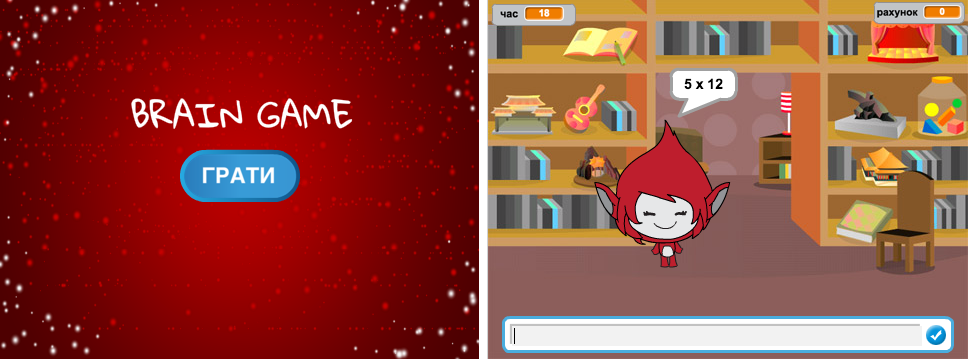

## Збережіть свій проект {.save}

# Крок 3: Додаємо графічні ефекти {.activity.new-page}

Замість того, щоб персонаж говорив гравцю тільки `Так! :)`, або `Ні :(` додаймо ще трохи графічних ефектів, які дозволять гравцю зрозуміти, як справи у персонажа.

+ Створіть новий спрайт, під назвою "Результат", який буде містити образи "галочка" і "хрестик".
    
    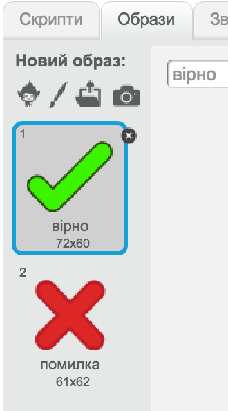

+ Змініть код свого персонажа так, щоб замість того, щоб повідомляти як персонажі справляються, код передавав повідомлення `вірно` {.blockevents} і `не вірно` {.blockevents}.
    
    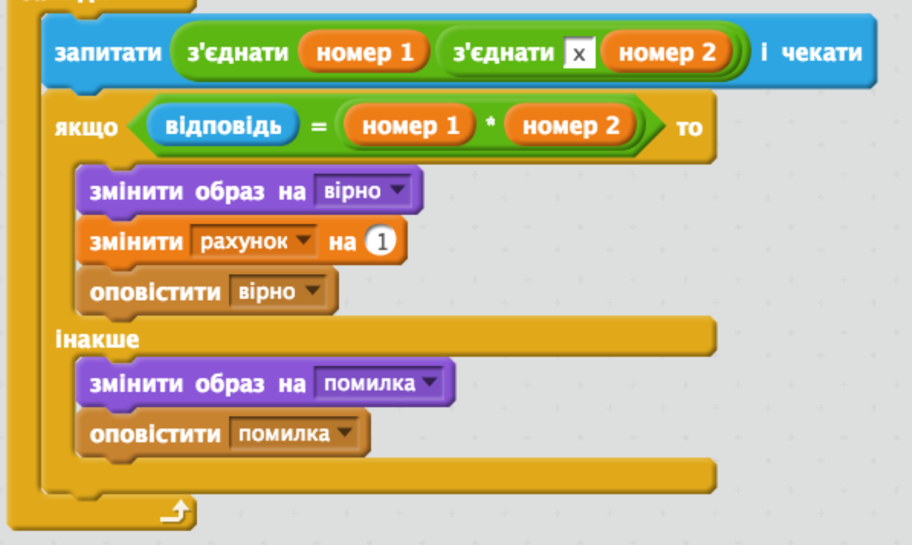

+ Тепер можете використов3увати ці повідомлення, що показати образ "галочки" і "хрестика". Додайте наступний код до свого спрайту "Результат":
    
    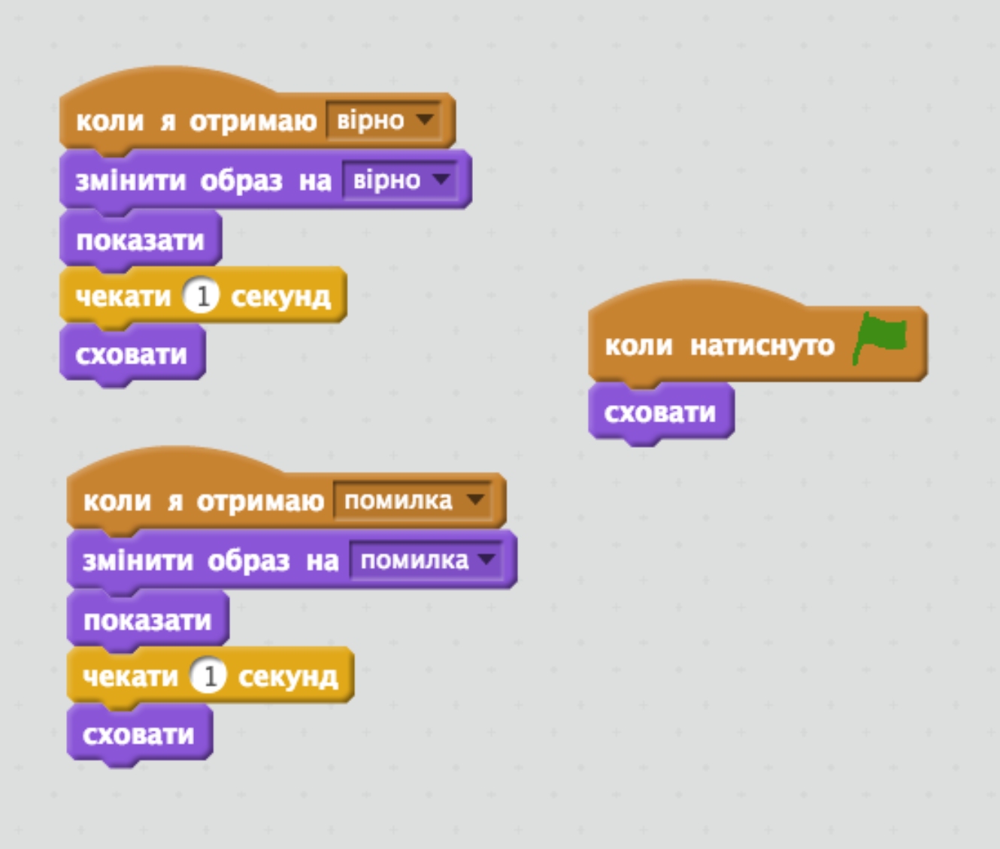

+ Перевірте свою гру знову. Ви повинні бачити галочку, якщо відповідь на питання правильна, і хрестик, якщо ви відповіли не вірно!
    
    

+ Чи помітили ви, що код `коли отримую вірно` {.blockevents} і `коли отримую не вірно` {.blockevents} майже одинаковий? Створімо функцію, яка зробить процес редагування коду простішим.
    
    В спрайті "Результат", натисніть `Більше Блоків` {.blockmoreblocks}, а тоді "Створити Блок". Створіть нову функцію під назвою `анімація` {.blockmoreblocks}.
    
    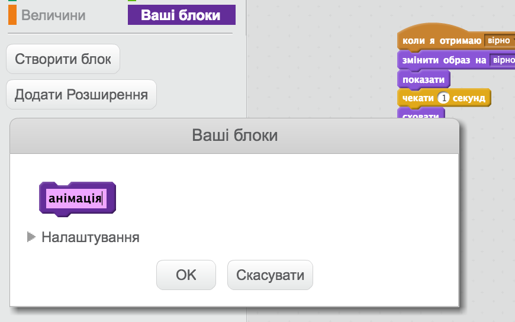

+ Потім можна додати код анімації до нової функції і використовувати функцію двічі:
    
    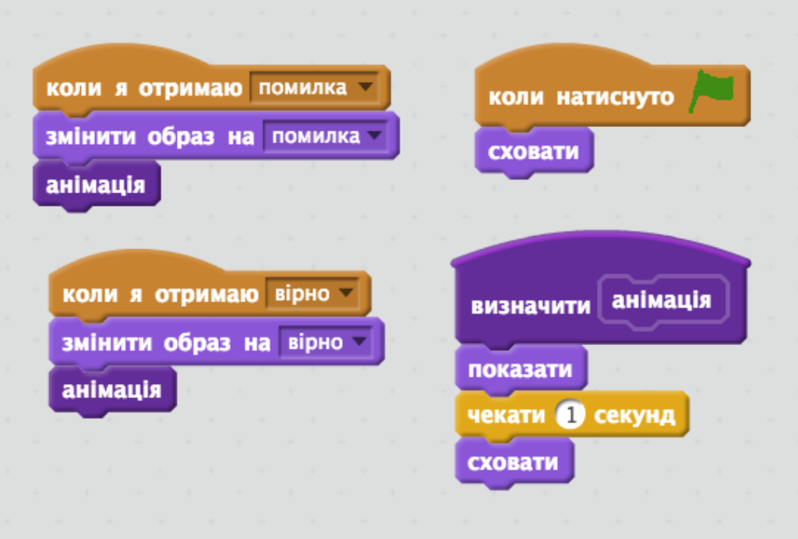

+ Тепер, якщо ви хочете показати галочку, або хрестик протягом довшого, або коротшого часу, вам потрібно буде змінити код. Спробуйте!

+ Замість того, щоб просто показати, або приховати галочку і хрестик, ви можете змінити свою функцію анімації, так щоб графічні ефекти зникали.
    
    ```blocks
    визначити [object Object]
встановити ефект [привид v] в (100)
показати
повторити (25)
   змінити ефект [привид v] на (-4)
end
сховати
```

## Збережіть свій проект {.save}

## Виклик: Вдосконалена анімація {.challenge}

Чи можна покращити анімацію графічних ефектів? Ви можете запрограмувати галочку і хрестик так, щоб вони зникали, або з'являлись. Або можете використовувати інші прикольні ефекти:

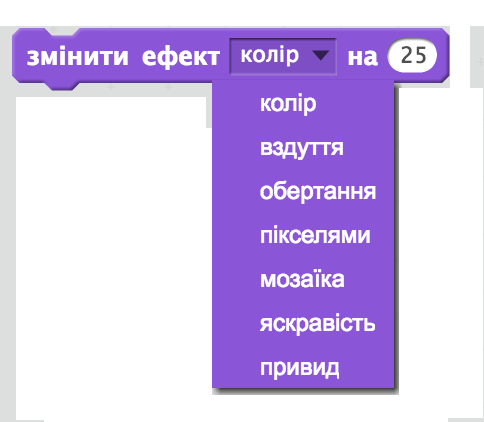

## Збережіть свій проект {.save}

## Виклик: Звук і музика {.challenge}

Чи можна додати до гри звукові ефекти і музику? Наприклад:

+ Включати звук, коли гравець відповідає правильно, або помиляється;
+ Додати звук цокання до таймера зворотнього відліку;
+ Включати звук, коли час закічився;
    
    ```blocks
    програти на барабані (10 v) (0.1) ударів
```

+ Можете також зробити так, щоб музика грала постійно (якщо ви не впевнені, як це зробити, проект "Рок-група" вам допоможе).

## Збережіть свій проект {.save}

## Виклик: Гонки до 10 балів {.challenge}

Чи можемо змінити гру так, щоб замість відповідей на максимально багато питань за 30 секунд, гравець міг побачити, як швидко йому вдасться правильно відповісти на 10 питань?

Щоб це зробити, потрібно змінити код таймера. Бачите, що саме потрібно змінити?

```blocks
    коли одержую [start v]
    встановити [time v] в (30)
    repeat until < (time) = [0] >
        чекати (1) секунд
    змінити [time v] на (-1)
    end
    оповістити [end v]
```

## Збережіть свій проект {.save}

## Виклик: Екран з інструкцією {.challenge}

Чи можемо додати до гри екран з інструкцією, який буде розповідати як її грати? Вам потрібна кнопка "Інструкція" і ще одний сценічний фон.

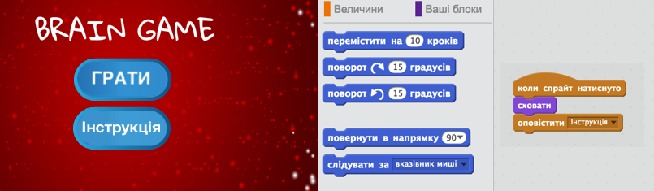

Також, знадобиться кнопка "Назад", яка буде переміщати в головне меню.

```blocks
    оповістити [main menu v]
```

## Збережіть свій проект {.save}