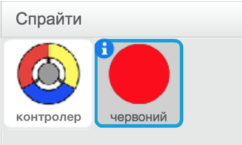
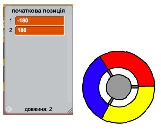
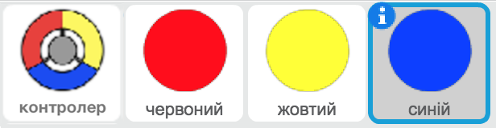
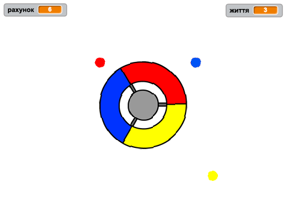
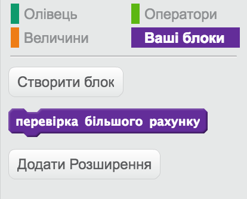
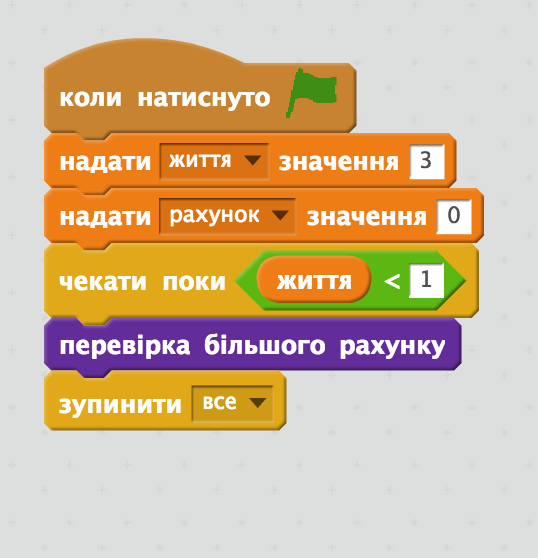

---
title: Спіймай крапки
level: Scratch 2
language: uk-UA
stylesheet: scratch
embeds: "*.png"
materials: ["Club Leader Resources/*","Project Resources/*"]
beta: true
...

# Передмова {.intro}

При реалізації цього проекту, ви навчитеся створювати гру, в якій потрібно буде ловити кольорові кульки стороною контролера-колеса такого ж кольору.

<div class="scratch-preview">
  <iframe allowtransparency="true" width="485" height="402" src="http://scratch.mit.edu/projects/embed/44942820/?autostart=false" frameborder="0"></iframe> 
</div>

# Крок 1: Створення контролера {.activity}

Розпочнемо зі створення контролера-колеса, яке ми використовуватимемо для збору крапок.

## Список дій {.check}

+ Створіть новий проект у Скретч та видаліть спрайт кота, так щоб проект став пустим. Онлайн Скретч-редактор знаходиться за посиланням [jumpto.cc/scratch-new](http://jumpto.cc/scratch-new).

+ Якщо тренер клубу дав вам доступ до папки "Ресурси", натисніть на кнопку "Завантажити спрайт з файлу" і додайте малюнок "controller.svg". Цей спрайт потрібно розмістити в центрі сцени.
    
    
    
    Якщо у вас немає такого зображення, ви можете намалювати власне!

+ Повертаємо наше колесо праворуч, коли натиснуто клавішу "стрілка вправо":
    
    ```blocks
    коли натиснуто ⚑
завжди
   if <key [стрілка вправо v] pressed?> then
   поворот ↻ (3) градусів
end
end
```

+ Перевірте колесо — воно має обертатися праворуч.

## Збережіть свій проект {.save}

## Виклик: Крутимось ліворуч {.challenge}

Зробіть так, щоб колесо оберталось ліворуч, якщо натиснута клавіша "стрілка вліво".

## Збережіть свій проект {.save}

# Крок 2: Ловимо кульки {.activity}

Тепер додамо декілька кульок, які гравець ловитиме за допомогою контролера-колеса.

## Список дій {.check}

+ Створіть новий спрайт із назвою "червона кулька". Вона має виглядати як маленька червона крапка.
    
    

+ Додайте цей скрипт до "червоної" кульки, щоб кожні кілька секунд створювався її новий клон:
    
    ```blocks
    коли натиснуто ⚑
чекати (2) секунд
завжди
   створити клон з [сам v]
   чекати (випадкове від (5) до (10)) секунд
end
```

+ Коли клон створений, ми хочемо, щоб він з'явився в одному з 4-х кутів сцени.
    
    
    
    Для цього спочатку створіть змінну-список `початкова позиція`{.blockdata}, і натисніть `(+)`, щоб додати значення `-180` та `180`.
    
    

+ Ці два елементи списку можна використати для вибору випадкового кута сцени. Додайте цей код до спрайту "кульки", і тепер кожен новий клон буде з'являтися в випадковій стороні, а потім повільно рухатися до контролера.
    
    ```blocks
    коли я починаю як клон
    перемістити в x:(елемент (random v) з [start positions v]) y:(елемент (random v) з [start positions v])
    слідувати за [controller v]
    показати
    repeat until <touching [controller v] ?>
        перемістити на (1) кроків
    end
```

Вищезазначений код вибирає `-180` або `180` для позицій x *і* y, це означає, що кожен клон починається в одному кутку сцени.

+ Перевірте свою гру. На сцені повинні з'являтися червоні кульки в різних кутах сцени, і повільно рухатись до центру, до нашого контролера.
    
    

+ Створіть 2 нові змінні: `життя`{.blockdata} і `рахунок`{.blockdata}.

+ Додайте до сцени код, який надасть блоку `життя` {.blockdata} значення 3 і блоку `рахунок` {.blockdata} значення 0 на початку гри.

+ Потрібно додати код після червоної крапки блоку ` запускається як клон` {.blockcontrol}, для того, щоб гравець отримав 1 до `рахунку` {.blockdata}, у випадку співпадіння кольорів, або в гравця віднімалось 1 `життя` {.blockdata}, якщо кольори не співпадають.
    
    ```blocks
    перемістити на (5) кроків
    if <touching color [#FF0000] ?> then
        змінити [score v] на (1)
        грати звук [pop v]
    інакше
        змінити [lives v] на (-1)
        грати звук [laser1 v]
    end
    вилучити цей клон
```

+ Додайте наступний код в кінці скрипта сцени, для того щоб гра закінчувалась, коли гравець втрачає всі життя:
    
    ```blocks
    wait until < (lives) < [1] >
    зупинити [все v]
```

+ Перевірте свою гру, щоб переконатися, що код працює належним чином.

## Збережіть свій проект {.save}

## Виклик: Ще більше кульок {.challenge}

Продублюйте спрайт "червона" крапка двічі і назвіть два нових спрайти "жовтий" і "блакитний".



Відредагуйте ці спрайти (включаючи їх код), так щоб кожна кольорова крапка відповідала правильному кольору на контролері. Не забудьте протестувати проект, переконавшись, що ви набирали бали і втрачали життя у визначений час, і що ваша гра не занадто легка, або занадто складна!



## Збережіть свій проект {.save}

# Крок 3: Ускладнюємо гру {.activity.new-page}

Спробуймо збільшити складність гри, залежно від того наскільки довго гравець виживає. Зробити це можна зменшивши затримку з якою з’являються крапки.

## Список дій {.check}

+ Створіть нову змінну `затримка`{.blockdata}.

+ Створіть на сцені новий скрипт, який надає "затримці" спочатку великого значення, а потім потроху його зменшує.
    
    ```blocks
    коли натиснуто ⚑
    встановити [delay v] в (8)
    repeat until < (delay) = (2) >
        чекати (10) секунд
        змінити [delay v] на (-0.5)
    end
```

Зверніть увагу, що це дуже схоже на те, як працює таймер!

+ Нарешті, можете використовувати змінну `затримка` {.blockdata} в скриптах червоної, жовтої і блакитної крапок. Видаліть код, що затримує створення клонів на випадкову кількість секунд і замініть його новою змінною `затримка` {.blockdata}:
    
    ```blocks
    чекати (delay) секунд
```

+ Перевірте свою функцію `затримка` {.blockdata} і подивіться чи затримка між крапками повільно зменшується. Чи працює це для всіх 3 кольорових крапок? Чи помітно, що значення функції `затримка` {.blockdata} зменшується?

## Збережіть свій проект {.save}

## Виклик: Невловимі кульки {.challenge}

Чи вийде у вас покращити гру, додавши змінну `швидкість`{.blockdata}, так щоб крапки починали рух з одного кроку за один раз, і поступово ставали все швидше й швидше? Це працюватиме подібно до змінної `затримка`{.blockdata}, яку ми використовували раніше; ти можеш використати її код, як підказку.

## Збережіть свій проект {.save}

# Крок 4: Найкращий рахунок {.activity}

Збережімо найкращий рахунок, для того щоб гравці розуміли, наскільки добре вони грають.

## Список дій {.check}

+ Створіть нову змінну `найкращий рахунок`{.blockdata}.

+ Натисніть на сцену і створіть новий блок під назвою `перевірити найкращий рахунок` {.blockmoreblocks}.
    
    

+ Перед закінченням гри додайте цей новий блок.
    
    

+ Додайте код до свого блоку, щоб зберігати поточний `рахунок` {.blockdata} як `найкращий рахунок` {.blockdata} `якщо` {.blockcontrol} це найкращий рахунок з існуючих:
    
    ```blocks
    визначити [object Object]
    if < (score) > (high score) > then
        встановити [high score v] в (score)
    end
```

+ Перевірте код, який додали. Розпочніть гру, щоб перевірити, чи `найкращий рахунок` {.blockdata} поновився правильно.

## Збережіть свій проект {.save}

## Виклик: Вдоскональ свою гру! {.challenge}

Спробуйте подумати над тим, як ще можна вдосконалити вашу гру? Наприклад, можна створити спеціальні крапки, які будуть:

+ подвоювати ваш рахунок;
+ сповільнювати на деякий час усі крапки;
+ ховати всі інші крапки на екрані!

## Збережіть свій проект {.save}

## Виклик: Ігрове меню {.challenge}

Ви можете додати меню (з кнопками) до вашої гри? Ви можете додати екран-інструкцію, або екран для виводу найкращого рахунку. Якщо ви забули, як це зробити, проект "Гра Розуму" вам допоможе.