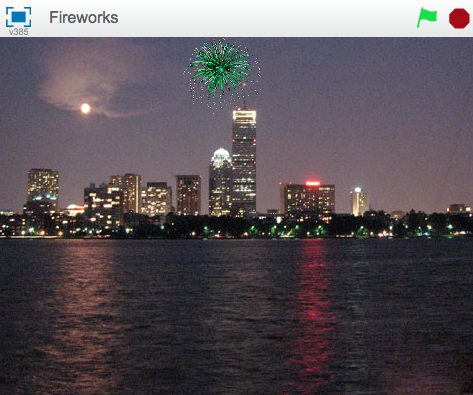

# Lời giới thiệu { .intro}
Lần này, chúng ta sẽ tạo một màn hình pháo hóa trong một thành phố.



#BƯỚC 1: Tạo một tên lửa bay về phía con trỏ chuột { .activity}
__Nhãy nhập những hình nền khác nhau cho trò chơi__

## Danh sách liệt kê hoạt động { .check}

+ Bắt đầu một dự án Scratch. Xóa chú mèo bằng cách click chuột phải và chọn lệnh "Delete"
+ Thay thế phông nền với __outdoor/city-with-water__ (ngoài trời/thành phố trong nước)
+ Sử dụng lệnh `Upload sprite from file` (tải hình ảnh từ file) {.blockgrey} để thêm một tên lửa cho dự án.
+ Làm ẩn tên lửa khi click vào lá cờ màu xanh lá cây.

Bây giờ chúng ta cần tạo một tên lửa di chuyển về phía con trỏ chuột khi click.

+ Thêm một khối điểu khiển `when space key pressed` và ở đó làm cho tên lửa xuất hiện và lướt về phía con trỏ chuột.

```blocks

    when FLAG clicked
    hide

    when [space v] key pressed
    show
    glide (1) secs to x: (mouse x) y: (mouse y)
```

##Chạy thử dự án của bạn { .flag}
__Chọn vào lá cờ màu xanh lá cây, đặt con trỏ chuột lên sân khấu.__

Tên lửa có xuất hiện và di chuyển đến con trỏ chuột?
Chuyện gì sẽ xảy ra khi ta không di chuyển chuột và nhấn vào khoảng không một lần nữa?

## Danh sách hoạt động { .check}

+ Pháo hoa không bay từ bên này sang bên kia, do đó đảm bảo rằng nó luôn lướt về phía con trỏ chuột từ phía dưới màn hình. Trước khi chúng ta cho hiển thị tên lửa, dùng khối `go to block` để giúp nó di chuyển tới đáy màn hình nhưng giữ nguyên vị trí theo chiều dọc.

```blocks

    when FLAG clicked
    hide

    when [space v] key pressed
    go to x: (mouse x) y: (-200)
    show
    glide (1) secs to x: (mouse x) y: (mouse y)
```

##Chạy thử dự án của bạn { .flag}
__Click vào lá cờ màu xanh, đặt trỏ chuột vào màn hình và nhấn phím cách.__
Tên lửa có bay về phía trỏ chuột từ dưới màn hình? Chuyện gì xảy ra khi ta di chuyển chuột và nhấn vào khoảng không một lần nữa?

## Danh sách hoạt động { .check}

+ Cuối cùng, hãy thực hiện công việc này bằng cách dùng chuột thay vì dấu cách. Để thực hiện nó, chúng ta có thể dùng lệnh trong một khối __forever if mouse down__ (luôn luôn nếu dùng chuột).
Sau đó hoán đổi khối __when space key pressed__ (khi ấn chuột) bằng khối __when flag clicked__ (khi click vào lá cờ) và hãy chắc chắn rằng tên lửa được ẩn đi khi mọi thứ khởi động.

```blocks

    when FLAG clicked
    hide
    forever
        if <mouse down?> then
            go to x: (mouse x) y: (-200)
            show
            glide (1) secs to x: (mouse x) y: (mouse y)
```
##Chạy thử dự án của bạn { .flag}
__Click vài lá cờ màu xanh lá, sau đó nhấn chuột trên sân khấu. Click một lần nữa tại một điểm khác.__

##Hãy thử! { .try}
1. Thử làm cho một vài tên lửa chậm hoặc nhanh hơn các tên lửa khác một chút.
2. Thử thay đổi nơi tên lửa di chuyển để khiến nó trượt về phía con trỏ chuột hơi có hình vòng cung.

##Lưu dự án của bạn { .save}

#BƯỚC 2: Làm cho tên lửa phát nổ { .activity}

## Danh sách hoạt động { .check}

+ Bước đầu tiên để làm cho tên lửa phát nổ là làm nó tạo ra một tiếng nổ __Resources/bang.wav__ trước khi nó bắt đầu di chuyển, sau đó ẩn đi khi nó tới vị trí con trỏ chuột. Nhập một đoạn âm thanh vào thẻ Sounds (âm thanh) và click nút `Upload sound from file` {.blockgrey} (Tải âm thanh từ file).

```blocks

    when FLAG clicked
    hide
    forever
        if <mouse down?> then
            go to x: (mouse x) y: (-200)
            play sound [bang v]
            show
            glide (1) secs to x: (mouse x) y: (mouse y)
            hide
```
+ Bước tiếp theo, làm cho tên lửa truyền một thông điệp mới khi nó phát nổ. Chúng ta sẽ nghe thông điệp này sau.

```blocks

    when FLAG clicked
    hide
    forever
        if <mouse down?> then
            go to x: (mouse x) y: (-200)
            play sound [bang v]
            show
            glide (1) secs to x: (mouse x) y: (mouse y)
            hide
            broadcast [explode v]
```
##Chạy thử dự án của bạn { .flag}
__Click vào lá cờ màu xanh.__
Hãy chắc chắn rằng tên lửa phát ra âm thanh và ẩn khi tới vị trí con trỏ chuột.

## Danh sách hoạt động { .check}

+ Tạo một hình mới từ File, __Resources/firework1.png__
+ Khi nhận được thông điệp về vụ nổ, nó sẽ tự ẩn đi và di chuyển tới vị trí quả tên lửa, sử dụng khối `go to`, tự hiện ra và lại biến mất sau một giây.

```blocks

    when I receive [explode v]
    hide
    go to [rocket v]
    show
    wait (1) secs
    hide
```
##Chạy thử dự án của bạn { .flag}
__Bắn một quả tên lửa khác.__

Nó có được thay thế bằng hình vụ nổ khi phát nổ không?
Chuyện gì sẽ xảy ra khi bạn giữ chuột trong lúc di chuyển nó? (Đừng lo lắng, chúng ta sẽ sửa lỗi đó sau).

##Lưu dự án của bạn { .save}

#BƯỚC 3: Làm cho mỗi vụ nổ trở nên độc đáo { .activity}

+ Bây giờ chúng ta làm cho mỗi vụ nộ trở nên độc đáo hơn bằng cách sử dụng lệnh `set color effect` {.blockpurple}, và chọn một màu sắc bất kì trong khoảng từ  __1__ tới __200__ trước khi hiển thị chúng.

```blocks

    when I receive [explode v]
    hide
    set [color v] effect to (pick random (1) to (200))
    go to [rocket v]
    show
    wait (1) secs
    hide

```

##Chạy thử dự án của bạn { .flag}
__Click vào lá cờ màu xanh.__

Mỗi vụ nổ có một màu khác nhau không?

## Danh sách hoạt động { .check}

+ Hãy thêm một số hình ảnh khác nhau cho vụ nổ bằng các sử dụng __Resources/firework2.png__ và __Resources/firework3.png__, rồi chuyển đổi chúng cho mỗi tên lửa một lần nữa trước khi hiển thị nó.

##Chạy thử dự án của bạn { .flag}
__Click vào lá cờ xanh lá.__

Mỗi tên lửa có một hình ảnh vụ nổ khác nhau không?

## Danh sách hoạt động { .check}

+ Cuối cùng, hãy làm cho vụ nổ lớn hơn sau khi tên lửa phát nổ! Thay vì chờ trong một giây, đặt kích thước của sprite __5%__ trước khi hiển thị nó, và sau khi nó đã được thể hiện, tăng kích thước __2 fifty times__, sử dụng lệnh `repeat` {.blockorange}.

```blocks

    when I receive [explode v]
    hide
    set [color v] effect to (pick random (1) to (200))
    go to [rocket v]
    show
    set size to (5) %
    repeat (50)
        change size by (2)
    end
    hide

```
##Chạy thử dự án của bạn { .flag}
__Click vào lá cờ màu xanh lá.__

Hình ảnh vụ nổ có lan ra từ trung tâm và lớn dần lên không?

#Hãy thử! { .try}
+ Tại sao không làm mỗi vụ nổ trở nên độc đáo hơn bằng cách thay đổi kích thước và tốc độ bùng cháy của vụ nổ.

##Lưu dự án của bạn { .save}

#Step 4: Sửa lỗi phát thông tin { .activity}

Bạn có nhớ rằng lúc trước chúng ta đã có một lỗi liên quan tới việc giữ chuột?
Vấn đề này xuất hiện bởi khi tên lửa phát thông tin vụ nổ của nó, nó sẽ ngay lập tức lặp lại nếu có vòng lặp và di chuyển trở lại phía dưới sân khấu, nó diễn ra trước khi vụ nổ được chuyển tới vị trí của tên lửa.

## Danh sách hoạt động { .check}

+ Để sửa lỗi này, chúng ta có thể thay thế các khối truyền phát bằng một khối truyền và chờ. Bằng cách này, vòng lặp sẽ không lặp lại tới khi vụ nổ kết thúc.

```blocks

    when FLAG clicked
    hide
    forever
        if <mouse down?> then
            go to x: (mouse x) y: (-200)
            play sound [bang v]
            show
            glide (1) secs to x: (mouse x) y: (mouse y)
            hide
            broadcast [explode v] and wait

```
##Chạy thử dự án của bạn { .flag}
__Click vào lá cờ màu xanh lá, giữ chuột và di chuyển quanh sân khấu.__

Hình ảnh vụ nổ xuất hiện ở đúng nơi và vào đúng thời điểm không?

##Lưu dự án của bạn { .save}

__Tuyệt vời, bạn đã hoàn thành, giờ hãy thưởng thức trò chơi!__

Đừng quên chia sẻ trò chơi của bạn với những người thân bằng cách click "Share" (chia sẻ) trên thanh menu!
