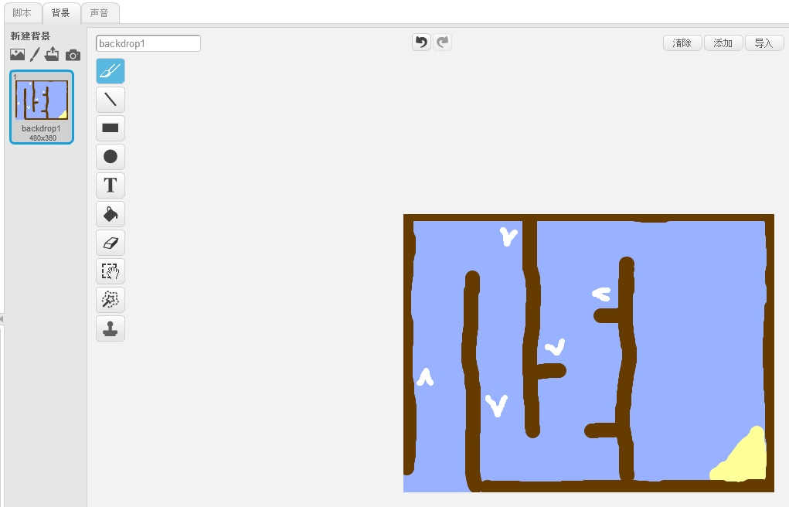
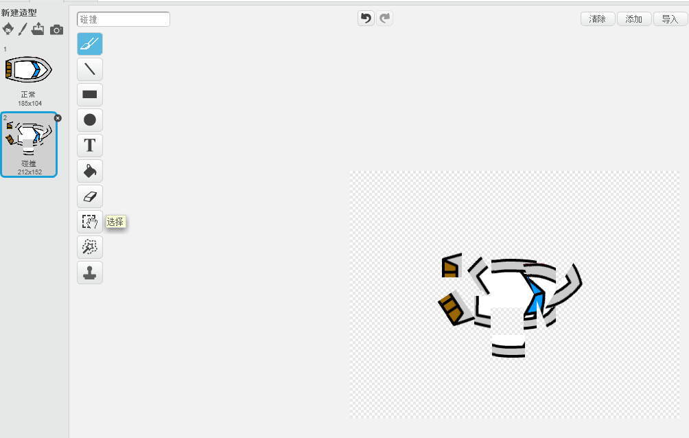
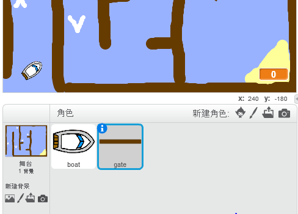

---
title: 赛艇比赛
level: Scratch 1
language: zh-CN
stylesheet: scratch
embeds: "*.png"
materials: ["Club Leader Resources/*","Project Resources/*"]
...

# 简介 { .intro }

本课程我们将制作一个游戏，用鼠标来指引一艘小船到达目的地。

<div class="scratch-preview">
  <iframe allowtransparency="true" width="485" height="402" src="http://scratch.mit.edu/projects/embed/63957956/?autostart=false" frameborder="0"></iframe>
  
</div>

# 步骤 1: 游戏准备 { .activity }

## 动作清单 { .check }

+ 新建一个项目，并删除默认角色。我们也在下面的链接中在线编辑 <a href="http://jumpto.cc/scratch-new">jumpto.cc/scratch-new</a>.

+ 点击舞台背景，并为游戏布局，我们应该添加下面内容：
	+ 小船不能碰到的障碍物；
	+ 小船要到达的目的地小岛。

	下图是游戏的布局简单例子：

	 

# 步骤 2: 控制小船 { .activity }

## 动作清单 { .check }

+ 我们从本地文件夹中上传一个小船图片作为角色。我们将小船缩小至合适大小并将它放在起点。

	

	如果没有小船的图片，我们可以自己画一个。

+ 添加下面的代码，你就能控制小船了:

	
	
+ 测试本段程序，看看小船是否跟着鼠标移动。

	

+ 如果小船碰到鼠标会怎么样？

	避免这个发生，我们需要添加个一个“如果”代码，让小船离鼠标在5个以上的像素时才进行移动。

		

+ 再次测试程序，看看是不是解决了刚才的问题。

## 保存项目 { .save }

# 步骤 3: 碰撞 { .activity .new-page }

我们不希望小船能够穿越棕色障碍物，现在来解决这个问题。

## 动作清单 { .check }

+ 现在我们需要给小船添加一个碰撞时的造型。复制一个小船造型，并取名为碰撞。

+ 点击碰撞造型，并将小船做得看起来像撞坏了。

	

+ 添加下面的代码，让小船碰到棕色障碍物就被撞毁：

	

	这段代码在“重复执行”这个循环中，所以程序会一直检查，小船是不是碰到障碍物，是否被撞坏。

+ 因为我们的小船有两个造型，所以我们在开始的时候要确保，小船看过去是好的。

+ 现在我们再讲小船开到障碍物上，小船就会变成撞毁的样子，并显示“不”的样子。

	

## 保存项目 { .save }

## 挑战: 胜利! {.challenge}

你是否能添加一个“如果”，让小船到达小岛时显示胜利。

当小船地抵达小岛，显示一个“胜利”


## 保存项目 { .save }

## 挑战: 声音效果 {.challenge}

能否为游戏添加声音效果？甚至为游戏添加背景音乐。

## 保存项目 { .save }

# 步骤 4: 计时器 { .activity }

我们为游戏做个计时器，让玩家尽快得到达目的地取得胜利。

## 动作清单 { .check }

+ 增加一个“时间”模块到舞台。

	

+ 添加下面的代码到背景脚本中，计时器将会从游戏开始时计时直到游戏结束。

	

+ 再次测试，看看，多快能完成游戏。

	

## 保存项目 { .save }

# 步骤 5: 陷阱和奖励 { .activity }

这个游戏目前看过去有限简单，我们来让它变得复杂点。

## 动作清单 { .check }

+ 首先我们增加一些奖励，如果小船碰到这些奖励，就能增加速度。

	

+ 我们可以添加下面的代码到小船的脚本，让小船碰到奖励的时候，快速前进。

	
		

+ 我们也可以添加一个旋转门。

	

	旋转门的颜色要和原来障碍物一样。

+ 选择角色的中心位置。

	

+ 在这个旋转木门的脚本中，添加代码，让他缓慢旋转。

+ 再次运行游戏，测试各个功能是否运作。

	

## 保存项目 { .save }

## 挑战: 更多障碍! {.challenge .new-page}

你能增加更多的障碍物吗？下面是一些建议

+ 你可以增加绿色的障碍物，让小船碰到时候慢下来。

```blocks
	等待 (0.01) 秒
```


+ 你也可以添加会移动的障碍，像鲨鱼那样。


下面的代码可能帮助到你：

```blocks
	移动 (1) 步
	碰到边缘就反弹
````

如果你新的障碍不是棕色的，那么你要添加下面的代码：

```blocks
	如果 <<碰到颜色 [#603C15]> 或 <碰到 [shark v]>> 那么
	结束
```

## 保存项目 { .save }

## 挑战: 更多的小船! {.challenge .new-page}

你能让两个人来一起玩这个游戏吗？

+ 复制小船并取名为玩家2，并更改小船颜色。


+ 用下面的代码，改变玩家2的初始位置。

```blocks
	移到 x:(-190) y:(-150)
```

+ 删除用鼠标控制小船的代码。

```blocks
	如果 <(到 [鼠标指针 v] 的距离) > [5]> 那么
	   面向 [鼠标指针 v]
	   移动 (1) 步
	结束
```

并用键盘控制小船的代码也取代原来的。

下面的代码可以帮助你用键盘控制小船。

```blocks
	如果 <按键 [上移键 v] 是否按下？> 那么
	   移动 (1) 步
	结束
```

同理，还要为左右键编写相应的代码。

## 保存项目 { .save }

## 挑战：更多的关卡! {.challenge .new-page}
你能否制作更多的关卡，让游戏者在不同的关卡中进行选择？

```blocks
	当按下 [空格键 v]
	下一个背景
```

## 保存项目 { .save }
