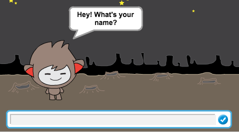
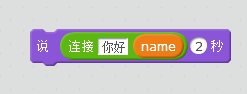
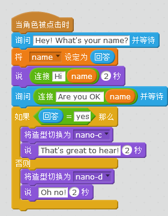
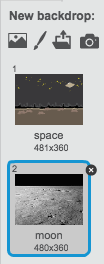
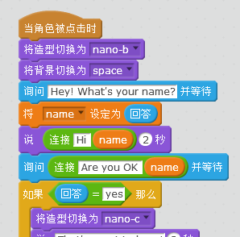
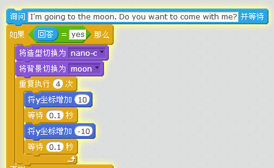

---
title: 聊天机器人
level: Scratch 1
language: zh-CN
stylesheet: scratch
embeds: "*.png"
materials: ["Club Leader Resources/*"]
...

# 简介 { .intro }

本课程我们将制作一个会聊天的机器人

<div class="scratch-preview">
  <iframe allowtransparency="true" width="485" height="402" src="http://scratch.mit.edu/projects/embed/26762091/?autostart=false" frameborder="0"></iframe>
  
</div>

# 步骤 1: 选择机器人 { .activity }

## 动作清单 { .check }

+ Before you start making your chatbot, you need to decide on their personality.在开始编程之前，我们需要先定义机器人的属性。
	+ 机器人叫什么
	+ 住在哪里
	+ 他们是开心的？严肃的？搞笑的？害羞的？还是有好的？

+ 新建一个项目，并删除默认角色，我们可以在下面链接在线编辑Scratch <a href="http://jumpto.cc/scratch-new">jumpto.cc/scratch-new</a>.

+ 选择一个机器人角色，并添加到项目中。

	

+ 选择一个和机器人性格匹配的背景，如下图：

	

## 保存项目 { .save }

# 步骤 2: 让机器人说话 { .activity }

现在我们编写程序让机器人和我们说话。

## Activity Checklist { .check }

+ 点击机器人角色，添加下面的代码：

	```blocks
		when this sprite clicked
		ask [Hey! What's your name?] and wait
		say [What a lovely name!] for (2) secs
	```

+ 测试上面的代码，当被问到姓名，将名字打入下面的文本框中。

	

+ 你的机器人每次都会简单的回复 `What a lovely name!`。你可以个性化机器人的答复，比如用你输入的名字，改变下面的代码：

	```blocks
		when this sprite clicked
		ask [Hey! What's your name?] and wait
		say <join [Hi] (answer)> for (2) secs
	```

	我们需要将`连接`{.blockoperators}和`说`{.blocklooks}两个代码块连起来。

	

	然后你可以将蓝色的`回答`{.blocksensing}拖到`连接`{.blockoperators}模块中。

	

+ 测试新的代码，是否如你所愿的运行？

+ 也许你想把刚才的名字保存在一个变量中，以便在后面的程序中使用这个变量。新建一个变量 `名字` {.blockdata}。

+ The information that you entered is already stored in a special variable called `answer` {.blocksensing}. Go to the Sensing group of blocks and click the answer block so that a tick appears. The current value in `answer` {.blocksensing} should then be shown on the top-left of the stage.我们的名字信息已经被保存到了叫 `回答` {.blocksensing}特殊变量中了。点击侦测模块，点击回答，一个勾选框会出现。`回答` {.blocksensing}的值会显示在舞台左上角。

+ 一旦你添加了新变量，改变下面的代码，将`回答` {.blocksensing}保存到新变量中：

	```blocks
		when this sprite clicked
		ask [Hey! What's your name?] and wait
		set [name v] to (answer)
		say <join [Hi ] (name)> for (2) secs
	```

+ 再次运行程序，我们会看到变量`名字` {.blockdata}和 `回答` {.blocksensing}的值一样的。

	

	如果舞台上看不到变量，可以在勾选变量名前勾选框，选择显示和隐藏。

## 保存项目 { .save }

## 挑战: 更多的问题 { .challenge }

编程使你的机器人问其他问题，你能保存问题的答案吗？


## 保存项目 { .save }

# 步骤 3: 做个决定 { .activity }

你可以编程让机器人更具用户的回答来决定做什么。

## Activity Checklist { .check }

+ 我们让机器人问个是非问题，这样答案会是`是`或者`不是`，下面是个例子，当然我们可以改变问题：

	```blocks
		when this sprite clicked
		ask [Hey! What's your name?] and wait
		set [name v] to (answer)
		say <join [Hi ] (name)> for (2) secs
		ask <join [Are you OK ] (name)> and wait
		if ((answer)=[yes]) then
			say [That's great to hear!] for (2) secs
		end
	```

	注意我们已经将名字保存到了一个变量，可以在后面随时使用。

+ 我们需要输入两次来测试代码，一次输入是，一次输入不是。

+ 问题在于输入不是的时候机器人没有反应。我们需要添加下面的代码来让它有反应：

	```blocks
		when this sprite clicked
		ask [Hey! What's your name?] and wait
		set [name v] to (answer)
		say <join [Hi ] (name)> for (2) secs
		ask <join [Are you OK ] (name)> and wait
		if ((answer)=[yes]) then
			say [That's great to hear!] for (2) secs
		else
			say [Oh no!] for (2) secs
		end
	```

+ If you test your code, you'll now see that you get a response when you answer `yes` or `no`. Your chatbot should reply with `That's great to hear!` when you answer `yes`, but will reply with `Oh no!` if you type anything other than `yes` (`else` {.blockcontrol} means 'otherwise').现在再次测试程序，是不是两个回答，机器人都能做出反应了呢？

	

+ 我们在`如果` {.blockcontrol} or `否则` {.blockcontrol}程序模块中，添加任何代码，不仅仅是让机器人说话，我们可以根据不同的回答让机器改变不同的造型。

	我们看下机器人造型，应该可以看到很多不同的造型。

	

	我们可以利用这些造型，作为机器人对我们回答的反应：

	

+ 测试程序，我们会看到机器人根据不同的回答，会改变造型：

	

## 保存项目 { .save }

## 挑战: 更多决策 { .challenge }

编程让机器人问个其他的是非问题，你能让机器人根据问题作出回应吗？


## 保存项目 { .save }

# 步骤 4: 改变位置 { .activity }

You can also program your chatbot to change its location.我们可以编程是机器人改变位置。

## 动作清单 { .check }

+ 为舞台添加新的背景，如月球表面：

	

+ 你现在可以编程改变机器人位置：

	```blocks
		ask [I'm going to the moon. Do you want to come with me?] and wait
		if ((answer) = [yes]) then
			switch backdrop to [moon v]
		end
	```

+ 添加下面的代码，确保开始和机器人对话时，机器人一直在外太空的背景：

	

+ 当机器人问你是否要去月球的时候，回答是，看看机器人的位置是不是改变了。

	

+ 如果你回答 `不`，或者回答我不确定呢？

+ 你也可以添加下面的代码，当你回答是的时候，让机器人上下跳动四次。

	```scratch
	repeat (4)
		change y by (10)
		wait (0.1) secs
		change y by (-10)
		wait (0.1) secs
	end
	```

	

+ 测试程序

## 保存项目 { .save }

## 挑战: 制作一个你自己的机器人{.challenge}

用所学到，制作一个你自己的交互机器人，下面是先建议：


一旦你制作完机器人，邀请朋友和他们一起玩，看看小朋友喜欢不喜欢你的机器人，他们是否会发现问题。

## 保存项目 { .save }
