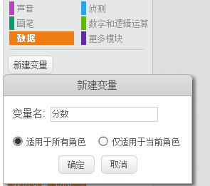
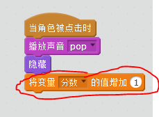
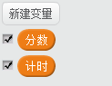
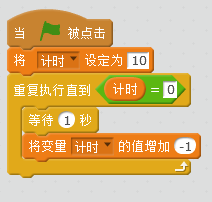

---
title: 捉鬼敢死队
level: Scratch 1
language: zh-CN
stylesheet: scratch
embeds: "*.png"
materials: ["Club Leader Resources/*"]
...

## 注释: { .challenge .pdf-hidden }
气球课程被移到 [Additional Scratch Projects](http://projects.codeclub.org.uk/en-GB/03_scratch_bonus/index.html)。

# 简介 { .intro }

我们要制作一个捕捉幽灵的游戏。

<div class="scratch-preview">
  <iframe allowtransparency="true" width="485" height="402" src="http://scratch.mit.edu/projects/embed/60787262/?autostart=false" frameborder="0"></iframe>
  
</div>

# 步骤 1: 制作一个幽灵 { .activity }

## 动作清单 { .check }

+ 新建一个项目，删除默认角色，我们也可以在下面链接中在线编辑Scratch<a href="http://jumpto.cc/scratch-new">jumpto.cc/scratch-new</a>.

+ 添加一个新的幽灵角色，并找个合适的背景。

	

+ 添加下面的代码，让幽灵时隐时现。

	```blocks
		点击绿旗时
		重复执行
		   隐藏
		   等待 (1) 秒
		   显示
		   等待 (1) 秒
		结束
	```

+ 测试程序

## 保存项目 { .save }

# 步骤 2: 随机幽灵 { .activity }

你的幽灵太容易被抓了，因为他们不会动。

## 动作清单 { .check }

+ 你可以让幽灵，随机出现在舞台，使用下面的代码：

	```blocks		
		点击绿旗时
		重复执行
		   隐藏
		   等待 (1) 秒
		   移到 x:(在 (-150) 到 (150) 间随机选一个数) y:(在 (-150) 到 (150) 间随机选一个数)
		   显示
		   等待 (1) 秒
		结束
	```

+ 测试程序，现在幽灵每次出现的位置都不一样了。

## 保存项目 { .save }

## 挑战: 更多的随机性 {.challenge}

你能让幽灵出现的时间也随机吗？能让幽灵的大小也随机改变吗?

## 保存项目 { .save }

# 步骤 3: 捕捉幽灵 { .activity }

现在让玩家可以捕捉幽灵。

## 动作清单 { .check }

+ 添加下面的代码：

	```blocks
		当角色被点击时
		隐藏
	```

+ 测试程序，你是否能抓到幽灵？如果你觉得困难，我们可以点击下面的按钮，进行全屏幕游戏。

	

## 挑战: 添加声音 { .challenge }

每当抓到幽灵，添加一个声音。

## 保存项目 { .save }

# 步骤 4: 添加分数 { .activity .new-page }

我们来为抓住幽灵计分。

## Activity Checklist { .check }

+ 为了记住分数，我们需要一个地方来保存分数，__变量__就是储存分数的地方。

	点击，脚本标签，选择数据模块，点击新建一个变量。

	

	为变量取个名字，比如“分数”，确保这个变量是给所有角色使用的，现在你可以看到有很多程序块可以为变量使用。

	

	你还可以在舞台左上角看到这个变量。

	

+ 当新游戏开始，我们需要将分数设置为0

	```blocks
	点击绿旗时
	将变量 [score v] 的值设定为 [0]
	```

+ 当幽灵被抓到，分数加1

	

+ 测试一下程序，抓几个幽灵，看看分数是否变化。

## 保存项目 { .save }

# 步骤 5: 添加计时器 { .activity }

你可以让游戏变的跟有趣，比如规定只有十秒时间能抓幽灵。

## 动作清单 { .check }

+ 你可以用另外的变量来储存，剩下的时间，新建一个变量，取名叫“时间”：

	

+ 计时器应该这样运作：

	+ 计时器从十秒开始倒计时;
	+ 计时器每秒减少一个;
	+ 当计时器变为0时，停止游戏.

	我们可以在舞台脚本中添加下面的代码。

	```blocks
		点击绿旗时
		将变量 [time v] 的值设定为 [10]
		重复执行直到 <(time) = [0]>
		   等待 (1) 秒
		   将变量 [time v] 的值增加 (-1)
		结束
		停止 [全部 v]
	```

	

+ 将时间变量拖到右上角，你也可以右键点击选择变量显示的样式。

	

+ 请你的朋友帮你测试下游戏，看看他们能得多少分？如果你觉得游戏太简单，你可以：

	+ 减少时间;
	+ 让幽灵减少显示时间;
	+ 让幽灵变小点。

	你可以根据自己的喜好来调试程序的难度。

## 保存项目 { .save }

## 挑战: 更多幽灵 {.challenge}

你可以添加更多的幽灵角色。


你考虑添下面几点：

+ 目标多大?
+ 目标出现的频率?
+ 目标被点击是否会改变造型或者发出声音?
+ 目标抓住的时候是否增减分数?

增加其他角色的也可以重复上面步骤。

## 保存项目 { .save }


