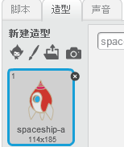
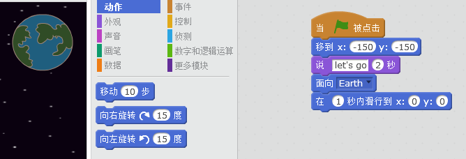
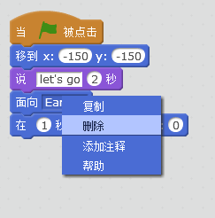
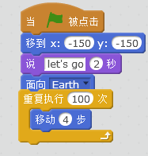
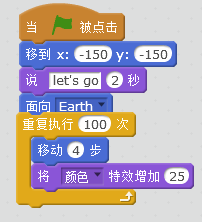
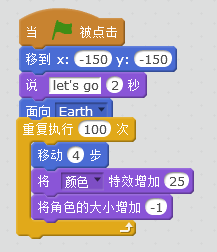
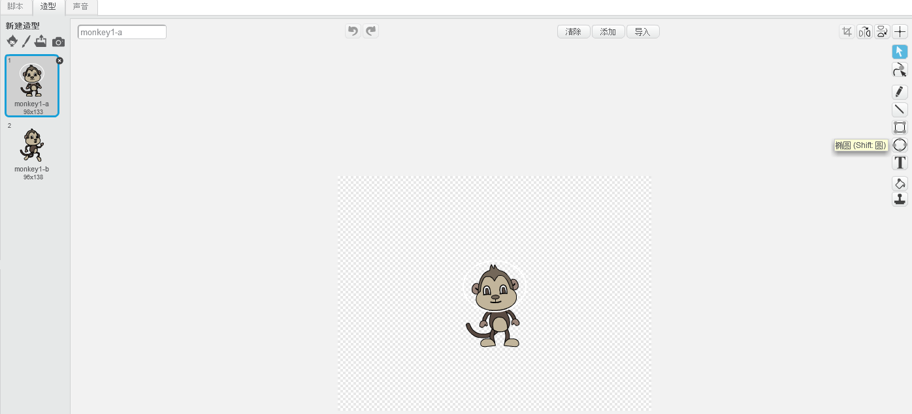
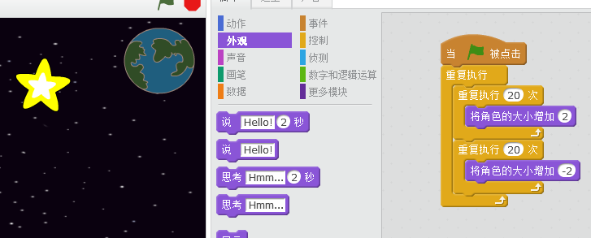

---
title: Lost in Space
level: Scratch 1
language: zh-CN
stylesheet: scratch
embeds: "*.png"
materials: ["Club Leader Resources/*"]
...

# 简介 { .intro }

我们讲学习如何编写动画。

<div class="scratch-preview">
  <iframe allowtransparency="true" width="485" height="402" src="http://scratch.mit.edu/projects/embed/26818098/?autostart=false" frameborder="0"></iframe>
  
</div>

# 步骤 1: 制作一个航天飞机 { .activity .new-page}

我们制作一个，飞向地球的航天飞机。

## 动作清单 { .check }

+ 新建一个项目，删除默认角色，我们也能在下面的链接在线编辑Scratch<a href="http://jumpto.cc/scratch-new">jumpto.cc/scratch-new</a>.

+ 在舞台添加航天飞机和地球角色，你也可以添加星空背景，完成后舞台应该像下图所示：

	

+ 点击航天飞机，选择造型。

	

+ 使用选择工具，选择飞机，然后使用旋转工具，旋转造型。

	

+ 添加下面的代码：

	

	更改代码中的数字，使数字和图片中一致。

+ 如果点击航天飞机，会说话，也会转弯飞向舞台中央。

	

	位置 `x:(0) y:(0)` {.blockmotion}是舞台的中央，位置 `x:(-150) y:(-150)` {.blockmotion} 是舞台的左下角, 位置 `x:(150) y:(150)` {.blockmotion} 是舞台右上角。

	

	如果你想知道舞台位置的坐标值，可以用鼠标移动到舞台任一方，可以看到舞台的坐标值。

	

+ 测试程序

	

## 挑战: 增强你的动画 {.challenge}
你能改变代码中的数字吗？
+ 让航天飞机一直飞行知道碰到地球？?
+ 航天飞机离地球越近飞得越慢?

你需要改变下面代码中的数字。

```blocks
	glide (1) secs to x:(0) y:(0)
```

## 保存项目 { .save }

# 步骤 2: 使用循环制作动画 { .activity .new-page }

另外一个做法就是，让航天飞机移动很多次，每次移动一点点。

## 动作清单 { .check }

+ 右键点击代码，并删除，你也可以简单的把代码拖离脚本去来删除代码。

	

+ 添加下面的代码：

	

	`重复` {.blockcontrol} 用来多次重复某个动作，也叫做__循环__。

+ 尝试运行新代码，可以看到效果和原来差不多。

+ 你可以在循环中添加更多的效果，比如，`改变颜色25` {.blocklooks}让航天飞机颜色渐变。

	

+ 再次运行程序看看效果

	

+ 你也可以让航天飞机越近地球变得越来越小。

	

+ 多次测试程序，是不是发现了问题，用下面这个代码来解决问题吧。

	```scratch
	set size to (100) %
	```

## 保存项目 { .save }

# 步骤 3: 漂浮的猴子 { .activity .new-page }

我们在舞台正价一个猴子，迷失在太空的猴子。 

## 动作清单 { .check }

+ 添加个猴子角色。

	

+ 点击造型，并未猴子画一个头盔。

	

+ 点击猴子的脚本，添加下面代码，让他在太空不停地旋转。

	```blocks
		when FLAG clicked
		forever
		    turn right (1) degrees
		end
	```

	这里的 `forever` {.blockcontrol} 是另外一种循环，这个循环不会停止。

+ 测试程序，你需要按停止按钮来停止这个程序。

	

# 步骤 4: 反弹小行星 { .activity .new-page }

我们来添加一些太空漂浮物。

## 动作清单 { .check }

+ 添加一个陨石到舞台。

	

+ 添加下面的代码，让陨石在太空里弹来弹去。

	```scratch
	when flag clicked
	point towards [Earth v]
	forever
		move (2) steps
		if on edge, bounce
	```

+ 测试程序，看看陨石是不是在舞台弹来弹去？

# 步骤 5: 闪烁的星星 { .activity .new-page }

我们用循环来制作闪烁的星星。

## 动作清单 { .check }

+ 添加一个星星角色。

	

+ 添加下面的代码:

	

+ 点击运行程序，看看程序会怎么做？星星慢慢地变大，又慢慢地变小，这两个循环，在一个`一直` {.blockcontrol}的循环中，所以星星可以重复的变大变小。

## 保存项目 { .save }

## 挑战: 制作自己的动画 {.challenge}

新建一个项目，用今天所学到重新制作新的动画，下面是一些例子：


## 保存项目 { .save }
