---
title: 绘图工具
level: Scratch 1
language: zh-CN
stylesheet: scratch
embeds: "*.png"
materials: ["Club Leader Resources/*","Project Resources/*"]
...

# 简介 { .intro }

本课程我们将学习制作一个绘画工具

<div class="scratch-preview">
  <iframe allowtransparency="true" width="485" height="402" src="http://scratch.mit.edu/projects/embed/63473366/?autostart=false" frameborder="0"></iframe>
  
</div>

# 步骤 1: 制作一支铅笔 { .activity }

我们首先来制作一支铅笔，这支铅笔要能在画布（舞台）画画。

## 动作清单 { .check }

+ 新建一个项目，删除默认的猫的角色，使舞台空白。我们可以在下面连接中，在线使用Scratch <a href="http://jumpto.cc/scratch-new">jumpto.cc/scratch-new</a>.

+ 添加角色：一支笔到项目中。

	 

+ 点击造型，并删除 'pencil-b' 造型。

	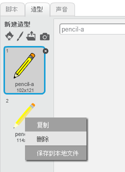 

+ 为铅笔取个新名字，叫做蓝色铅笔，并用“为形状填色”的工具，将铅笔涂成蓝色。

	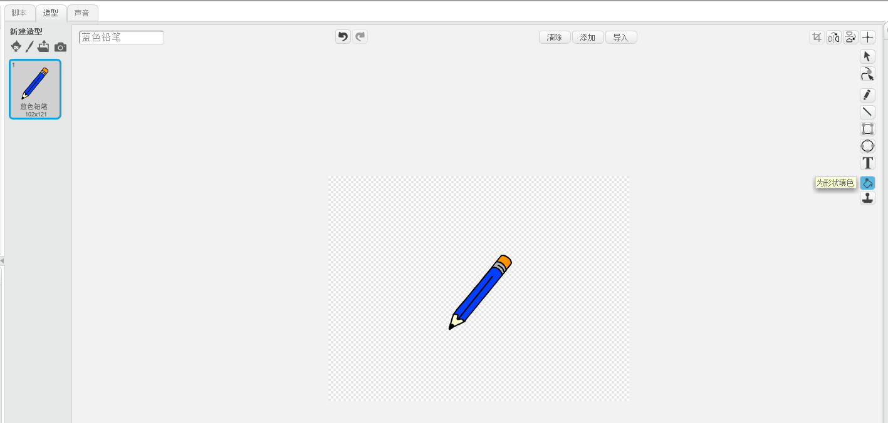 

+ 因为我们需要使用鼠标画画，我们希望这支笔一直跟着鼠标 `一直` {.blockcontrol}.将下面的代码添加到蓝色铅笔的脚本中。

	```blocks
		点击绿旗时
		重复执行
		   移到 [mouse pointer v]
		结束
	```

+ 点击开始的旗帜，测试下上面这段程序，在舞台上随意滑动鼠标，看看是不是达到预期效果。

+ 是否注意到现在鼠标指针指向的是铅笔中部，而不是铅笔的头部。

	

	我们可以通过造型中的“设置造型中心”来修正这个问题。

	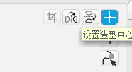

+ 我们把设置造型中心的十字移到蓝色铅笔头的左下角，这样鼠标指针就去指向铅笔头部了。

	

+ 再次点击开始旗帜测试程序，现在的效果是不是比刚才更好。

+ 接下去，`如果` {.blockcontrol}我们点击鼠标，我们就要让铅笔在舞台上画出线条。添加下面的代码到铅笔脚本中：

	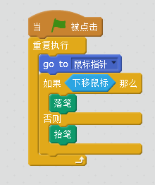	

+ 再次测试测序，按住鼠标左键并在舞台中移动，现在铅笔是否能画出线条来？

	

## 保存项目 { .save }

# 步骤 2: 彩色铅笔 { .activity }

作为绘画工具，我们需要加入多种颜色的铅笔，可以让画图者来自由选择。

## 动作清单 { .check }

+ 点击铅笔角色，选择造型，并复制蓝色铅笔的造型。

	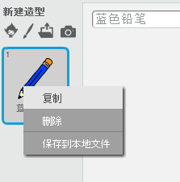

+ 将复制的造型取名为绿色铅笔，并将铅笔填成绿色。

	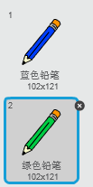

+ 在新建两个角色，用来让用户选择蓝色铅笔或则绿色铅笔

	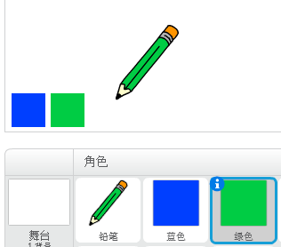

+ 当绿色图标被点击，我们需要`广播` {.blockevents}一个消息给铅笔角色，让铅笔变成绿色的造型。

	我们需要将下面的代码加到绿色图标的脚本处:

	```blocks
		当角色被点击时
		广播 [green v]
	```

	点击广播消息中的消息下拉菜单，并选择新建消息。

	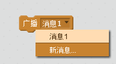

	我们建立一个叫绿色的新消息。

	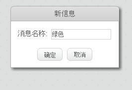

+ 当铅笔接受到广播消息，我们需要添加下面的代码来告诉它接下去怎么做。

	

	我们可以点击`将画笔颜色设定为`的程序块，将铅笔颜色变为绿色。

+ 按照上面的提示我们为蓝色图标添加相应的脚本:

	

	...并将下面的代码加入到铅笔的脚本中：

	

+ 在开始程序后，我们希望画布是空白的，默认画笔是蓝色的，我们将下面代码添加到铅笔角色。

	

	当然我们也可以设置绿色为默认铅笔。

+ 测试程序，现在是否可以切换不同颜色的画笔了？

	

## 保存项目 { .save }

# 步骤 3: 清除错误 { .activity .new-page }

画画的时候我们很容易出错，所以我们需要一个清除按钮，来将画布恢复成空白状态。

## 动作清单 { .check }

+ 如图，添加一个清除按钮到舞台。

	

+ 为新加的按钮添加脚本代码。

	```blocks
		当角色被点击时
		清空
	```

	注意我们不需要通知其他角色，因为任何角色都可以清空舞台。

+ 我们也可以制作一个橡皮檫，选择“从本地文件中上传造型”，将橡皮擦造型添加到铅笔的角色中。

	
	
	如果没有这个图片，我们可以用白色铅笔来代替。

+ 我们还要为这个橡皮擦添加一个图标。

	

+ 并为这个图标添加代码：当被点击时，广播消息给小铅笔角色。

	```blocks
		当角色被点击时
		广播 [eraser v]
	```

+ 当铅笔角色接受到消息，铅笔角色要变成橡皮檫造型，画笔的颜色也要设置成本和舞台一样的颜色（这里是白色）

	```blocks
		当接收到 [eraser v]
		将造型切换为 [eraser v]
		将画笔的颜色设定为 [#FFFFFF]
	```

+ 再次运行测序，看看清除按钮和橡皮檫是否运作正常。

	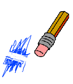

+ 现在还有个问题就是我们可以在舞台任意地方画画，包括图标：

	

	我们需要在角色中添加下面的代码，来确保，只有在绘画区，铅笔才能画画。

	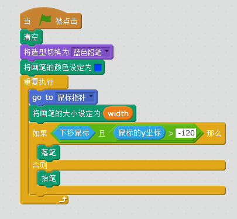

+ 再次运行程序，看看是否正常运作。

	

## 保存项目 { .save }

# 步骤 4: 改变线条粗细 { .activity .new-page }

我们需要让用户选择不同大小的画笔。

## 动作清单 { .check }

+ 首先，我们需要添加一个变量，我们叫做宽度。

+ 添加下面的代码到铅笔角色:

	```blocks
		将画笔的大小设定为 (width)
	```

	现在画笔的大小总是和变量宽度相同。

+  我们右键点击变量，让它显示为滑杆。

	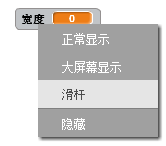

	现在我们可以通过滑动滑杆来改变变量的值。

	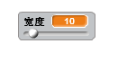

+ 运行程序，看看程序是否正常运作。

	

	我们可以通过点击“设置滑块的最大值和最小值”来为变量设置最大值和最小值。

	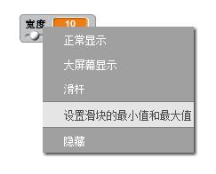

	
## 保存项目 { .save }

## 挑战: 快捷键 { .challenge }
为画图工具添加快捷键? 比如:

+ b = 选择蓝色铅笔
+ g = 选择绿色铅笔
+ e = 选择橡皮擦
+ c = 清除屏幕

## 保存项目 { .save }

## 挑战: 更多画笔 { .challenge }
添加更多的画笔到画图工具，比如红色，黄色，黑色。并为它们添加快捷键。

尝试用自己做画图工具画个画吧


