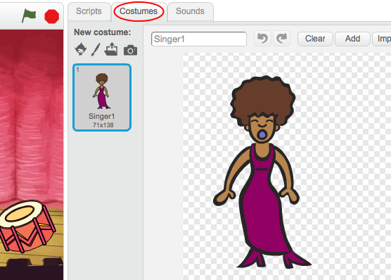

---
title: 摇滚乐队
level: Scratch 1
language: zh-CN
stylesheet: scratch
embeds: "*.png"
materials: ["Club Leader Resources/*"]
...

# 简介 { .intro }

在本课程中，你将学到如何通过编程制作你自己的乐器。

<div class="scratch-preview">
  <iframe allowtransparency="true" width="485" height="402" src="http://scratch.mit.edu/projects/embed/26741186/?autostart=false" frameborder="0"></iframe>
  
</div>

# 第1步： 精灵 { .activity }

在开始编程之前，我们首先需要添加一个可以编程的“东西”。在Scratch中，我们叫这东西 **精灵**。 

## 行动清单 { .check }

+ 首先，打开Scratch编辑器。你也可以使用线上编辑器<a href="http://jumpto.cc/scratch-new">jumpto.cc/scratch-new</a>。如下图所示:

	

+ 你能看到一个小猫精灵，它是Scratch的吉祥物。让我们右键点击它，然后选择“删除”来清除掉这个精灵。
	
	

+ 接着，点击“从角色库中选择角色”，打开所有Scratch自带的角色。

	

+ 向下滚动直到你看到下图所示的鼓，点击选择一个鼓，然后点击“确认”将鼓添加到项目中。

	

+ 选择“缩小”按钮，接着连续点击刚才选中的鼓，将它缩小到合适的尺寸。

	

## 保存项目 { .save }
在左上角的输入框中输入项目名称。

然后点击“文件”菜单中的“保存”来保存你的项目。


（如果你没有Scratch账号，你可以点击“下载到您的计算机”菜单将项目保存到本地。）

# 第2步：舞台 { .activity }

左上角方形区域叫**舞台**，**舞台**是所有角色活动的地方，就像现实中的舞台，所有演员都在舞台上表演。

## 行动清单 { .check }

+ 如图所示，目前舞台还是白色的，看上去很单调。我们可以点击“从背景库中选择背景”来为舞台添加背景。

	

+ 点击左侧的“室内”选项，选择一个舞台背景，并点击“确认”。

	

+ 现在我们的舞台看上去像一个正真的舞台了:

	

# 第3步: 制作一个鼓 { .activity }

现在让我们为鼓编写代码，让它敲击时发出声音。

## 行动清单 { .check }

+ 你可以在“脚本”选项卡中找到所有代码块，不同功能的代码块有不同的功能。

	点击鼓，然后将下面2个代码块拖动到右侧编码区域，并确保他们像乐高积木一样连接在一起：

	

+ 点击舞台中的鼓，看看是否能够发出声音！


##挑战: 改进你的鼓 { .challenge }

+ 你能改变鼓敲击时发出的鼓声吗？

	

+ 你能在空格键按下时让鼓也发出声音吗？你需要用到 `事件` {.blockevents} 代码块:

```blocks
	当按下 [空格键 v]
```

	你可以右键点击现有代码然后点击“复制”来复制代码。
	
	

## 保存项目 { .save }

# 第4步: 制作一个歌手 { .activity .new-page }

让我们为乐队添加一个歌手

## 行动清单 { .check }

+ 在舞台上添加另外两个精灵：歌手和麦克风。

	

+ 要想让歌手唱歌，你需要为你的歌手添加声音。选择歌手，点击“声音”选项卡，然后点击“从声音库中选择声音”：

	

+ 点击左边的“声乐”选项卡为歌手选择一个合适的声音：

	

+ 现在声音已经添加，我们可以为歌手添加如下代码：

	```blocks
		当角色被点击时
		播放声音 [singer1 v] 直到播放完毕
	```

+ 点击歌手，测试歌手是否唱歌。

## 保存项目{ .save }

##第5步: 造型 { .challenge }

+ 你也可以通过新建造型改变歌手的造型。点击“造型”选项卡，你会看到歌手的图片。

	
	
+ 右键点击造型图片并点击“复制”，复制一份造型。

		

+ 点击新建的造型（名叫'Singer2'）然后选择选择直线工具画几条线让歌手看起来真的像在唱歌。

	
	
+ 目前造型的名字表意没有什么含义。在每个造型的名字输入框中输入造型的新名字，将两个造型的名字改为'not singing' 和 'singing'。

	
	
+ 现在歌手有2个不同造型了，你可以选择显示哪个造型！为歌手加入下面两句代码：

	
	
	切换造型的代码块在 `外观` {.blocklooks} 分区中。
	
	测试你的歌手。当歌手被点击时，你的歌手应该看上去像在唱歌。
	
##挑战: 改变鼓的造型 { .challenge }
你能让你的鼓看起来像在被击打吗？如果你需要帮助，可以参考上面的改变歌手造型的做法。 


Remember to test that your new code works!

## 保存项目 { .save }

##挑战: 创建属于你自己的乐队 { .challenge }

利用本项目学到的知识创建一个属于你自己的乐队！你可以创建任何你喜欢的乐器。看一下声音库和造型库都有哪些声音和乐器，希望可以给你一些灵感。


你的乐器不一定非要十分合理。比如，你可以让蛋糕发出钢琴的声音。


除了使用现有精灵，你也可以自己画自己的精灵。


如果你有麦克风，你还可以录制自己的声音，甚至通过摄像头击打乐器。


## 保存项目 { .save }


