---
title: 摇滚乐队
level: Scratch 1
language: zh-CN
stylesheet: scratch
embeds: "*.png"
materials: ["Club Leader Resources/*"]
...

# 简介 { .intro }

在本课程中，我们将学习如何编写音乐器材动画。

<div class="scratch-preview">
  <iframe allowtransparency="true" width="485" height="402" src="http://scratch.mit.edu/projects/embed/26741186/?autostart=false" frameborder="0"></iframe>
  
</div>

# 第一步： 角色 { .activity }

在制作动画之前，我们需要添加一个东西让它动起来，这个东西在Scratch中，我们叫他们角色。 

## 动作清单 { .check }

+ 首先，打开Scratch编辑器。你也可以使用线上编辑器<a href="http://jumpto.cc/scratch-new">jumpto.cc/scratch-new</a>. 如下图所示:

	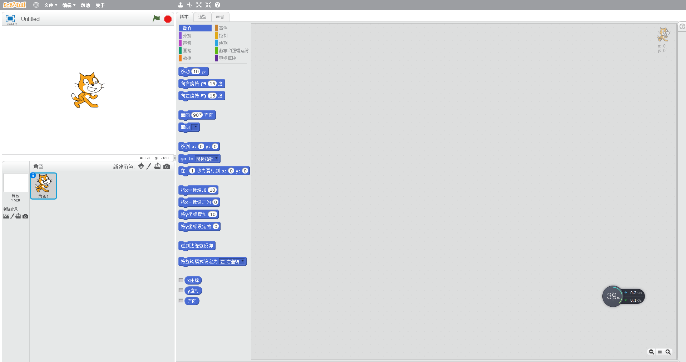

+ 左上角的猫是Scratch的吉祥物，也是默认角色。我们可以通过右键点击左下角色中的猫，并选择“删除”，来清除这个角色。
	
	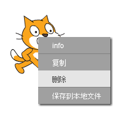

+ 接着，点击“从角色库中选择角色”，打开所有Scratch自带的角色。

	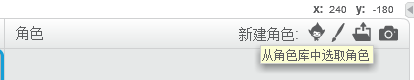

+ 向下滚动直到你看到下图所示的鼓，点击选择一个鼓，将鼓添加到我们的项目中来。

	

+ 选择“缩小”按钮，接着连续点击刚才选中的鼓，是它缩小至合适尺寸。

	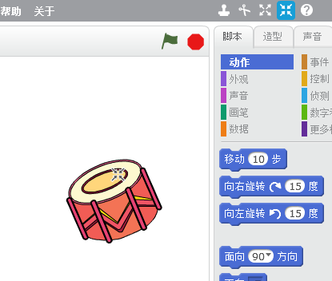

## 保存项目 { .save }

我们可以点击“文件”菜单中的“保存”来保存我们的程序。

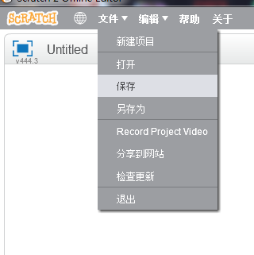

# 第二步：舞台 { .activity }

左上角方形区域叫**舞台**，**舞台**是所有角色活动的地方，就想现实中的舞台，所有演员都在舞台上表演。

## 动作清单 { .check }

+ 如图所示，目前舞台是白色的，看过去很单调。我们可以点击“从背景库中选择背景”来为舞台添加背景。

	

+ 从室内选项中，选择一个舞台背景，并点击确认。

	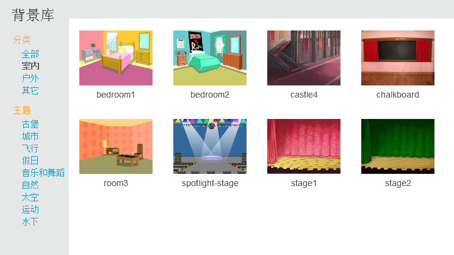

+ 现在我们的舞台看过去像一个正真的舞台:

	

# 第三步: 制作一个鼓 { .activity }

现在我们要给舞台中的鼓编写代码，让这个鼓能够发出声音。

## 动作清单 { .check }

+ 我们可以在脚本标签中找到所有代码块，代码块，不同功能的代码块有不同的功能。

	点击鼓的脚本标签，并拖动下面那个代码块到右边的脚本区域，并确认他们像积木一样结合在一起：

	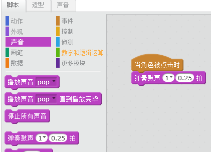

+ 点击舞台中的鼓，看看是否能够发出声音。

+ 我们还能改变鼓发声时的造型，点击“造型”标签，我们可以到一个鼓的图片。

	

+ 右键点击这个图片，并选择复制，创建一个副本。

	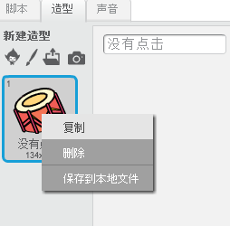

+ 点击新的造型（叫做“drum2”）并选择线段工具，在鼓的四周画上线条，代表鼓发声时候的造型。

	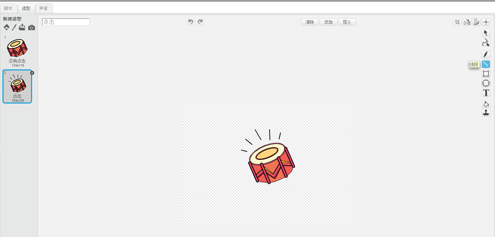

+ 我们可以在造型区域的左上角的文本框中为不同造型取名，我们将两个鼓的造型分别取名为“没有点击”和“点击”

	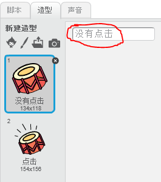

+ 现在我们的鼓拥有了两个不同的造型，我们可以选择显示任意一个。将下面的代码块加入鼓的脚本：

	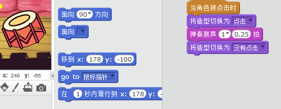

	改变造型的代码块在 `外观` {.blocklooks} 选项中。

+ 试试点击鼓，看看鼓是否改变了造型。

## 保存项目 { .save }

##挑战: 增强这个鼓 { .challenge }

+ 尝试改变鼓被点击时候发出的声音吗？

	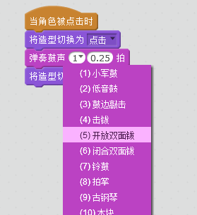

+ 尝试按下空格键，让鼓发出声音。需要用到 `事件` {.blockevents} 代码块:

	右键点击代码选择复制可以复制现有的代码
	
	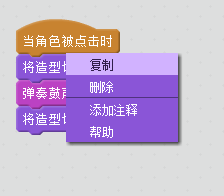

## 保存项目 { .save }

# 第四步: 制作一个歌手 { .activity .new-page }

为乐队添加一个歌手

## 动作清单 { .check }

+ 在我们的舞台上添加另外两个角色：歌手和麦克风。

	

+ 为歌手添加声音，选择歌手，点击声音标签，并点击“从声音库中选择声音”：

	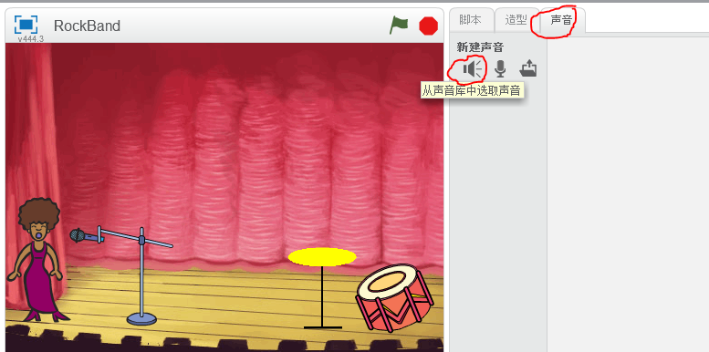

+ 我们可以在“声乐”选项中为歌手选择合适的声音：

	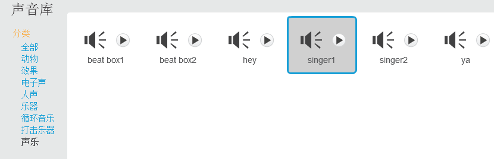

+ 现在声音已经添加到歌手，我们可以为歌手添加下面的代码：

	```模块

		当角色被点击时
		播放声音 [singer1 v] 直到播放完毕
	```

+ 点击歌手，测试歌手是否唱歌。

## 保存项目{ .save }

##挑战: 改变歌手的造型 { .challenge }

+  尝试改变歌手唱歌时的造型，可以参考上面改变的鼓的造型

	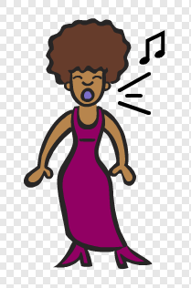

	记得测试新的代码，确保他们工作正常。

## 保存项目 { .save }

##挑战: 制作一个属于你自己的乐队 { .challenge }

根据本课程学到的知识，尝试制作一个我们自己喜欢的乐队，或者乐器。我们可以在声音库中查看现有的声音获取灵感。


我们的乐器不一定非要和现实中一样，比如我们可以让蛋糕发出钢琴的声音，请发挥大家的想象。


除了使用现成的角色，我们还可以自己来画角色。

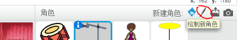

我们还可以为角色录制声音，甚至通过摄像头我们能够控制角色。

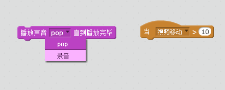

## 保存项目 { .save }
