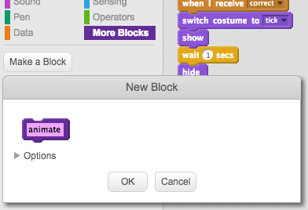

---
title: Brain Game
level: Scratch 2
language: zh-CN
stylesheet: scratch
embeds: "*.png"
materials: ["Club Leader Resources/*"]
...

# 简介 { .intro }

通过这个项目你将学到如何构建一个乘法表测试，你需要在30秒内回答尽可能多的题目。

<div class="scratch-preview">
  <iframe allowtransparency="true" width="485" height="402" src="http://scratch.mit.edu/projects/embed/42225768/?autostart=false" frameborder="0"></iframe>
  
</div>

# 第1步: 创建问题 { .activity }

让我们从创建随机问题让玩家回答开始。

## 行动列表 { .check }

+ 新建一个Scratch项目，删除默认的小猫精灵，让工程变成一个空白工程。您可以在 <a href="http://jumpto.cc/scratch-new">jumpto.cc/scratch-new</a> 找到在线Scratch编辑器。

+ 为你的游戏选择一个角色和一个背景。你可以选择任何你喜欢的角色和背景！下面是个例子：

		

+ 新建2个变量，分别叫 `number 1` {.blockdata} 和 `number 2` {.blockdata} 。这两个变量用于存储乘数和被乘数。

	

+ 为角色加入代码，为这两个变量赋予2到12之间的 `随机` {.blockoperators} 数。

	```blocks
		点击绿旗时
		将变量 [number 1 v] 的值设定为 (在 (2) 到 (12) 间随机选一个数)
		将变量 [number 2 v] 的值设定为 (在 (2) 到 (12) 间随机选一个数)
	```

+ 接下来你就可以问玩家答案，并让玩家知道他们回答的是否正确。

	```blocks
		点击绿旗时
		将变量 [number 1 v] 的值设定为 (在 (2) 到 (12) 间随机选一个数)
		将变量 [number 2 v] 的值设定为 (在 (2) 到 (12) 间随机选一个数)
		询问 (连接 (number 1) (连接 [x] (number 2))) 并等待
		如果 <(回答) = ((number 1) * (number 2))> 那么
		  说 [yes! :)] (2) 秒
		否则
		  说 [nope :(] (2) 秒
	   结束
	```

+ 通过正确回答一题，错误回答一题，充分测试你的项目。

+ 用 `forever` {.blockcontrol} 循环包裹住上面代码，让玩家可以回答很多很多问题。

+ 用变量 `time` {.blockdata}，在舞台上创建一个倒计时计时器。如果你需要帮助，可以参考'Balloons'项目中创建计时器的教程（在第6步）！

+ 重新测试你的项目 - 你应该可以连续回答问题直到倒计时时间到。

## 保存项目 { .save }

## 挑战: 变换造型 {.challenge}
你能让角色根据玩家的回答变换不同造型吗？


## 挑战: 添加分数 {.challenge}
你可以为游戏添加分数吗？每回答对一题可以加1分。你甚至可以在玩家答错时将分数清零。

## 保存项目 { .save }

# 第2步: 多次游戏 { .activity .new-page}

让我们为游戏增加“开始”按钮，这样你就可以玩很多次了。

## 行动列表 { .check }

+ 新建一个“开始”按钮精灵，玩家点击该按钮即可开始一局新游戏。你可以自己绘制这个按钮，也可以编辑Scratch素材库中 精灵。

	

+ 为开始按钮加入如下代码。

	```blocks
		点击绿旗时
		显示
		
		当角色被点击时
		隐藏
		广播 [start v]
	```

	这段代码在游戏启动时显示开始按钮。按钮被点击时隐藏按钮并广播消息开始游戏。

+ 你需要编辑角色的代码，让角色收到 `start` {.blockevents} 消息时开始游戏，而不是点击旗子时开始。

	将 `when flag clicked` {.blockevents} 替换为 `when I receive start` {.blockevents}.

	

+ 点击绿旗，然后点击开始按钮测试游戏。你应该看到直到开始按钮被点击后游戏才开始。

+ 你发现倒计时器在绿旗被点下时就开始计时了吗？而不是游戏开始时才计时。

	

	你能修复这个问题吗？

+ 点击舞台，用 `end` {.blockevents} 消息替换 `stop all` {.blockcontrol} 代码块。

	

+ 你可以为按钮添加代码让它在游戏结束时重新显示出来。

	```blocks
		当接收到 [结束 v]
		显示
	```

+ 游戏结束时，你还需要停止角色提问问题：

	```blocks
		当接收到 [结束 v]
		停止 [角色的其他脚本 v]
	```

+ 多玩几局游戏，测试开始按钮。你会发现每局结束后开始按钮都会出现。为了让测试简单一点，你可以缩短每局游戏的时间，这样一局游戏只需几秒钟。

	```blocks
		将变量 [time v] 的值设定为 [10]
	```

+ 你甚至可以在鼠标悬停时改变按钮的外观。

	```blocks
		点击绿旗时
		显示
		重复执行
		  如果 <碰到 [鼠标指针 v]> 那么
		      将 [超广角镜头 v] 特效设定为 (30)
		  否则
		      将 [超广角镜头 v] 特效设定为 (0)
		  结束
		结束
	```

	

## 保存项目 { .save }

## 挑战: 开始屏幕 {.challenge}
你可以为你的舞台添加另一个背景作为游戏的开始屏幕吗？你可以用 `when I receive start` {.blockevents} 和 `when I receive end` {.blockevents} 模块控制背景切换。

你还可以通过下面的代码显示或隐藏游戏角色，甚至显示或隐藏计时器：

```blocks
显示变量 [time v]
```
```blocks
隐藏变量 [time v]
```


## 保存项目 { .save }

# 第3步: 添加图形 { .activity .new-page}

现在游戏角色通过说 `yes! :)` 或 `nope :(` 来高手玩家结果，让我们加点图形来提示玩家他们的回答到底是对是错。

+ 新建一个名叫'Result'的精灵，这个精灵包含'tick' 和 'cross'两种造型。

	

+ 修改角色的代码，用广播 `correct` {.blockevents} 和 `wrong` {.blockevents} 消息代替直接告诉玩家结果。

	

+ 现在你可以用这些消息控制显示对号造型或叉叉造型。为'Result'精灵添加如下代码：

		

+ 测试你的游戏。你会发现当你回答正确时会出现对号，回答错误时会出现叉叉！

	

+ 你发现了吗？`when I receive correct` {.blockevents} 和 `when I receive wrong` {.blockevents} 代码块非常相似。让我们创建一个函数让它更容易修改和维护。

	选中'Result'精灵，点击 `更多模块` {.blockmoreblocks}，然后点击'创建新功能块'。创建一个名叫 `animate` {.blockmoreblocks} 的模块。

	

+ 然后你可以将动画代码加入到新建的animation函数中，接着使用该函数两次：

	

+ 现在，如果你想让对号或叉叉显示的时间长点儿或短点儿，你只需要修改一次代码。试一下！

+ 你可以修改你的animation函数，用图形淡出效果替代直接显示或隐藏对号或叉叉。

	```blocks
		定义 [object Object]
		将 [虚像 v] 特效设定为 (100)
		显示
		重复执行 (25) 次
		  将 [虚像 v] 特效增加 (-4)
		结束
		隐藏
	```

## 保存项目 { .save }

## 挑战: 优化动画 {.challenge}
你可以优化图形动画吗？你可以编程让对号和叉叉淡出淡入。或者实现其他很酷的特效：


## 保存项目 { .save }

## 挑战: 声音和音乐 {.challenge}
你可以为游戏加入音效和音乐吗？例如：

+ 当玩家回答正确或错误时播放一个声音；
+ 为倒计时器加入嘀嗒声；
+ 当时间用完时播放声音；

	```blocks
		弹奏鼓声 (10 v) (0.1) 拍
	```

+ 你也可以无限循环播音乐（如果你不知道该怎么做，“摇滚乐队”项目的第4步将给你指引）。

## 保存项目 { .save }

## 挑战: 10分竞赛 {.challenge}
你能改变游戏规则，让游戏不再是30秒内回答尽可能多问题，而是看玩家多快时间能够回答正确10道题吗？

要做到这一点，你只需要修改定时器的代码。你知道修改哪里吗？

```blocks
	当接收到 [start v]
	将变量 [time v] 的值设定为 (30)
	重复执行直到 <(time) = [0]>
	   等待 (1) 秒
	   将变量 [time v] 的值增加 (-1)
	结束
	广播 [结束 v]
```

## 保存项目 { .save }

## 挑战: 引导界面 {.challenge}
你能添加一个引导界面，告诉玩家游戏规则吗？你需要一个“操作指南”按钮和另一个舞台背景。


你可能还需要一个“返回”按钮用来返回主菜单。

```blocks
	广播 [main menu v]
```

## 保存项目 { .save }


