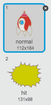

---
title: 克隆战争
level: Scratch 2
language: zh-CN
stylesheet: scratch
embeds: "*.png"
materials: ["Club Leader Resources/*"]
beta: true
...

## 社区贡献项目 { .challenge .pdf-hidden }
本项目由Erik创建。如果你想贡献你自己的项目，请 [在Github上联系我们](https://github.com/CodeClub)。

# 简介 { .intro }

在这个项目中，你将学习如何构建一个从太空怪物手中拯救地球的游戏。

<div class="scratch-preview">
  <iframe allowtransparency="true" width="485" height="402" src="http://scratch.mit.edu/projects/embed/46018140/?autostart=false" frameborder="0"></iframe>
  
</div>

# 第1步: 创建飞船 { .activity }

让我们来创建保护地球的飞船！

## 行动清单 { .check }

+ 新建一个Scratch项目，删除默认的小猫精灵，让项目变成一个空白项目。您可以在 <a href="http://jumpto.cc/scratch-new">jumpto.cc/scratch-new</a> 找到在线Scratch编辑器。

+ 向项目中添加“星星”背景和“飞船”精灵。缩小飞船的大小并将其移到接近屏幕底部。

	

+ 添加代码，让飞船在左箭头按下时向左移动。你需要用到如下模块：

	```blocks
		点击绿旗时
		重复执行
		  如果 <按键 [左移键 v] 是否按下？> 那么
		      将x坐标增加 (-4)
		  结束
		结束
	```

+ 添加代码让飞船在右箭头按下时向右移动。

+ 测试项目，看是否可以通过箭头键控制飞船移动。

## 保存项目 { .save }

# 第2步: 闪电弹 { .activity }

让我们给飞船赋予发射闪电弹的能力！

## 动作清单 { .check }

+ 从Scratch造型库中添加“闪电”精灵。点击精灵的造型将其上下翻转。

	

+ 当游戏开始时，闪电应该一直隐藏直到飞船发射子弹。

	```blocks
		点击绿旗时
		隐藏
	```

+ 将下列代码加到 **飞船** 上，每当空格键按下时，创建一个闪电弹。


	```blocks
		点击绿旗时
		重复执行
		  如果 <按键 [空格键 v] 是否按下？> 那么
		      克隆 [Lightning v]
		  结束
		结束
	```

+ 每当新克隆体创建时，克隆体应该跟飞船同一位置，然后向上移动直到碰到屏幕边缘。将下列代码加入 **闪电精灵**：

	```blocks
		当作为克隆体启动时
		移到 [Spaceship v]
		显示
		重复执行直到 <碰到 [边缘 v]>
		  将y坐标增加 (10)
		结束
		删除本克隆体
	```

注意：我们移动新建克隆体到飞船位置时它还处于隐藏状态，然后再将其显示出来。 这样看起会更自然。

+ 点击空格键，测试闪电弹。

## 保存项目 { .save }

## 挑战: 修复闪电 {.challenge}
如果你按住空格键不放会发生什么情况？你能利用 `wait` {.blockcontrol} 模块修复这个问题吗？

## 保存项目 { .save }

# 第3步: 飞行的太空河马 { .activity }

让我们加入一些想要破坏你飞船的飞行的河马。

## 行动清单 { .check }

+ 用Scratch造型库中的'Hippo1'图片创建一个新精灵。

	

+ 将其旋转风格设为仅能左右旋转，然后加入如下代码，让它在游戏开始时隐藏： 

	```blocks
		点击绿旗时
		隐藏
	```

+ 为河马精灵新建一个叫 `speed` {.blockdata} 的变量。

	

	你可以很容易地发现你做的对不对，因为变量旁边会有精灵的名字，就像这样：

	

+ 下面的代码会每隔几秒创建一个河马。 **舞台** 是这段代码最好的添加处：

	```blocks
		点击绿旗时
		重复执行
		  等待 (在 (2) 到 (4) 间随机选一个数) 秒
		  克隆 [Hippo1 v]
		结束
	```

+ 当河马克隆体创建后，让它（以随机速度）在舞台上移动，直到碰到闪电。 将如下代码添加到 **河马** 精灵上：

	```blocks
		当作为克隆体启动时
		将变量 [speed v] 的值设定为 (在 (2) 到 (4) 间随机选一个数)
		移到 x:(在 (-220) 到 (220) 间随机选一个数) y:(150)
		显示
		重复执行直到 <碰到 [lightning v]>
		  移动 (speed) 步
		  转动CW (在 (-10) 到 (10) 间随机选一个数) 度
		  碰到边缘就反弹
		结束
		删除本克隆体
	```

+ 测试河马代码。你应该看到每隔几秒就出现一个新的河马以它自己的速度移动。

	

+ 测试激光炮。当碰到河马时，它消失了吗？

+ 当河马碰到飞船时，飞船要爆炸！要实现这个功能，首先确保飞船有2个造型，一个叫 'normal' ，另一个叫 'hit'。

	

	飞船的 'hit' 造型可以从Scratch造型库中导入 'Sun' 图片来创建，然后用 '为造型填色' 工具改变它的颜色。

	

+ 为飞船加入如下代码让它在碰到飞行的河马时切换造型：

	```blocks
		点击绿旗时
		重复执行
		  将造型切换为 [normal v]
		  在 <碰到 [Hippo1 v]> 之前一直等待
		  将造型切换为 [hit v]
		  广播 [hit v]
		  等待 (1) 秒
		结束
	```

+ 你发现上面的代码广播了一个'hit' 消息吗？当飞船碰到河马时，你可以用这个消息让所有河马都消失。

	为河马加入下面的代码：

	```blocks
		当接收到 [hit v]
		删除本克隆体
	```

+ 开始一局新游戏并让飞船碰到河马来测试这段代码。 

	

## 保存项目 { .save }

## 挑战: 生命和得分 {.challenge}
你能为游戏加入 `lives` {.blockdata}、 `score` {.blockdata} 甚至 `highscore` {.blockdata} 吗？你可以参考 'Catch the Dots' 项目。

## 保存项目 { .save }

# 第4步: 水果蝙蝠! { .activity }

让我们创建一个向飞船扔桔子的水果蝙蝠。

## 行动清单 { .check }

+ 首先，创建一个蝙蝠精灵，这个蝙蝠精灵`永远` {.blockcontrol}在舞台上方来回`移动` {.blockmotion}。记得测试你的代码。

	

+ 如果你查看蝙蝠的造型，你会发现它已经拥有2个造型了：

	

	使用 `下一个造型` {.blocklooks} 模块让蝙蝠在移动时扇动翅膀。

+ 从Scratch造型库新建一个“桔子”精灵。

	


+ 为蝙蝠添加如下代码，让它每隔几秒钟创建一个桔子克隆体。

	```blocks
		点击绿旗时
		重复执行
		  等待 (在 (5) 到 (10) 间随机选一个数) 秒
		  克隆 [Orange v]
		结束
	```

+ 点击桔子精灵，为它添加如下代码，让桔子从蝙蝠的位置向飞船掉落：

	```blocks
		点击绿旗时
		隐藏
		
		当作为克隆体启动时
		移到 [Bat1 v]
		显示
		重复执行直到 <碰到 [边缘 v]>
		  将y坐标增加 (-4)
		结束
		删除本克隆体
		
		当接收到 [hit v]
		删除本克隆体
	```

+ 你需要修改飞船精灵的代码，让飞船碰到河马或桔子时爆炸：

	```blocks
		在 <<碰到 [Hippo1 v]> 或 <碰到 [Orange v]>> 之前一直等待
	``` 

+ 测试你的游戏。当你碰到下落的桔子时会发生什么？

## 保存项目 { .save }

# 第5步: 游戏结束 { .activity }

当我们在游戏结束时添加 'game over' 信息。

## 行动清单 { .check }

+ 如果你还没有创建 `lives` {.blockdata} 变量，请先创建`lives` {.blockdata}变量。飞船起始有3条生命，每次碰到敌人失去一条生命。当所有生命用完，游戏结束。如果你需要帮助，请参考'Catch the Dots'项目。

+ 用文字工具绘制一个名叫'Game Over'的精灵。

	

+ 当游戏结束时，在舞台上广播 `game over` {.blockevents} 消息。

	```blocks
		广播 [game over v] 并等待
	```

+ 为'Game Over'精灵添加如下代码，让它在游戏结束时显示出来：

	```blocks
		点击绿旗时
		隐藏
		
		当接收到 [game over v]
		显示
	```

	以为你在舞台上使用了 `广播 [game over] 并等待
` {.blockevents} 模块，结束游戏前会等待'Game Over'精灵显示出来。

+ 测试你的游戏，看看你能得多少分？如果游戏太简单或太难，你能想出办法优化它吗？

## 保存项目 { .save }

## 挑战: 优化游戏 {.challenge}
你能从哪些方面改进你的游戏呢？下面是一些想法：
+ 加入血包，手机一定数量的血包可以获得额外的生命；


+ 加入浮动的石头，飞船不能碰到石头；
	


+ 当分数大于100分时出现更多的敌人。

```blocks
	在 <(score) = [100]> 之前一直等待
```

## 保存项目 { .save }

