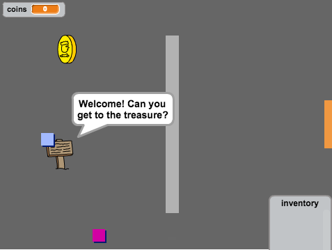
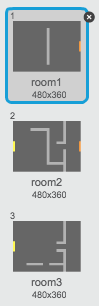

---
title: 创造你自己的世界
level: Scratch 2
language: zh-CN
stylesheet: scratch
embeds: "*.png"
materials: ["Club Leader Resources/*","Project Resources/*"]
...

# 简介 { .intro }

在这个项目中，你将学习如何创建属于你自己的开放世界探险游戏。

<div class="scratch-preview">
  <iframe allowtransparency="true" width="485" height="402" src="http://scratch.mit.edu/projects/embed/34248822/?autostart=false" frameborder="0"></iframe>
  
</div>

# 第1步: 编码游戏角色 { .activity }

让我们从创建一个能够在世界中四处走动的游戏角色开始。

## 行动清单 { .check }

+ 新建一个Scratch项目，删除默认的小猫精灵，让项目变成一个空白项目。你可以在 <a href="http://jumpto.cc/scratch-new">jumpto.cc/scratch-new</a> 找到在线Scratch编辑器。

+ 在这个项目里，有一个'Project Resources'文件夹装着所有你需要的图片。请确保你能找到这个文件夹，如果找不到请向你的老师求助。

	

+ 将图片'room1.png'作为新舞台屏幕背景添加到项目中，并用图片 'player.png'新建一个精灵。如果你没有这些图片你可以自己画！你项目项目看上去应该是这样的：

	

+ 让我们用箭头键移动游戏角色。大概玩家按下上箭头时，通过修改游戏角色的y坐标让其向上移动。为游戏角色精灵添加如下代码：

	```blocks
		点击绿旗时
		重复执行
		  如果 <按键 [上移键 v] 是否按下？> 那么
		      将y坐标增加 (2)
		  结束
		结束
	```

+ 点击绿旗，然后按住上箭头，测试游戏角色。游戏角色向上移动吗？

	

+ 要让角色向左移动，你需要为角色添加另一个 `if` {.blockcontrol} 模块来改变角色的x坐标：

	```blocks
		点击绿旗时
		重复执行
		  如果 <按键 [上移键 v] 是否按下？> 那么
		      将y坐标增加 (2)
		  结束
		  如果 <按键 [左移键 v] 是否按下？> 那么
		      将x坐标增加 (-2)
		  结束
		结束
	```

## 挑战: 向四个方向移动 {.challenge}
你可以为角色加入更多代码让他可以上下左右四个方向移动。参考你已经写的代码！

## 保存项目 { .save }

+ 重新测试游戏角色，你会发现角色能够穿过浅灰色的墙。

	

+ 要修复这个问题，你需要在移动角色的时候判断他们是否碰到了浅灰色的墙，如果碰到了就后退。下面是代码：

	```blocks
		点击绿旗时
		重复执行
		  如果 <按键 [上移键 v] 是否按下？> 那么
		      将y坐标增加 (2)
		      如果 <碰到颜色 [#BABABA]> 那么
		          将y坐标增加 (-2)
		      结束
		  结束
		结束
	```

	注意新加的 `如果`{.blockcontrol}`碰到颜色`{.blocksensing} 模块在  `如果`{.blockcontrol}`按键 [上移键]`{.blocksensing} 模块 _内_ 。

+ 让角色自下而上撞墙来测试新加的代码 - 角色不应该会穿墙而过了。

	

+ 让我们用同样的方法处理左箭头，当角色碰到墙时后退。代码应该是这样的：

	

## 挑战: 修复游戏角色的移动 {.challenge}
为你的游戏角色添加代码让他4个方向都不会穿墙而过。你可以参考已有的代码！

## 保存项目 { .save }

# 第2步: 编码游戏世界 { .activity }

让我们为角色加入功能，让他可以穿过门渠道另一个房间！

## 行动清单 { .check }

+ 再为舞台添加2个背景（'room2.png' 和 'room3.png'），这样舞台总共有3个背景。确保它们的顺序是正确的 - 这点在后面会帮你很大忙。

	

+ 你需要一个名叫 `room` {.blockdata} 的变量来记录角色当前在哪个房间。

	

+ 当角色在第一个房间碰到橙色门时，下一个舞台背景显示出来，并且游戏角色移动到舞台的左侧。下面是你所需的代码 - 应该放置在角色的 `forever` {.blockcontrol} 循环中：

	```blocks
		如果 <碰到颜色 [#F2A24A]> 那么
		  将背景切换为 [下一个背景 v]
		  移到 x:(-200) y:(0)
		  将变量 [room v] 的值增加 (1)
		结束
	```

+ 将下面的代码添加到角色代码的 _开头_ （在 `forever` {.blockcontrol} 循环之前），确保当绿旗点击时一切都重新设置：

	```blocks
		将变量 [room v] 的值设定为 (1)
		移到 x:(-200) y:(0)
		将背景切换为 [room1 v]
	```

+ 点击绿旗然后移动角色到橙色门。游戏角色进入下一屏了吗？`room` {.blockdata} 变量的值变为2了吗？

	

## 挑战: 返回上一房间 {.challenge}
当游戏角色碰到黄色门时，你能让他返回上一房间吗？记住，这段代码跟移动角色到下一房间的代码 _非常_ 相似。

## 保存项目 { .save }

# 第3步: 路标 { .activity }

让我们在游戏世界中加入路标，指引游戏角色的征程。

## 行动清单 { .check }

+ 导入图片 'sign.svg' 新建一个精灵，并重命名为'welcome sign'.

	

+ 这个路标只出现在房间1，所以我们需要为路牌添加一些代码确保它只出现在房间1:

	```blocks
		点击绿旗时
		重复执行
		  如果 <(room) = [1]> 那么
		      显示
		  否则
		      隐藏
		  结束
		结束
	```

+ 在两个房间来回进出测试路牌。路牌只应该出现在房间1。

	

+ 没有信息的路牌不是好路牌！让我们再加点代码（在另一独立代码块中）让角色碰到路牌时可以显示信息：

	```blocks
		点击绿旗时
		重复执行
		  如果 <碰到 [player v]> 那么
		      说 [欢迎！你能找到宝藏吗？]
		  否则
		      说 []
		  结束
		结束
	```
+ 测试路牌，当游戏角色碰到路牌时应该出现信息。

	

## 保存项目 { .save }

## 挑战: 宝藏! {.challenge}
你能利用 'chest.svg' 图片新建一个宝箱精灵吗？将这个宝箱放到房间3，当游戏角色碰到它时显示信息 “干得漂亮！” 。


## 保存项目 { .save }

# 第4步: 人物 { .activity }

让我们为游戏世界添加其他人物角色，让他们跟游戏角色互动。

## 活动清单 { .check }

+ 使用图'person.png'新建一个人物精灵。 

	

+ 加入如下代码，让人物跟游戏角色进行对话。这段代码与路牌的代码非常相似：

	```blocks
		点击绿旗时
		移到 x:(-200) y:(0)
		重复执行
		  如果 <碰到 [player v]> 那么
		      说 [你知道你可以进橙色和黄色门吗？]
		  否则
		      说 []
		  结束
		结束
	```

+ 下面两句代码能够让人物移动：

	```blocks
		移动 (1) 步
		碰到边缘就反弹
	```

	你可以将这段代码放在 `forever` {.blockcontrol} 循环中也可以放在 `if` {.blockcontrol} 模块中。根据你方式的位置不同，人物的表现行为不同。试一下两种方案，看看你更喜欢哪个。

	

+ 你注意到人物会反转吗？要解决这个问题，点击精灵的信息图标(`i`{.blockmotion})， 然后点击旋转模式的点按钮。

	

## 挑战: 优化人物 {.challenge}
你能为人物添加代码，让他只出现在房间1吗？记得测试你的代码！

## 保存项目 { .save }

+ 你也可以加入巡逻的敌人，游戏角色碰到他就游戏结束。新建一个敌人精灵，修改旋转模式，就像修改人物精灵的旋转模式一样。

+ 为敌人精灵添加代码，让他只出现在房间2。

+ 你还需要添加代码让过敌人精灵移动，让游戏角色碰到敌人时结束游戏。在两个独立代码块中很更容易实现。敌人精灵的代码如下：

	

+ 测试敌人精灵，确保：
	+ 只出现在房间2；
	+ 在房间巡逻；
	+ 角色碰到他时游戏结束。

## 保存项目 { .save }

## 挑战: 更多敌人 {.challenge}
你能在房间3中创建上下巡逻的敌人吗？


## 保存项目 { .save }

# 第5步: 收集金币 { .activity }

## 行动清单 { .check }

+ 为你的项目新建一个名为 `coins` {.blockdata} 的变量。

+ 为项目添加 'coin' 精灵。


+ 为金币加入代码，让它只出现在房间1中。

+ 为金币精灵添加如下代码，让它被捡起时 `coins` {.blockdata} 变量加1:

	```blocks
		点击绿旗时
		在 <碰到 [player v]> 之前一直等待
		将变量 [coins v] 的值增加 (1)
		停止 [角色的其他脚本 v]
		隐藏
	```

	`停止 [角色的其他脚本]` {.blockcontrol} 这句代码让金币被捡起后不在出现在房间1。

+ 游戏开始时，你要将 `coins` {.blockdata} 变量设为0。

+ 测试项目 - 收集金币后分数应该加1。

## 挑战: 更多金币 {.challenge}
你能为游戏加入更多金币吗？他们散落在不同的房间，有些金币甚至有敌人把守。

# 第6步: 门和钥匙 { .activity }

## 行动清单 { .check }

+ 从 'key-blue.svg' 图片新建一个钥匙精灵。切换到舞台场景3，将这个钥匙放在一个不容易拿到的地方！

 	

+ 确保钥匙只出现在房间3。

+ 新建一个名为 `inventory` {.blockdata} 的列表变量，用于存储所有玩家收集到的物品。

+ 收集钥匙的代码与收集金币的代码非常相似。不同之处是这里将钥匙加入 `inventory` {.blockdata} 列表。

	```blocks
		点击绿旗时
		在 <碰到 [player v]> 之前一直等待
		将 [blue key] 加入链表 [inventory v]
		停止 [角色的其他脚本 v]
		隐藏
	```

+ 测试钥匙，看你能否收集到钥匙并将它加入背包中。记得在舞台上加入代码，当游戏启动时清空背包。

	```blocks
		删除链表 (全部 v) 的第 [inventory v] 项
	```

+ 用'door-blue.png'图片新建一个精灵，将蓝色门放到两个墙的间隙中。

	

+ 为蓝门加入代码，让它只出现在房间3中。

+ 如果玩家背包中有蓝色钥匙，则隐藏蓝门，让玩家通过。

	```blocks
		点击绿旗时
		在 <[inventory v] 包含 [blue key]> 之前一直等待
		停止 [角色的其他脚本 v]
		隐藏
	```

+ 测试项目，看你能否手机到蓝色钥匙并打开门！

## 保存项目 { .save }

## 挑战: 创建你自己的世界 {.challenge}
现在你可以继续创建你自己的游戏世界了。 这里是一些想法：

+ 改变游戏的设定和图形；
+ 为游戏加入声音和音乐；
+ 加入更多的人物、敌人、路牌和金币；
+ 加入红色和黄色的门，分别需要对应颜色的钥匙来打开；
+ 加入更多的房间；
+ 加入其他有用的物品；
+ 用金币向他人购买信息；

	

+ 你甚至可以在上下方向上加入门，让玩家可以在4个方向上进出房间。例如，你有9个房间，你可以理解他们按照3x3的格子排列。当从下面的门进入房间时房间号加3。

	

## 保存项目 { .save }

