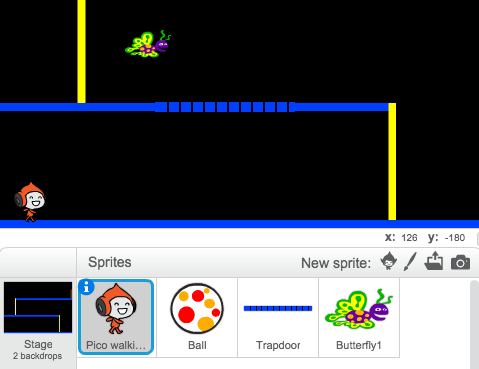

---
title: Dodgeball
level: Scratch 2
language: zh-CN
stylesheet: scratch
embeds: "*.png"
materials: ["Club Leader Resources/*","Project Resources/*"]
...

# 简介 { .intro }

在本项目中，你将学习如何创建一个躲避移动小球的平台游戏。

<div class="scratch-preview">
  <iframe allowtransparency="true" width="485" height="402" src="http://scratch.mit.edu/projects/embed/39740618/?autostart=false" frameborder="0"></iframe>
  
</div>

# 第1步：角色移动 { .activity }

让我们从创建一个可以移动的角色开始，这个角色不但可以左右移动，还能够爬梯子。

## 行动清单 { .check }

+ 新建一个Scratch项目，删除默认的小猫精灵, 让项目变成一个空白项目。你可以在这里 <a href="http://jumpto.cc/scratch-new">jumpto.cc/scratch-new</a>找到在线Scratch编辑器。

+ 本项目需要用到'Project Resources'文件夹，这里面保存这你需要的背景图。确保你能够找到这个文件夹，如果找不到请找你的老师帮忙。

	

+ 将图片'background.png'添加到舞台作为新舞台背景，或者你也可以自己绘制！如果你要自己绘制关卡，一定要确保梯子和地面是不同颜色的，并且要有一扇门（或者类似的东西）最为玩家需要达到的目的地。完成后你的项目应该如下图所示：

	

+ 添加一个精灵作为游戏角色。最好选择有多套造型的精灵，这样你就可以让精灵看上去真的像在走。

	

+ 让我们用箭头键控制角色移动。当玩家点击右箭头时，角色要面向右，移动几步并切换到下一个造型：

	```blocks
		点击绿旗时
		重复执行
		  如果 <按键 [右移键 v] 是否按下？> 那么
		      面向 (90 v) 方向
		      移动 (3) 步
		      下一个造型
		  结束
		结束
	```

+ 点击绿旗测试你的角色，按住右箭头键，你的角色向右移动了吗？它看起来像在走路吗？

	

+ 想让角色向左移动，你需要在 `forever` {.blockcontrol} 循环中添加另一个  `if` {.blockcontrol} 代码块来控制角色左移。记得测试你的新代码，确保它能够正常工作！如果你的角色左移时turns upside down，在 `forever` {.blockcontrol} 循环前加入 `set rotation style` {.blockcontrol} 模块：

	```blocks
		点击绿旗时
		将旋转模式设定为 [左-右翻转 v]
		重复执行
		  如果 <按键 [右移键 v] 是否按下？> 那么
		      面向 (90 v) 方向
		      移动 (3) 步
		      下一个造型
		  结束
		结束
	```

+ 想让角色爬粉色梯子，你的角色需要碰到正确的颜色并在上箭头键按下时稍微向上移动。在角色的 `forever` {.blockcontrol} 循环中加入如下代码：

	```blocks
		如果 <<按键 [上移键 v] 是否按下？> 且 <碰到颜色 [#FFFF00]>> 那么
		  将y坐标增加 (4)
		结束
	```

+ 测试你的角色 - 你能爬上粉色梯子并到达关卡终点吗？

	

## 保存项目 { .save }

## 挑战：完成关卡 {.challenge}
你能为你的角色添加更多代码让你的角色到达绿色门时说点什么？


## 保存项目 { .save }

# 第2步：重力和跳跃 { .activity }

让我们为你的角色加入跳跃和重力，让角色的运动更加真实些。

## 行动清单 { .check }

+ 你可以已经发现了，你的角色会走出平台悬在半空中。试着让角色走出平台看会发生什么。

	

+ 要修复这个问题，我们需要为游戏加入重力。新建一个名为 `gravity` {.blockdata} 的变量。如果你愿意的话你可以将这个变量隐藏起来。

	

+ 加入下面的新代码块，将重力设为负数，然后不停地修改角色的y坐标。

	```blocks
		点击绿旗时
		将变量 [gravity v] 的值设定为 [-4]
		重复执行
		  将y坐标增加 (gravity)
		结束
	```

+ 点击旗子，然后将你的角色拖到舞台的最上方。发生了什么？重力如你预期的产生作用了吗？

	

+ 重力是不能让你的角色穿越平台或梯子的！想你的代码中加入 `if` {.blockcontrol} 模块，让重力只作用于角色悬于半空时。重力代码块看上去应该像这样：

	```blocks
		点击绿旗时
		将变量 [gravity v] 的值设定为 [-4]
		重复执行
		  如果 <<<碰到颜色 [#0000FF]> 或 <碰到颜色 [#FFFF00]>> 不成立> 那么
		      将y坐标增加 (gravity)
		  结束
		结束
	```

+ 重新测试重力。你的角色碰到平台或梯子时会停下来吗？你能走下平台边缘落到下一层吗？

	

+ 当玩家按下空格键时，我们让角色跳起来。一个非常简单的实现跳跃的方法是让角色向上移动几下，下面是代码：

	```blocks
		当按下 [空格键 v]
		重复执行 (10) 次
		  将y坐标增加 (4)
		结束
	```

	由于重力始终作用于角色向下移动4个像素，所以 `change y by (4)` {.blockmotion} 代码块中的数值需要大于4。不断调试这个数字直到你对角色的跳跃高度满意为止。

+ 如果你测试了这段代码，你会发现这段代码没有问题，但是运动不是很流畅。想让跳跃看起来更流畅，你需要让你的角色移动的越来越小，直到不再移动。

+ 要想做到这一点，需要新建另一个变量，名叫 `jump height` {.blockdata}。一样的，如果你愿意可以将这个变量隐藏起来。

+ 删除你之前为角色添加的跳跃代码，替换成如下代码：

	```blocks
		当按下 [空格键 v]
		将变量 [jump height v] 的值设定为 [8]
		重复执行直到 <(jump height) = [0]>
		  将y坐标增加 (jump height)
		  将变量 [jump height v] 的值增加 (-0.5)
		结束
	```

这段代码让角色向上移动8个像素，然后是7.5个像素，然后是7个像素，以此类推...直到角色完成跳跃。这样会使跳跃看上去更加顺畅

+ 不断调整 `jump height` {.blockdata} 变量的初始值直到你对角色的跳跃高度满意为止。

## 保存项目 { .save }

## 挑战: 优化跳跃 {.challenge}
任何时候当空格键按下时，你的角色都会跳起，即便是他还在半空中。你可以通过长安街空格键测试这种情况。你能够修复这个问题吗？`如果` {.blockcontrol}角色在蓝色平台上，才让角色跳跃。

## 保存项目 { .save }

# 第3步: 躲避小球 { .activity .new-page}

现在你已经让你的角色可以到处移动了，下面让我们加入一些小球让角色躲避。

## 行动清单 { .check }

+ 新建一个小球精灵。你可以选择任何你喜欢的球。

	

+ 调整球的大小让你的角色能够跳过它。让角色不断跳过小球来测试球的大小。

	

+ 为小球加入如下代码：

	

	这段代码每3秒钟就会复制创建一个新球。每个复制出来的小球都会从上方平台沿着平台移动。

+ 点击旗子测试这段代码。

	

+ 为小球精灵添加更多代码，让它能够走遍3层平台。

	

+ 最后，当角色碰到小球时，你需要代码来处理这种情况！为小球精灵添加如下代码：

	```blocks
		当作为克隆体启动时
		重复执行
		  如果 <碰到 [Pico walking v]> 那么
		      广播 [hit v]
		  结束
	   结束
	```

+ 同时你还需要为角色添加代码，让他碰到小球时回到起点：

	```blocks
		当接收到 [hit v]
		面向 (90 v) 方向
		移到 x:(-210) y:(-120)
	```	

+ 测试你的角色看他碰到小球时会不会返回起点。

## 保存项目 { .save }

## 挑战: 随机小球 {.challenge}
这些角色要避开的小球看上球都是一样的，并且总是3秒出现一个。你能改进一下吗？让他们：

+ 不要看上去都一样
+ 一段随机时间后消失
+ 随机大小


## 保存项目 { .save }

# Step 4: 激光! { .activity .new-page}

Let's make your game a little harder to complete, by adding lasers!

## Activity Checklist { .check }

+ 为你的游戏新建一个精灵，命名为“激光”。它拥有2个造型，一个开一个关。

	

+ 将你新建的激光放置在两层平台间任意你喜欢的位置。

	

+ 为你的激光添加代码，让它在两个造型间切换。

	```blocks
		点击绿旗时
		重复执行
		  将造型切换为 [开启 v]
		  等待 (2) 秒
		  将造型切换为 [关闭 v]
		  等待 (2) 秒
		结束
	```

	如果你愿意，你可以在造型切换之间 `等待` {.blockcontrol} 一个 `random` {.blockoperators} 时间。

+ 最后，为你的激光加入代码，让它碰到角色时广播'hit'消息。这段代码跟你加到小球上的代码一样。

	你不在需要为你的角色添加任何代码 - 他已经知道如何处理hit消息！

+ 测试你的游戏看你能否穿过激光。如果激光太容易或太难穿过，那么就要修改 `等待` {.blockcontrol} 时间。

## 挑战: 更多障碍 {.challenge}
如果你觉得你的游戏还是太容易了，你可以增加更多的障碍。你可以加入任何你喜欢的障碍，下面是一些参考：

+ 飞舞的杀手蝶
+ 时隐时现的平台
+ 必须躲避的下落的网球



你甚至可以创造多个背景，当角色到达棕色门时去到下一关：

```blocks
	如果 <碰到颜色 [#714300]> 那么
	   将背景切换为 [下一个背景 v]
	   移到 x:(-210) y:(-120)
	   等待 (1) 秒
	结束
```

## 保存项目 { .save }

## 挑战: 优化重力 {.challenge}
游戏中还有另个小bug：角色的 _任何_ 位置碰到蓝色平台，都不会让角色落下来！即便是他的头碰到了也不会落下来。你可以让角色爬过梯子大部分距离后向左移动来测试出这种情况。


你能修复这个bug吗？要想解决这个问题，你需要给你的角色不用颜色的裤子（ _所有_ 造型都要）...


...然后将下面的代码： 

```blocks
	碰到颜色 [#0000FF]
```

替换为：

```blocks
	颜色 [#00FF00] 碰到 [#0000FF]?
```

记得测试你的游戏确保你修复了这个bug！

## 保存项目 { .save }

## 挑战: 更多生命 {.challenge}
你可以给玩家3条 `生命` {.blockdata} 吗？这样就不用每次将角色送回起点了。 这面是游戏的工作流程Here's how your game could work:

+ 玩家一开始有3条命；
+ 每当玩家碰到小球就失去一条命并返回起点；
+ 如果没有生命了，游戏结束。

## 保存项目 { .save }


