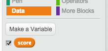

---
title: Memory
level: Scratch 2
language: zh-CN
stylesheet: scratch
embeds: "*.png"
materials: ["Club Leader Resources/*"]
...

## 社区贡献项目 { .challenge .pdf-hidden }
本项目由Erik和他的女儿Ruth共同创建。 如果您也想贡献您自己的项目，那么请 [通过Github联系我们](https://github.com/CodeClub)。

# 简介 { .intro }

在本项目中，你将创建一个记忆游戏，你需要记住随机出现的颜色，并将他们按顺序重复出来！

<div class="scratch-preview">
  <iframe allowtransparency="true" width="485" height="402" src="http://scratch.mit.edu/projects/embed/34874510/?autostart=false" frameborder="0"></iframe>
  
</div>

# 第1步: 随机颜色 { .activity }

首先，让我们创建一个能够随机变换颜色的角色来让玩家记忆颜色。

## 行动清单 { .check }

+ 新建一个Scratch项目，删除默认的小猫精灵，让项目变成一个空白项目。你可以在这里 <a href="http://jumpto.cc/scratch-new">jumpto.cc/scratch-new</a>找到在线Scratch编辑器。

+ 选择一个角色和一个背景。角色不一定非要是人物，但是要能够显示不同颜色。

	

+ 在游戏中，你需要用不同的数字代表每一种颜色：

	+ 1 = red;
	+ 2 = blue;
	+ 3 = green;
	+ 4 = yellow.

	按照上面的颜色，给你的角色4套不同颜色的服装。要确保服装的颜色跟上面的顺序是一致的。 

	

+ 要创建一个随机序列，你需要创建一个 __列表__ 。 列表就是一个能够 __按顺序__ 存储很多数据的变量。新建一个名叫 `sequence` {.blockdata} 的列表。因为只有你的角色需要看到这个列表，我们可以点击选择'For this sprite only'选项。

	

	现在你应该能够看到在你的舞台左上方有一个空列表，还有很多操作列表的新模块。

	

+ 为你的角色添加如下代码，重复执行5此，每次向列表中添加1个随机数（并且显示对应的服装）：

	```blocks
	   点击绿旗时
	   删除链表 (全部 v) 的第 [sequence v] 项
	   重复执行 (5) 次
	       将 (在 (1) 到 (4) 间随机选一个数) 加入链表 [sequence v]
	       将造型切换为 (链表 (last v) 的第 [sequence v] 项)
	       等待 (1) 秒
	   结束
	```

	注意，一定要在开始时清空列表。

## 挑战：添加声音 {.challenge}
测试几次你的项目，你会发现有时相同的数字会连续出现看次（或更多），这让颜色序列难以记忆。你能在每次角色变换服装时播放鼓声吗？

你能根据随机选择的数字不同播放不同的鼓声吗？这个功能与你变换角色服装的代码 _非常_ 的相似。 

## 保存项目 { .save }

# 第2步： 重复序列 { .activity }

让我们添加4个按钮好让玩家能够重复出他们记忆的颜色序列。

## 行动清单 { .check }

+ 向项目中添加4个精灵来充当按钮。编辑这4个精灵让他们每个拥有四种颜色中的一种。

	

+ 当红色的鼓被点击时，你需要向你的角色广播一条消息，让它知道红色按钮被点击了。为你的红鼓添加如下代码：

	```blocks
	   当角色被点击时
	   广播 [red v]
	```

+ 当你的角色收到了这条消息，它就要检测数字1是否在列表的起始位置（起始位置表示序列中的下一个颜色）。 如果是，你可以将数字从列表中移除，表示猜对了。否则游戏结束！

	```blocks
		当接收到 [red v]
		如果 <(链表 (1 v) 的第 [sequence v] 项) = [1]> 那么
		  删除链表 (1 v) 的第 [sequence v] 项
		否则
		  说 [Game over!] (1) 秒
		  停止 [全部 v]
		结束
	```

+ 一旦列表为空，你也可以展示一些闪烁的灯光，表示整个序列都猜对了。在角色的 `when flag clicked` {.blockevents} 脚本末尾添加如下代码：

	```blocks
		在 <(链表 [sequence v] 的长度) = [0]> 之前一直等待
		广播 [won v] 并等待
	```

+ 点击你的舞台，添加如下代码，当玩家赢了时让背景变换颜色。

	```blocks
		当接收到 [won v]
		播放声音 [drum machine v]
		重复执行 (50) 次
		  将 [颜色 v] 特效增加 (25)
		  等待 (0.1) 秒
		结束
		清除所有图形特效
	```

## 挑战：创建4个按钮 {.challenge}

重复上面步骤创建蓝色、绿色和黄色按钮，那么按钮的哪处代码需要修改呢？

当按钮按下时你一样也可以添加声音。

记得测试你添加的代码！你能记住5个颜色的序列吗？这些序列每次都不同吗？

## 保存项目 { .save }

# 第3步：多难度等级 { .activity .new-page }

目前为止，玩家只能记忆5个颜色。让我们改进一下你的游戏让序列长度变长。

## 行动清单 { .check }

+ 新建一个名叫 `score` {.blockdata} 的变量。

	

+ 这个 `score` {.blockdata} 用来决定玩家需要记忆的序列的长度。设score的初始值（序列的长度）为3。将下面的代码添加到角色 `when flag clicked` {.blockevents} 代码的开头：

	```blocks
		将变量 [score v] 的值设定为 [3]
	```

+ 为了不让序列永远都生成5个颜色，现在你想用 `score` {.blockdata} 来控制序列的长度。 修改角色的 `repeat` {.blockcontrol} 循环（用于生成序列）为如下代码:

	```blocks
		重复执行 (score) 次
		结束
	```

+ 序列被猜对了一次，score的值就加1，来增加序列的长度。

	```blocks
		将变量 [score v] 的值增加 (1)
	```

+ 最后，你需要在代码的最外层添加 `forever` {.blockcontrol} 循环来确保每个等级生成一个新的序列。下面是你的角色的完整代码：

	```blocks
		点击绿旗时
		将变量 [score v] 的值设定为 [3]
		重复执行
		  删除链表 (全部 v) 的第 [sequence v] 项
		  重复执行 (score) 次
		      将 (在 (1) 到 (4) 间随机选一个数) 加入链表 [sequence v]
		      将造型切换为 (链表 (last v) 的第 [sequence v] 项)
		      等待 (1) 秒
		  结束
		  在 <(链表 [sequence v] 的长度) = [0]> 之前一直等待
		  广播 [won v] 并等待
		  将变量 [score v] 的值增加 (1)
		结束
	```

+ 召集你的朋友来测试你的游戏吧。在他们玩之前记得要隐藏 `sequence` {.blockdata} 列表！

## 保存你的项目 { .save }

# 第4步：最高分 { .activity }

让我们保存最高分，这样你就可以和朋友进行比赛了。

## 行动清单 { .check }

+ 在你的项目中添加2个新变量，一个叫 `high score` {.blockdata}，另一个叫 `name` {.blockdata}。

+ 每当游戏结束时（点击了错误的按钮），你需要判断玩家的分数是否比当前的最高分高。如果高于当前最高分，你需要将玩家分数记录为最高位，并且保存该玩家的名字。下面是红色按钮的代码：

	```blocks
		当接收到 [red v]
		如果 <(链表 (1 v) 的第 [sequence v] 项) = [1]> 那么
		  删除链表 (1 v) 的第 [sequence v] 项
		否则
		  说 [Game over!] (1) 秒
		  如果 <(score) > (high score)> 那么
		      将变量 [high score v] 的值设定为 (score)
		      询问 [High score! What is your name?] 并等待
		      将变量 [name v] 的值设定为 (回答)
		  结束
		  停止 [全部 v]
		结束
	```

+ 你需要将此代码添加到其他3个按钮！你注意到了吗？4个按钮的“Game over” 代码是完全一样的。

	

+ 如果你要修改此处代码，比如添加声音或修改'Game over!' 信息，你必须修改4次！ you'd have to change it 4 times! 这太烦人了，并且还浪费了不少时间。

	一个解决方案是，定义你自己的模块并在项目中复用！ 要自定义模块，请点击 `more blocks` {.blockmoreblocks}，然后点击 'Make a block'。给模块起个名字，比如'Game over'。

	

+ 将红色按钮 `else` {.blockcontrol} 模块中的代码添加到新模块中，如下图：

	

+ 现在你创建了一个新的 _函数_ 名叫 `Game over` {.blockmoreblocks}，这个函数可以用来任何地方。将你的新建的 `Game over` {.blockmoreblocks} 模块拖到4个按钮的脚本中

	

+ 现在当按错按钮时添加一个声音。你只需要在 `Game over` {.blockmoreblocks} 模块中添加一次代码即可，不需要分别添加4次！

	

## 挑战：创建更多模块 {.challenge}

你注意到4个按钮中其他相同的代码了吗？


你能构建自定义模块让每个按钮都能使用吗？

## 保存项目 { .save }

## 挑战： Another costume {.challenge}

你注意到了吗？每当游戏开始时角色总是显示颜色序列中最后一个颜色。

你可以为角色添加一套白色服装吗？当游戏开始或者玩家开始尝试重复序列时显示白色服装。


## 保存项目 { .save }

## 挑战：难度等级 {.challenge}
你能让你的玩家在“简单模式”（只用红色和蓝色鼓）和“正常模式”（用所有4个鼓）中挑选难度等级吗？

你甚至可以加入“复杂模式”，用5个鼓！

## 保存项目 { .save }


