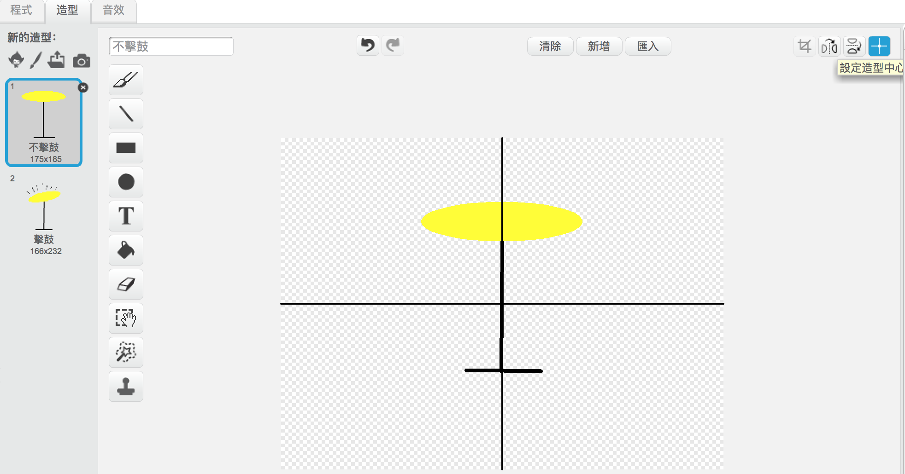

---
title: 搖滾樂隊 — 教學筆記
language: zh-HK
embeds: "*.png"
...

# 簡介:
透過此項目，孩子們將學習如何為項目加入聲音和音樂，同時也學習如何編寫程式，改變精靈的造型。

#資源
此項目需要用到Scratch 2。 Scratch 2 可以通過[jumpto.cc/scratch-on](http://jumpto.cc/scratch-on) 在綫使用，也可以通過 [jumpto.cc/scratch-off](http://jumpto.cc/scratch-off) 下載安裝離綫版本離綫使用。

您可以在 <a href="http://scratch.mit.edu/projects/26741186/#editor">online</a>找到此項目的完整版，也可以點擊「下載項目資料」鏈結下載此項目，項目文件包括:

+ RockBand.sb2

#學習目標
+ 精靈；
+ 造型；
+ 順序代碼塊；
+ 事件；
+ 聲音和音樂。

#挑戰
+ "優化鼓聲” - 改變精靈聲音並加入事件；
+ "變換歌手的造型” - 添加並控制精靈造型；
+ "打造自己的樂隊” - 利用所學技能創造新的樂器.

#常見問題
+ 當孩子們創建自己的精靈時，他們可能會發現當點擊精靈時，精靈變換造型時會「跳」一下。這是因為兩個造型的中心不在同一個位置。

  要修復這個問題，請對 _兩個_ 精靈都點擊「設置造型中心」按鈕，確保兩個造型的中心點在同一點上。

  

+ 在Linux系統中，右鍵點擊刪除精靈可能無效。如果出現這情況，按住「shift」鍵並左鍵點擊，菜單會彈出，從菜單刪除精靈。