---
title: 搖滾樂隊
level: Scratch 1
language: zh-HK
stylesheet: scratch
embeds: "*.png"
materials: ["Club Leader Resources/*"]
...

# 簡介 { .intro }

在本項目中，你將學到如何編程製作自己的樂器!

<div class="scratch-preview">
	<iframe allowtransparency="true" width="485" height="402" src="http://scratch.mit.edu/projects/embed/26741186/?autostart=false" frameborder="0"></iframe>
	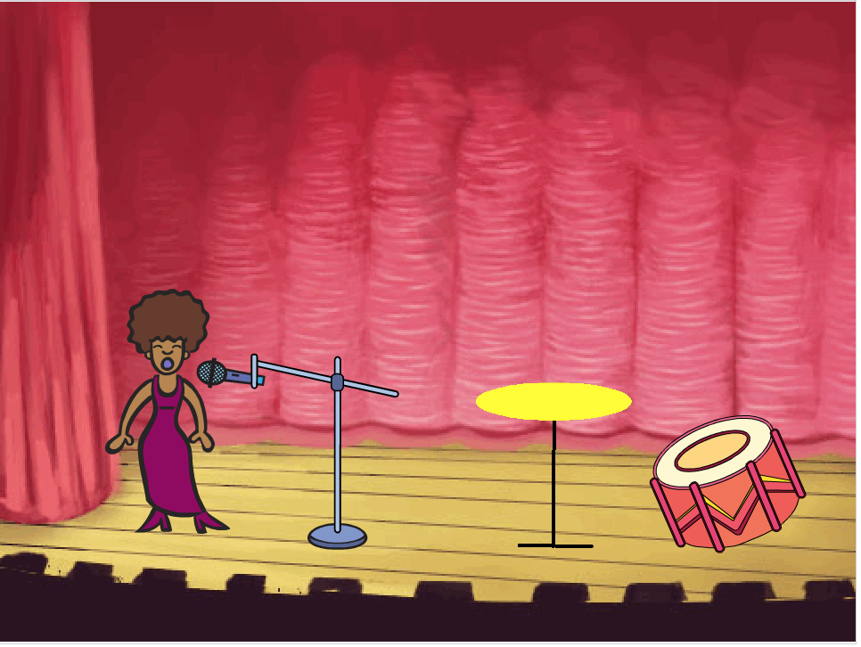
</div>

# 第1步: 精靈 { .activity }
 
在開始編程之前，我們首先需要添加一個可以編程的「東西」。在Scratch中，我們叫這些「東西」為**精靈**。

## 行動清單 { .check }

+ 首先，打開Scratch編輯器。你也可以在<a href="http://jumpto.cc/scratch-new" target="_blank">jumpto.cc/scratch-new</a>使用線上編輯器。如下圖所示：

	

+ 你所看到的小猫精靈是Scratch的吉祥物。右鍵點擊它，然後選擇「刪除」來刪掉它。

	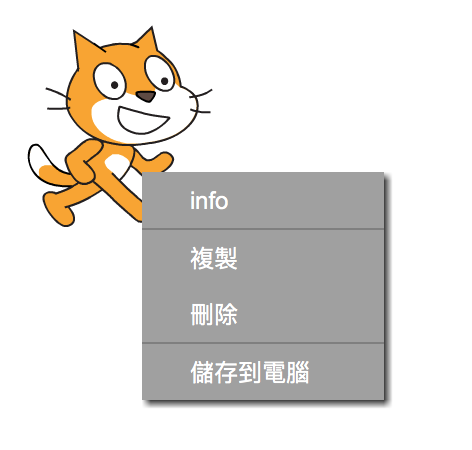

+ 接著，點擊「從庫中選取角色」，打開Scratch的角色清單。

	

+ 向下滾動直至你看到下圖所示的鼓。點擊選取，然後點擊「確定」，將鼓加入項目中。

	

+ 點擊「縮小」按鈕，然後連續點擊剛才所選的鼓，將它縮小到合適的尺寸。

	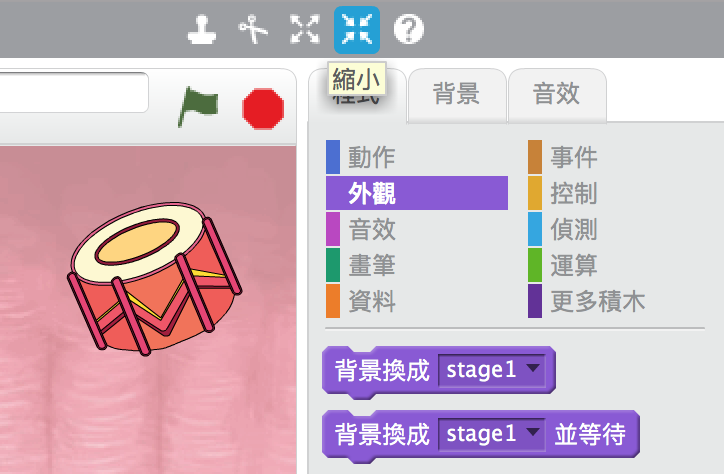

## 儲存項目{ .save }

在左上方的文字框中輸入項目名稱。

然後點擊「檔案」，選擇「儲存」來儲存你的項目。


(如果你沒有Scratch的賬號，你可以點擊「下載至你的電腦」儲存項目。
# 第2步: 舞台 { .activity }

左邊為**舞台**，是所有角色活動的地方。就像現實中的舞台，所有演員都在舞台上表演!

## 行單清單 { .check }

+ 如圖所示，目前舞台還是白色的，看上去很單調。我們可以點擊「從庫中選取背景」來為舞台添加背景。

	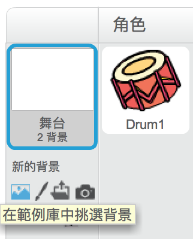

+ 點擊左側的「室內」選項，點選一個舞台背景，然後點擊「確認」。

	

+ 現在你的舞台看上去像一個真的舞台了:

	

# 第3步: 製作一個鼓 { .activity }

現在讓我們為鼓編寫代碼，讓它被敲擊時發出聲音。

## 行動清單 { .check }

+ 你可以在「語言」標籤中找到所有代碼塊，不同功能的代碼塊以不同顏色區分。

        點擊一下鼓，然後將下面2個代碼塊拖曳到右方的編碼區域，並确保它們像樂高積木般連接在一起：

	

+ 點擊舞台中的鼓，看看是否能够發出聲音！

## 儲存項目 { .save }

##挑戰: 改進你的鼓 { .challenge }

+ 你能改變鼓被敲擊時發出的鼓聲嗎？

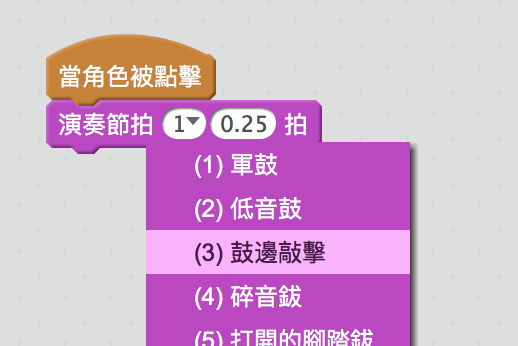


+ 你能在按「空格」鍵時使鼓發出聲音嗎？你需要用到「事件」{.blockevents} 代碼塊：

```blocks
	當按 [空格 v]键
```

你可以右鍵點擊現有的代碼，然後點擊「複製」來複製代碼。

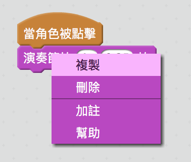


## 儲存項目 { .save }

# 第4步: 製作一名歌手 { .activity .new-page }

讓我們為樂隊添加一名歌手!

## 行動清單 { .check }

+ 在舞台中增添另外2個精靈：歌手和麥克風。

	

+ 要想讓歌手唱歌，你需要為你的歌手加入聲音。首先選取你的歌手，然後點擊「聲音」標籤，再點擊「從庫中選取聲音」：


	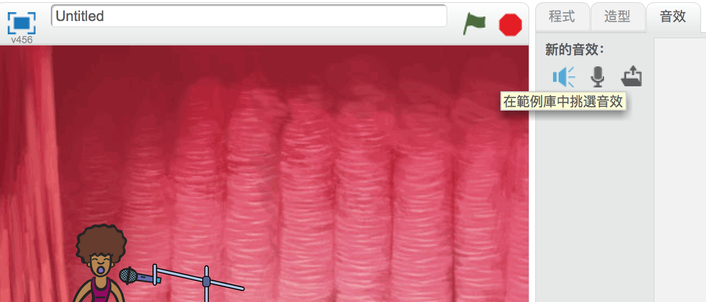

+ 從左方選項中點擊「聲樂」，為歌手選擇一個合適的聲音。

	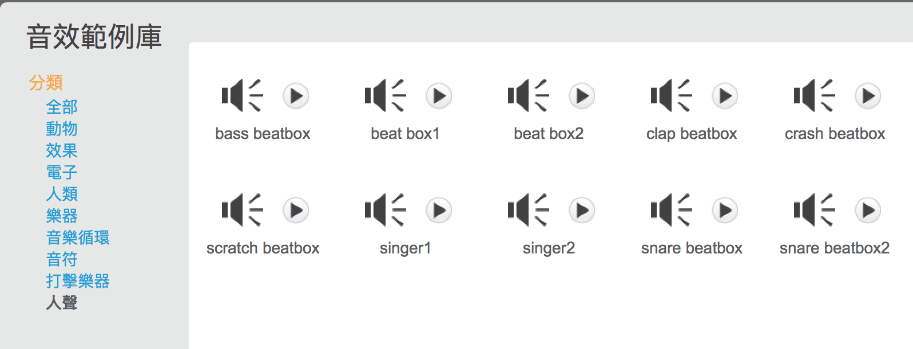

+ 現在已添加聲音，我們可以為歌手添加以下代碼：

	```blocks
		當角色被點擊時
		播放聲音 [singer1 v] 直至播放完畢
	```

+ 點擊歌手，測試歌手是否唱歌。

## 儲存項目  { .save }

# 第5步: 造型 { .activity .new-page }

讓我們令歌手看起來像在唱歌!

## 行動清單 { .check }

+ 你也可以通過新建造型改變歌手的造型。點擊「造型」標籤，你會看到歌手的圖像。

	

+ 右鍵點擊造型圖片並點擊「複製」，複製一份造型。

	

+ 點擊新建的造型（名叫「Singer2」），然后選取綫條工具，並畫幾條綫令歌手看起來真的像在唱歌。

	

+ 目前造型的名字表意没有什麼含義。在每個造型的名字輸入框中輸入不同的名字，將2個造型改稱為「not singing」 和 「singing」。

	


+ 現在歌手有2個不同造型了，你可以選擇顯示哪個造型！為歌手加入以下2組代碼塊：

	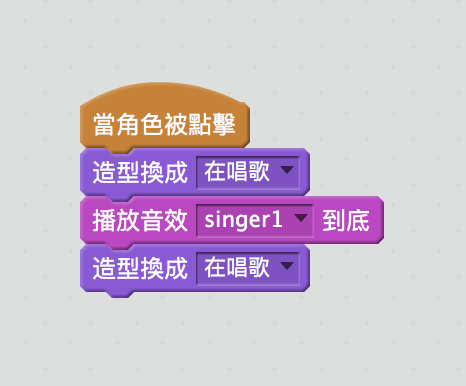

        切换造型的代碼塊在「外觀」 {.blocklooks} 分區中。

+ 測試：當點擊你的歌手時，她應看似在唱歌!

##挑戰: 改變鼓的造型 { .challenge }
你能讓你的鼓看似被擊打嗎？如你需要幫助，可以參考上面改變歌手造型的做法。 


別忘記測試你的新代碼！

## 儲存項目 { .save }

##挑戰: 創建屬於你自己的樂隊{ .challenge }

利用本項目學到的技巧創建一個屬於你自己的樂隊！你可以創建任何你喜歡的樂器。看一下庫中有哪些聲音和樂器，希望可以给你一些靈感。

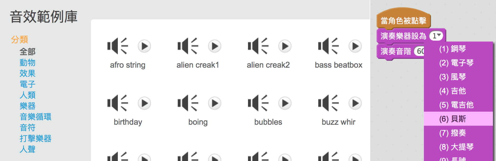

你的樂器不一定要十分合理。比如，你可以讓蛋糕發出鋼琴的聲音!


除了使用現有的精靈，你也可以繪畫屬於你自己的精靈。


如果你有麥克風，你還可以錄製自己的聲音，甚至通過網路攝影機擊打樂器!

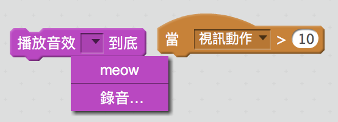

## 儲存項目 { .save }
